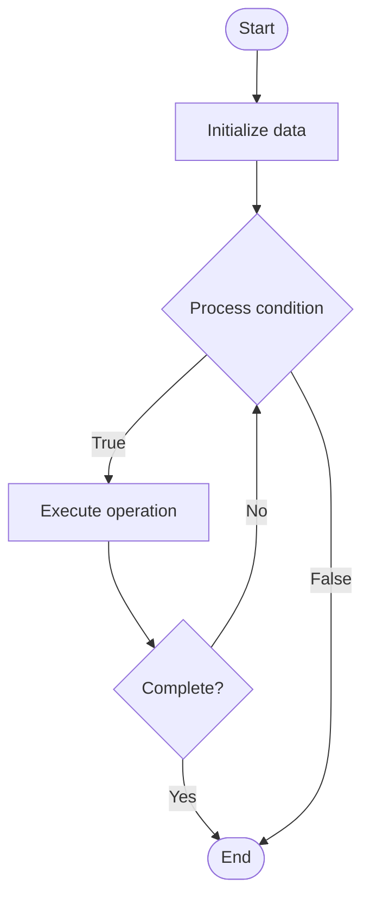

# Concurrent Data Structures

1. **Name of Algorithm**  

## Code Files


## Algorithm Visualization

### Flowchart (ASCII)


```
Concurrent Data Structures Flowchart:

┌─────────────┐
│   Start     │
└──────┬──────┘
       │
       ▼
┌─────────────┐
│  Initialize │
│   data      │
└──────┬──────┘
       │
       ▼
┌─────────────┐      Yes
│  Process   ├──────┐
│  condition?│      │
└──────┬──────┘      │
       │ No          │
       ▼             │
┌─────────────┐      │
│  Execute   │      │
│  operation │      │
└──────┬──────┘      │
       │             │
       └─────────────┘
       │
       ▼
┌─────────────┐
│    End      │
└─────────────┘
```


### Step-by-Step Execution


```
Concurrent Data Structures Step-by-Step Execution:

Input: [example data]

Step 1: Initialize
State: [initial state]

Step 2: Process
State: [intermediate state]

Step 3: Finalize
State: [final state]

Result: [output]
```


### Interactive Flowchart (Mermaid)





> **Note**: Mermaid diagrams are rendered automatically on GitHub. For local viewing, use a Mermaid-compatible Markdown viewer.
- [Python Implementation](semester_09/lecture_57_concurrency_advanced/concurrent_data_structures/algorithm.py)
- [Java Implementation](semester_09/lecture_57_concurrency_advanced/concurrent_data_structures/Algorithm.java)
- [Python Tests](semester_09/lecture_57_concurrency_advanced/concurrent_data_structures/test_algorithm.py)


   Concurrent Data Structures

2. **What problem does it solve? (1 sentence)**  
   Implements thread-safe data structures that support concurrent access from multiple threads without data corruption, using locks, lock-free algorithms, or transactional memory.

3. **Intuition (plain-language explanation)**  
   Like a shared whiteboard with rules: concurrent data structures are like a whiteboard that multiple people can write on simultaneously - you need rules to prevent chaos (synchronization) - you could use a lock (only one person writes at a time), or use special pens that don't conflict (lock-free algorithms), or use transactions (write changes, then commit if no conflicts) - the goal is to allow safe concurrent access while maintaining data integrity.

4. **Inputs & Outputs**  
   - Input: Concurrent operations (insert, delete, search), thread identifiers, synchronization primitives, data structure type.  
   - Output: Thread-safe operations, consistent data structure state, correct concurrent access results.

5. **Step-by-step description (5–10 lines max)**  
1. Choose approach: select synchronization approach (locks, lock-free, transactional).
2. Design structure: design data structure with concurrency in mind.
3. Implement operations: implement thread-safe operations (insert, delete, search, update).
4. Synchronize: add synchronization (locks, atomic operations, transactions).
5. Handle conflicts: resolve conflicts between concurrent operations.
6. Validate: ensure operations maintain data structure invariants.
7. Optimize: minimize contention and improve performance.
8. Test: thoroughly test with concurrent access patterns.
9. Measure: benchmark performance under various concurrency levels.
10. Tune: adjust synchronization strategy based on workload.

6. **Tiny example (hand-simulated)**  
   Concurrent hash table: multiple threads inserting/searching → approach: fine-grained locking (lock per bucket) → insert: acquire bucket lock → insert → release lock → search: acquire bucket lock (read) → search → release lock → result: 8 threads, 1M operations → throughput: 500K ops/sec → thread-safe, high performance → concurrent data structure.

7. **Time & Space Complexity**  
   - Time: O(1) average for hash table with locks, O(log n) for lock-free tree structures where n is size.  
   - Space: O(n) where n is data structure size (synchronization adds minimal overhead).

8. **Strengths**  
- Thread safety: enables safe concurrent access from multiple threads.
- Performance: can achieve high throughput with proper design.
- Correctness: maintains data integrity under concurrent access.

9. **Weaknesses / limitations**  
- Complexity: concurrent data structures are more complex than sequential ones.
- Contention: high contention can degrade performance.
- Correctness: ensuring correctness is challenging and requires careful design.

10. **Compare with alternatives**  
    Alternatives: Sequential Data Structures with External Locking, Lock-Free Data Structures, Transactional Memory, Message Passing

11. **30-second explanation (your own words)**  
    Implements thread-safe data structures that support concurrent access from multiple threads without data corruption, using locks, lock-free algorithms, or transactional memory.

*Sources: Adapted from standard university textbooks and Wikipedia summaries.*
