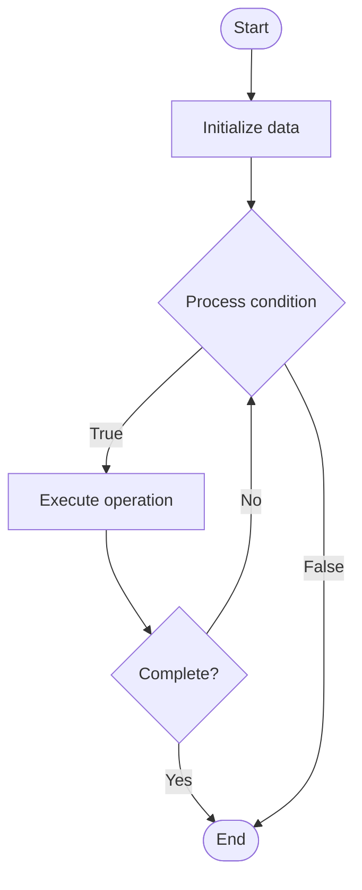

# Communicating Sequential Processes (CSP)

## Учебные материалы

- [Школьный уровень](school.ru.md)
- [Университетский уровень](univer.ru.md)

## Algorithm Visualization

### Flowchart (ASCII)

```
Communicating Sequential Processes (CSP) Flowchart:

┌─────────────┐
│   Start     │
└──────┬──────┘
       │
       ▼
┌─────────────┐
│  Initialize │
│   data      │
└──────┬──────┘
       │
       ▼
┌─────────────┐      Yes
│  Process   ├──────┐
│  condition?│      │
└──────┬──────┘      │
       │ No          │
       ▼             │
┌─────────────┐      │
│  Execute   │      │
│  operation │      │
└──────┬──────┘      │
       │             │
       └─────────────┘
       │
       ▼
┌─────────────┐
│    End      │
└─────────────┘
```

### Step-by-Step Execution

```
Communicating Sequential Processes (CSP) Step-by-Step Execution:

Input: [example data]

Step 1: Initialize
State: [initial state]

Step 2: Process
State: [intermediate state]

Step 3: Finalize
State: [final state]

Result: [output]
```

### Interactive Flowchart (Mermaid)



> **Note**: Mermaid diagrams are rendered automatically on GitHub. For local viewing, use a Mermaid-compatible Markdown viewer.

- [Python Implementation](/code/semester_09/lecture_57_concurrency_advanced/csp_model/algorithm.py)
- [Java Implementation](/code/semester_09/lecture_57_concurrency_advanced/csp_model/Algorithm.java)
- [Python Tests](/code/semester_09/lecture_57_concurrency_advanced/csp_model/test_algorithm.py)

   Communicating Sequential Processes (CSP)

What problem does it solve? (1 sentence)  
   Models concurrent systems using independent sequential processes that communicate through synchronous message passing over channels, providing deterministic concurrency and avoiding shared state.

Intuition (plain-language explanation)  
   Like a phone call system: CSP is like a phone call where both parties must be ready to talk (synchronous) - when you call someone (send message), you wait until they answer (receive), then you exchange information (communicate), and both hang up (synchronization complete) - unlike email (asynchronous), phone calls require both parties to be ready at the same time, ensuring messages are delivered and received in a coordinated way.

Inputs & Outputs  

  - Input: Processes, channels, messages, synchronization points, communication patterns.  
  - Output: Synchronized communication, deterministic behavior, coordinated processes, no shared state.

Step-by-step description (5–10 lines max)  
Define processes: create independent sequential processes.
Create channels: establish communication channels between processes.
Send: process sends message on channel (blocks until receiver ready).
Receive: process receives message from channel (blocks until sender ready).
Synchronize: send and receive operations synchronize (rendezvous).
Select: use select statement to wait on multiple channels.
Compose: compose processes to build larger concurrent systems.
Verify: use formal methods to verify system properties.
Execute: run processes concurrently with synchronized communication.
Monitor: observe communication patterns and system behavior.

Tiny example (hand-simulated)  
   CSP: producer-consumer → producer process: produce item → send on channel → wait for consumer → consumer process: receive from channel → process item → send acknowledgment → producer receives ack → continue → synchronization: both processes coordinate → no shared buffer needed → deterministic behavior → CSP model.

Time & Space Complexity  

  - Time: O(1) for channel operations, O(n) for process execution where n is computation size.  
  - Space: O(p + c) where p is number of processes, c is channel buffer size (often 0 for synchronous).

Strengths  

- Determinism: synchronous communication provides deterministic behavior.
- Formal verification: amenable to formal methods and verification.
- No shared state: avoids race conditions and data races.

Weaknesses / limitations  

- Blocking: synchronous communication can cause blocking and deadlocks.
- Performance: may have lower throughput than asynchronous models.
- Complexity: managing many channels and processes can be complex.

Compare with alternatives  
    Alternatives: Actor Model, Shared Memory, Message Queues, Asynchronous Communication

30-second explanation (your own words)  
    Models concurrent systems using independent sequential processes that communicate through synchronous message passing over channels, providing deterministic concurrency and avoiding shared state.

*Sources: Adapted from standard university textbooks and Wikipedia summaries.*


## References

- [Csp Model - Wikipedia](https://en.wikipedia.org/wiki/Csp%20Model)
