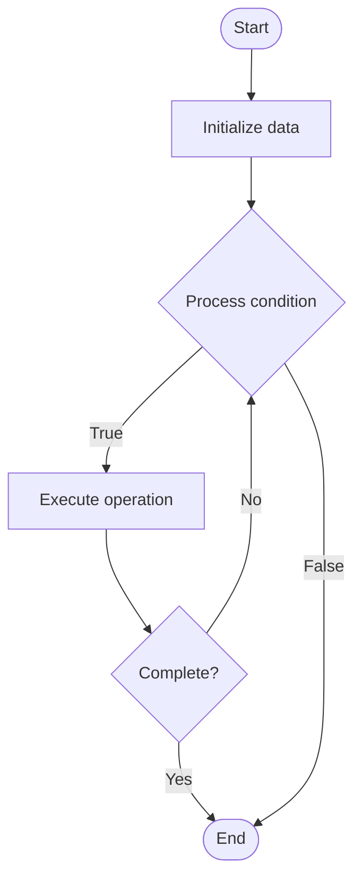

# Lock-Free Data Structures

## Учебные материалы

- [Школьный уровень](school.ru.md)
- [Университетский уровень](univer.ru.md)

## Algorithm Visualization

### Flowchart (ASCII)

```
Lock-Free Data Structures Flowchart:

┌─────────────┐
│   Start     │
└──────┬──────┘
       │
       ▼
┌─────────────┐
│  Initialize │
│   data      │
└──────┬──────┘
       │
       ▼
┌─────────────┐      Yes
│  Process   ├──────┐
│  condition?│      │
└──────┬──────┘      │
       │ No          │
       ▼             │
┌─────────────┐      │
│  Execute   │      │
│  operation │      │
└──────┬──────┘      │
       │             │
       └─────────────┘
       │
       ▼
┌─────────────┐
│    End      │
└─────────────┘
```

### Step-by-Step Execution

```
Lock-Free Data Structures Step-by-Step Execution:

Input: [example data]

Step 1: Initialize
State: [initial state]

Step 2: Process
State: [intermediate state]

Step 3: Finalize
State: [final state]

Result: [output]
```

### Interactive Flowchart (Mermaid)



> **Note**: Mermaid diagrams are rendered automatically on GitHub. For local viewing, use a Mermaid-compatible Markdown viewer.

- [Python Implementation](/code/semester_09/lecture_57_concurrency_advanced/lock_free_data_structures/algorithm.py)
- [Java Implementation](/code/semester_09/lecture_57_concurrency_advanced/lock_free_data_structures/Algorithm.java)
- [Python Tests](/code/semester_09/lecture_57_concurrency_advanced/lock_free_data_structures/test_algorithm.py)

   Lock-Free Data Structures

What problem does it solve? (1 sentence)  
   Implements concurrent data structures that guarantee progress for at least one thread without using locks, using atomic operations and compare-and-swap to achieve thread safety.

Intuition (plain-language explanation)  
Like a self-service system: lock-free data structures are like a self-service checkout where multiple people can use it simultaneously without a cashier (lock) - the system uses smart mechanisms (atomic operations) that ensure if one person's transaction conflicts with another, at least one will succeed (progress guarantee) - people retry if their operation fails (optimistic concurrency), but the system never gets stuck waiting for a lock (no deadlocks).

Inputs & Outputs  

  - Input: Concurrent operations, atomic operations (CAS, load-linked/store-conditional), retry logic, memory ordering.  
  - Output: Lock-free operations, progress guarantee, thread-safe data structure, high concurrency performance.

Step-by-step description (5–10 lines max)  
Design algorithm: design data structure operations using atomic operations.
Use CAS: implement operations using compare-and-swap (CAS) or similar atomics.
Read: read current state atomically.
Modify: compute new state based on current state.
Update: attempt to update using CAS (compare current state, swap if unchanged).
Retry: if CAS fails (state changed), retry from beginning (optimistic).
Handle ABA: prevent ABA problem using version numbers or tags.
Memory ordering: use appropriate memory ordering (acquire, release, sequential consistency).
Validate: ensure algorithm guarantees progress (at least one thread succeeds).
Test: thoroughly test with high concurrency and stress tests.

Tiny example (hand-simulated)  
   Lock-free stack: push operation → read head pointer → create new node → set new node.next = head → CAS: compare head with read value, swap to new node → if CAS succeeds: done → if CAS fails: retry (another thread modified head) → no locks → high concurrency → progress guarantee: at least one push succeeds → lock-free.

Time & Space Complexity  

  - Time: O(1) expected for operations, O(k) worst case where k is number of retries (usually small).  
  - Space: O(n) where n is data structure size (minimal overhead for lock-free).

Strengths  

- Performance: high performance under high concurrency (no lock contention).
- Progress: guarantees progress (no deadlocks, livelocks rare).
- Scalability: scales well with number of threads.

Weaknesses / limitations  

- Complexity: lock-free algorithms are complex to design and verify.
- ABA problem: requires careful handling of ABA problem.
- Correctness: proving correctness is challenging.

Compare with alternatives  
    Alternatives: Lock-Based Structures, Transactional Memory, Wait-Free Structures, Lock-Coupling

30-second explanation (your own words)  
    Implements concurrent data structures that guarantee progress for at least one thread without using locks, using atomic operations and compare-and-swap to achieve thread safety.

*Sources: Adapted from standard university textbooks and Wikipedia summaries.*


## References

- [Lock Free Data Structures - Wikipedia](https://en.wikipedia.org/wiki/Lock%20Free%20Data%20Structures)
