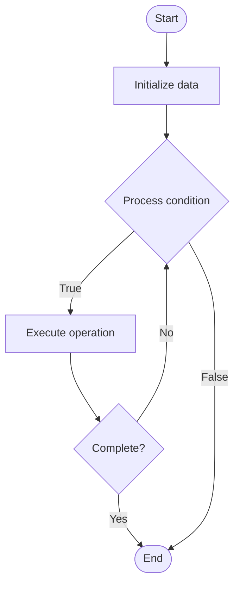

# Transactional Memory

1. **Name of Algorithm**  

## Code Files


## Algorithm Visualization

### Flowchart (ASCII)


```
Transactional Memory Flowchart:

┌─────────────┐
│   Start     │
└──────┬──────┘
       │
       ▼
┌─────────────┐
│  Initialize │
│   data      │
└──────┬──────┘
       │
       ▼
┌─────────────┐      Yes
│  Process   ├──────┐
│  condition?│      │
└──────┬──────┘      │
       │ No          │
       ▼             │
┌─────────────┐      │
│  Execute   │      │
│  operation │      │
└──────┬──────┘      │
       │             │
       └─────────────┘
       │
       ▼
┌─────────────┐
│    End      │
└─────────────┘
```


### Step-by-Step Execution


```
Transactional Memory Step-by-Step Execution:

Input: [example data]

Step 1: Initialize
State: [initial state]

Step 2: Process
State: [intermediate state]

Step 3: Finalize
State: [final state]

Result: [output]
```


### Interactive Flowchart (Mermaid)





> **Note**: Mermaid diagrams are rendered automatically on GitHub. For local viewing, use a Mermaid-compatible Markdown viewer.
- [Python Implementation](semester_09/lecture_57_concurrency_advanced/transactional_memory/algorithm.py)
- [Java Implementation](semester_09/lecture_57_concurrency_advanced/transactional_memory/Algorithm.java)
- [Python Tests](semester_09/lecture_57_concurrency_advanced/transactional_memory/test_algorithm.py)


   Transactional Memory

2. **What problem does it solve? (1 sentence)**  
   Provides atomic, isolated execution of code blocks (transactions) in concurrent programs, simplifying concurrent programming by automatically handling synchronization and conflict resolution.

3. **Intuition (plain-language explanation)**  
   Like database transactions for memory: transactional memory is like database transactions but for in-memory operations - you mark a block of code as a transaction (like BEGIN TRANSACTION), execute it (read/write memory), and if there are no conflicts with other transactions, it commits (like COMMIT) - if there's a conflict (like two transactions modifying same data), one rolls back and retries (like ROLLBACK) - this makes concurrent programming easier by handling synchronization automatically.

4. **Inputs & Outputs**  
   - Input: Code blocks (transactions), memory operations, conflict detection, transaction boundaries.  
   - Output: Atomic execution, isolated transactions, conflict resolution, simplified concurrency.

5. **Step-by-step description (5–10 lines max)**  
1. Define transaction: mark code block as transaction (atomic, isolated).
2. Begin: start transaction, initialize transaction state.
3. Execute: execute code within transaction (read/write memory).
4. Track: track memory accesses (read set, write set).
5. Detect conflicts: detect conflicts with other concurrent transactions.
6. Commit: if no conflicts, commit changes (make visible to other threads).
7. Abort: if conflict detected, abort transaction (rollback changes).
8. Retry: retry aborted transaction (optimistic execution).
9. Validate: validate transaction before commit (check for conflicts).
10. Synchronize: automatically handle synchronization and memory ordering.

6. **Tiny example (hand-simulated)**  
   Transactional memory: transfer money between accounts → transaction: { read balance1, read balance2, balance1 -= amount, balance2 += amount, write balance1, write balance2 } → execute optimistically → validate: no other transaction modified balance1 or balance2 → commit: changes visible → if conflict: abort, retry → automatic synchronization → simpler than locks → transactional memory.

7. **Time & Space Complexity**  
   - Time: O(t) for transaction execution where t is transaction size, O(c) for conflict detection where c is concurrent transactions.  
   - Space: O(t) where t is transaction size (read/write sets, undo logs).

8. **Strengths**  
- Simplicity: simplifies concurrent programming compared to locks.
- Composability: transactions compose naturally (no lock ordering issues).
- Automatic: automatically handles synchronization and conflict resolution.

9. **Weaknesses / limitations**  
- Overhead: transaction overhead may be higher than fine-grained locks.
- Contention: high contention can cause many aborts and retries.
- Hardware support: hardware transactional memory (HTM) has limitations.

10. **Compare with alternatives**  
    Alternatives: Locks, Lock-Free Programming, Software Transactional Memory (STM), Isolated Execution

11. **30-second explanation (your own words)**  
    Provides atomic, isolated execution of code blocks (transactions) in concurrent programs, simplifying concurrent programming by automatically handling synchronization and conflict resolution.

*Sources: Adapted from standard university textbooks and Wikipedia summaries.*
