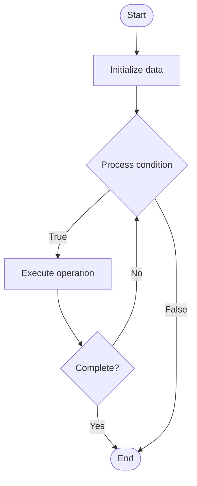

# Wait-Free Algorithms

## Учебные материалы

- [Школьный уровень](school.ru.md)
- [Университетский уровень](univer.ru.md)

## Algorithm Visualization

### Flowchart (ASCII)

```
Wait-Free Algorithms Flowchart:

┌─────────────┐
│   Start     │
└──────┬──────┘
       │
       ▼
┌─────────────┐
│  Initialize │
│   data      │
└──────┬──────┘
       │
       ▼
┌─────────────┐      Yes
│  Process   ├──────┐
│  condition?│      │
└──────┬──────┘      │
       │ No          │
       ▼             │
┌─────────────┐      │
│  Execute   │      │
│  operation │      │
└──────┬──────┘      │
       │             │
       └─────────────┘
       │
       ▼
┌─────────────┐
│    End      │
└─────────────┘
```

### Step-by-Step Execution

```
Wait-Free Algorithms Step-by-Step Execution:

Input: [example data]

Step 1: Initialize
State: [initial state]

Step 2: Process
State: [intermediate state]

Step 3: Finalize
State: [final state]

Result: [output]
```

### Interactive Flowchart (Mermaid)



> **Note**: Mermaid diagrams are rendered automatically on GitHub. For local viewing, use a Mermaid-compatible Markdown viewer.

- [Python Implementation](/code/semester_09/lecture_57_concurrency_advanced/wait_free_algorithms/algorithm.py)
- [Java Implementation](/code/semester_09/lecture_57_concurrency_advanced/wait_free_algorithms/Algorithm.java)
- [Python Tests](/code/semester_09/lecture_57_concurrency_advanced/wait_free_algorithms/test_algorithm.py)

   Wait-Free Algorithms

What problem does it solve? (1 sentence)  
   Implements concurrent algorithms that guarantee every thread completes its operation in a bounded number of steps regardless of other threads' progress, providing the strongest progress guarantee.

Intuition (plain-language explanation)  
   Like a guaranteed service counter: wait-free algorithms are like a service counter where every customer (thread) is guaranteed to be served within a fixed number of steps, no matter how busy it is or what other customers are doing - unlike a regular counter where you might wait indefinitely if someone ahead is slow (blocking), or a self-service where you might retry many times (lock-free), wait-free guarantees you'll finish in a predictable, bounded time - it's the strongest guarantee for concurrent operations.

Inputs & Outputs  

  - Input: Concurrent operations, thread identifiers, operation parameters, progress guarantees.  
  - Output: Wait-free operations, bounded completion time, guaranteed progress, high reliability.

Step-by-step description (5–10 lines max)  
Design algorithm: design algorithm with bounded steps guarantee.
Use helping: implement helping mechanism (threads help other threads complete).
Allocate work: distribute work so each thread has bounded work.
Avoid blocking: ensure no thread waits for another thread's progress.
Use atomics: use atomic operations for coordination.
Implement: implement wait-free version of data structure operation.
Bound steps: prove that operation completes in bounded number of steps.
Handle all cases: ensure algorithm works in all execution scenarios.
Verify: formally verify wait-free property.
Test: stress test with high concurrency and various scenarios.

Tiny example (hand-simulated)  
   Wait-free queue: enqueue operation → use fetch-and-add to get ticket number → each thread gets unique position → complete operation in bounded steps (no waiting for other threads) → dequeue: similar approach → guarantee: every operation completes in O(1) steps regardless of other threads → wait-free → strongest progress guarantee → real-time systems benefit.

Time & Space Complexity  

  - Time: O(1) or O(log n) bounded steps where n is data structure size (guaranteed, not expected).  
  - Space: O(n·t) where n is data structure size, t is number of threads (may need per-thread storage).

Strengths  

- Strong guarantee: strongest progress guarantee (bounded completion time).
- Real-time: suitable for real-time systems with timing requirements.
- No starvation: guarantees no thread starves.

Weaknesses / limitations  

- Complexity: wait-free algorithms are very complex to design.
- Overhead: may have higher overhead than lock-free or lock-based approaches.
- Space: may require more memory (per-thread storage, helping structures).

Compare with alternatives  
    Alternatives: Lock-Free Algorithms, Lock-Based Algorithms, Obstruction-Free Algorithms, Bounded Wait-Free

30-second explanation (your own words)  
    Implements concurrent algorithms that guarantee every thread completes its operation in a bounded number of steps regardless of other threads' progress, providing the strongest progress guarantee.

*Sources: Adapted from standard university textbooks and Wikipedia summaries.*
