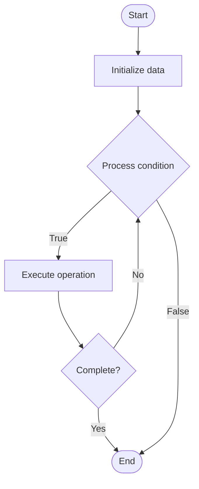

# GPU Computing

Name of Algorithm  

## Code Files


## Algorithm Visualization

### Flowchart (ASCII)


```
GPU Computing Flowchart:

┌─────────────┐
│   Start     │
└──────┬──────┘
       │
       ▼
┌─────────────┐
│  Initialize │
│   data      │
└──────┬──────┘
       │
       ▼
┌─────────────┐      Yes
│  Process   ├──────┐
│  condition?│      │
└──────┬──────┘      │
       │ No          │
       ▼             │
┌─────────────┐      │
│  Execute   │      │
│  operation │      │
└──────┬──────┘      │
       │             │
       └─────────────┘
       │
       ▼
┌─────────────┐
│    End      │
└─────────────┘
```


### Step-by-Step Execution


```
GPU Computing Step-by-Step Execution:

Input: [example data]

Step 1: Initialize
State: [initial state]

Step 2: Process
State: [intermediate state]

Step 3: Finalize
State: [final state]

Result: [output]
```


### Interactive Flowchart (Mermaid)





> **Note**: Mermaid diagrams are rendered automatically on GitHub. For local viewing, use a Mermaid-compatible Markdown viewer.
- [Python Implementation](/code/semester_09/lecture_58_parallel_computing/gpu_computing/algorithm.py)
- [Java Implementation](/code/semester_09/lecture_58_parallel_computing/gpu_computing/Algorithm.java)
- [Python Tests](/code/semester_09/lecture_58_parallel_computing/gpu_computing/test_algorithm.py)


   GPU Computing

What problem does it solve? (1 sentence)  
   Utilizes Graphics Processing Units (GPUs) for general-purpose parallel computation, leveraging thousands of cores to accelerate data-parallel workloads like machine learning, scientific computing, and image processing.

Intuition (plain-language explanation)  
   Like a factory with many workers: GPU computing is like a factory with thousands of workers (GPU cores) that can all work on similar tasks simultaneously - instead of one expert worker (CPU) doing complex tasks sequentially, you have many workers doing simple, similar tasks in parallel (like processing pixels in an image, or matrix multiplications) - GPUs excel at doing the same operation on lots of data at once (data parallelism), making them perfect for tasks like image processing, machine learning, and scientific simulations.

Inputs & Outputs  
   - Input: Data-parallel workloads, GPU kernels, data arrays, computation patterns, GPU memory.  
   - Output: Parallel computation results, accelerated processing, high throughput, GPU-optimized output.

Step-by-step description (5–10 lines max)  
Identify parallelism: identify data-parallel operations in workload.
Design kernel: design GPU kernel (function that runs on each thread).
Allocate memory: allocate GPU memory (device memory) for data.
Transfer data: copy data from CPU memory (host) to GPU memory (device).
Configure launch: configure kernel launch (grid size, block size, threads).
Execute kernel: launch kernel on GPU (thousands of threads execute in parallel).
Synchronize: wait for kernel execution to complete.
Transfer results: copy results from GPU memory back to CPU memory.
Optimize: optimize memory access patterns, use shared memory, minimize transfers.
Measure: benchmark performance and compare with CPU implementation.

Tiny example (hand-simulated)  
   GPU computing: image processing → 4K image (3840×2160 pixels) → CPU: process sequentially, 1 second → GPU: launch kernel with 8M threads (one per pixel) → all pixels processed in parallel → execution time: 0.01 seconds → 100x speedup → GPU excels at data-parallel tasks → GPU computing.

Time & Space Complexity  
   - Time: O(n/p) where n is problem size, p is number of parallel threads (theoretical), actual speedup depends on memory bandwidth and computation intensity.  
   - Space: O(d) where d is data size (GPU memory requirements).

Strengths  
- Performance: massive parallelism provides huge speedups for data-parallel workloads.
- Throughput: high throughput for parallelizable computations.
- Cost-effective: GPUs provide high performance per dollar for suitable workloads.

Weaknesses / limitations  
- Suitability: only effective for data-parallel, compute-intensive workloads.
- Memory: limited GPU memory and bandwidth can be bottlenecks.
- Complexity: GPU programming requires specialized knowledge and tools.

Compare with alternatives  
    Alternatives: CPU Computing, FPGA, TPU, Distributed Computing

30-second explanation (your own words)  
    Utilizes Graphics Processing Units (GPUs) for general-purpose parallel computation, leveraging thousands of cores to accelerate data-parallel workloads like machine learning, scientific computing, and image processing.

*Sources: Adapted from standard university textbooks and Wikipedia summaries.*
