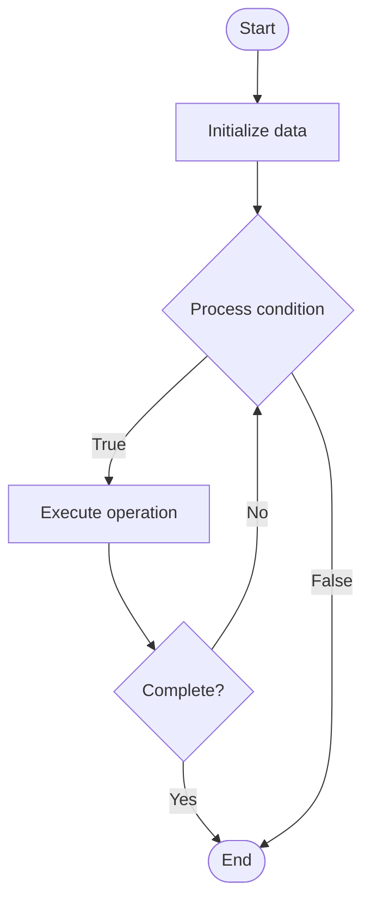

# Parallel Algorithms

## Учебные материалы

- [Школьный уровень](school.ru.md)
- [Университетский уровень](univer.ru.md)

## Algorithm Visualization

### Flowchart (ASCII)

```
Parallel Algorithms Flowchart:

┌─────────────┐
│   Start     │
└──────┬──────┘
       │
       ▼
┌─────────────┐
│  Initialize │
│   data      │
└──────┬──────┘
       │
       ▼
┌─────────────┐      Yes
│  Process   ├──────┐
│  condition?│      │
└──────┬──────┘      │
       │ No          │
       ▼             │
┌─────────────┐      │
│  Execute   │      │
│  operation │      │
└──────┬──────┘      │
       │             │
       └─────────────┘
       │
       ▼
┌─────────────┐
│    End      │
└─────────────┘
```

### Step-by-Step Execution

```
Parallel Algorithms Step-by-Step Execution:

Input: [example data]

Step 1: Initialize
State: [initial state]

Step 2: Process
State: [intermediate state]

Step 3: Finalize
State: [final state]

Result: [output]
```

### Interactive Flowchart (Mermaid)



> **Note**: Mermaid diagrams are rendered automatically on GitHub. For local viewing, use a Mermaid-compatible Markdown viewer.

- [Python Implementation](/code/semester_09/lecture_58_parallel_computing/parallel_algorithms/algorithm.py)
- [Java Implementation](/code/semester_09/lecture_58_parallel_computing/parallel_algorithms/Algorithm.java)
- [Python Tests](/code/semester_09/lecture_58_parallel_computing/parallel_algorithms/test_algorithm.py)

What problem does it solve? (1 sentence)  
   Designs algorithms that execute multiple operations simultaneously across multiple processors or cores, reducing execution time and improving throughput for computationally intensive problems.

Intuition (plain-language explanation)  
Like a team working together: parallel algorithms are like having a team of people work on a project simultaneously instead of one person doing everything sequentially - you divide the work (problem decomposition), assign tasks to team members (processors), they work in parallel (simultaneous execution), and you combine their results (result aggregation) - the goal is to finish faster by doing work in parallel, though coordination overhead (communication) limits how much faster you can go.

Inputs & Outputs  

- Input: Problem data, number of processors, parallel computation model, communication patterns.
  - Output: Parallel execution, reduced computation time, improved throughput, scalable performance.

Step-by-step description (5–10 lines max)  
Analyze problem: identify parallelism opportunities in problem.
Decompose: decompose problem into independent or loosely coupled subproblems.
Choose model: select parallel computation model (PRAM, BSP, MapReduce, etc.).
Design algorithm: design algorithm with parallel execution in mind.
Partition data: partition data across processors.
Execute: execute operations in parallel across processors.
Communicate: coordinate and communicate between processors if needed.
Synchronize: synchronize processors at coordination points.
Combine: aggregate results from parallel computations.
Analyze: analyze speedup, efficiency, and scalability.

Tiny example (hand-simulated)  
   Parallel algorithm: matrix multiplication C = A × B → decompose: partition matrices into blocks → assign: each processor computes one block of C → parallel: all processors compute simultaneously → communicate: processors exchange data as needed → combine: assemble final matrix C → speedup: 8 processors → 6x speedup (not 8x due to communication overhead) → parallel algorithm.

Time & Space Complexity  

  - Time: O(n³/p + n²) for matrix multiplication where n is matrix size, p is processors (theoretical), actual depends on communication overhead.  
  - Space: O(n²/p) per processor where n is problem size, p is processors (data partitioned).

Strengths  

- Speedup: reduces execution time for parallelizable problems.
- Scalability: can scale to large numbers of processors.
- Throughput: improves overall system throughput.

Weaknesses / limitations  

- Overhead: communication and synchronization overhead limits speedup.
- Complexity: parallel algorithms are more complex than sequential ones.
- Scalability: not all problems scale well with number of processors.

Compare with alternatives  
    Alternatives: Sequential Algorithms, Distributed Algorithms, GPU Algorithms, Vectorized Algorithms

30-second explanation (your own words)  
    Designs algorithms that execute multiple operations simultaneously across multiple processors or cores, reducing execution time and improving throughput for computationally intensive problems.

*Sources: Adapted from standard university textbooks and Wikipedia summaries.*
