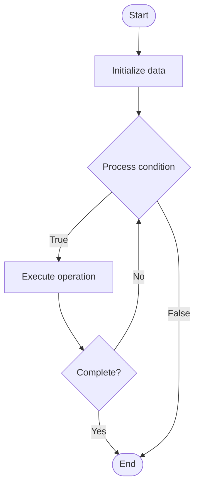

# Parallel Prefix (Scan)

## Учебные материалы

- [Школьный уровень](school.ru.md)
- [Университетский уровень](univer.ru.md)

## Algorithm Visualization

### Flowchart (ASCII)

```
Parallel Prefix (Scan) Flowchart:

┌─────────────┐
│   Start     │
└──────┬──────┘
       │
       ▼
┌─────────────┐
│  Initialize │
│   data      │
└──────┬──────┘
       │
       ▼
┌─────────────┐      Yes
│  Process   ├──────┐
│  condition?│      │
└──────┬──────┘      │
       │ No          │
       ▼             │
┌─────────────┐      │
│  Execute   │      │
│  operation │      │
└──────┬──────┘      │
       │             │
       └─────────────┘
       │
       ▼
┌─────────────┐
│    End      │
└─────────────┘
```

### Step-by-Step Execution

```
Parallel Prefix (Scan) Step-by-Step Execution:

Input: [example data]

Step 1: Initialize
State: [initial state]

Step 2: Process
State: [intermediate state]

Step 3: Finalize
State: [final state]

Result: [output]
```

### Interactive Flowchart (Mermaid)



> **Note**: Mermaid diagrams are rendered automatically on GitHub. For local viewing, use a Mermaid-compatible Markdown viewer.

- [Python Implementation](/code/semester_09/lecture_58_parallel_computing/parallel_prefix/algorithm.py)
- [Java Implementation](/code/semester_09/lecture_58_parallel_computing/parallel_prefix/Algorithm.java)
- [Python Tests](/code/semester_09/lecture_58_parallel_computing/parallel_prefix/test_algorithm.py)

   Parallel Prefix (Scan)

What problem does it solve? (1 sentence)  
Computes all prefix sums (or other associative operations) of an array in parallel, enabling efficient parallel computation of cumulative operations like running sums, maximums, or products.

Intuition (plain-language explanation)  
   Like calculating running totals in parallel: parallel prefix is like calculating running totals for a list of numbers, but doing it in parallel - instead of calculating each total sequentially (1, 1+2, 1+2+3, ...), you use a tree structure where you combine results at different levels, allowing multiple calculations to happen simultaneously - it's like having multiple people calculate different parts of the running totals and then combining their results.

Inputs & Outputs  

  - Input: Array of values, associative binary operation (addition, multiplication, maximum, etc.), number of processors.  
  - Output: Prefix array (scan results), parallel computation, cumulative values.

Step-by-step description (5–10 lines max)  
Up-sweep: build binary tree, compute partial results bottom-up (upward pass).
Combine: at each level, combine results from left and right subtrees.
Store: store intermediate results in tree nodes.
Down-sweep: propagate results top-down (downward pass).
Distribute: distribute prefix values to appropriate positions.
Compute: compute final prefix values using tree structure.
Parallelize: execute tree operations in parallel across processors.
Combine: combine results from parallel execution.
Output: return prefix array with all cumulative values.

Tiny example (hand-simulated)  
   Parallel prefix: array [1, 2, 3, 4, 5] → up-sweep: build tree, compute sums → level 1: 1, 2, 3, 4, 5 → level 2: 3, 7, 5 → level 3: 10, 5 → root: 15 → down-sweep: propagate → prefix sums: [1, 3, 6, 10, 15] → parallel execution → O(log n) time with n processors.

Time & Space Complexity  

  - Time: O(log n) with n processors, O(n) with single processor where n is array size.  
  - Space: O(n) where n is array size (tree structure and output array).

Strengths  

- Efficiency: O(log n) parallel time complexity.
- Versatility: works with any associative operation.
- Scalability: scales well with number of processors.

Weaknesses / limitations  

- Complexity: algorithm is more complex than sequential scan.
- Overhead: tree construction and communication overhead.
- Associativity: requires associative operation (not all operations are associative).

Compare with alternatives  
    Alternatives: Sequential Scan, Parallel Reduction, Tree-based Algorithms, Recursive Doubling

30-second explanation (your own words)  
Computes all prefix sums (or other associative operations) of an array in parallel, enabling efficient parallel computation of cumulative operations like running sums, maximums, or products.

*Sources: Adapted from standard university textbooks and Wikipedia summaries.*


## References

- [Parallel Prefix - Wikipedia](https://en.wikipedia.org/wiki/Parallel%20Prefix)
