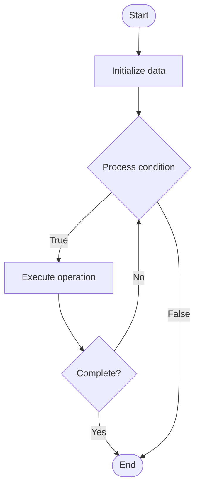

# Parallel Reduction

## Учебные материалы

- [Школьный уровень](school.ru.md)
- [Университетский уровень](univer.ru.md)

## Algorithm Visualization

### Flowchart (ASCII)

```
Parallel Reduction Flowchart:

┌─────────────┐
│   Start     │
└──────┬──────┘
       │
       ▼
┌─────────────┐
│  Initialize │
│   data      │
└──────┬──────┘
       │
       ▼
┌─────────────┐      Yes
│  Process   ├──────┐
│  condition?│      │
└──────┬──────┘      │
       │ No          │
       ▼             │
┌─────────────┐      │
│  Execute   │      │
│  operation │      │
└──────┬──────┘      │
       │             │
       └─────────────┘
       │
       ▼
┌─────────────┐
│    End      │
└─────────────┘
```

### Step-by-Step Execution

```
Parallel Reduction Step-by-Step Execution:

Input: [example data]

Step 1: Initialize
State: [initial state]

Step 2: Process
State: [intermediate state]

Step 3: Finalize
State: [final state]

Result: [output]
```

### Interactive Flowchart (Mermaid)



> **Note**: Mermaid diagrams are rendered automatically on GitHub. For local viewing, use a Mermaid-compatible Markdown viewer.

- [Python Implementation](/code/semester_09/lecture_58_parallel_computing/parallel_reduction/algorithm.py)
- [Java Implementation](/code/semester_09/lecture_58_parallel_computing/parallel_reduction/Algorithm.java)
- [Python Tests](/code/semester_09/lecture_58_parallel_computing/parallel_reduction/test_algorithm.py)

What problem does it solve? (1 sentence)  
   Computes a single aggregate value (sum, product, maximum, etc.) from an array by combining all elements using an associative operation, executing the reduction in parallel across multiple processors.

Intuition (plain-language explanation)  
   Like a tournament bracket: parallel reduction is like a tournament where you start with many players (array elements), pair them up (combine pairs), winners advance (results), and you keep pairing until one winner remains (final result) - but instead of one match at a time, all matches at each level happen simultaneously (in parallel), making it much faster - the final winner is your aggregate result (sum, max, etc.).

Inputs & Outputs  

  - Input: Array of values, associative binary operation (addition, multiplication, maximum, minimum, etc.), number of processors.  
  - Output: Single aggregate value, parallel computation result, reduced value.

Step-by-step description (5–10 lines max)  
Partition: divide array into chunks, assign to processors.
Local reduce: each processor reduces its chunk to a single value.
Combine: combine results from all processors using tree structure.
Pair: pair up results and combine them.
Repeat: repeat pairing and combining until one value remains.
Parallelize: execute all operations at each level in parallel.
Synchronize: synchronize processors between levels.
Output: return final aggregated value.

Tiny example (hand-simulated)  
   Parallel reduction: array [1, 2, 3, 4, 5, 6, 7, 8], sum → level 1: [1+2, 3+4, 5+6, 7+8] = [3, 7, 11, 15] (parallel) → level 2: [3+7, 11+15] = [10, 26] (parallel) → level 3: [10+26] = [36] → result: 36 → O(log n) time with n processors → parallel reduction.

Time & Space Complexity  

  - Time: O(log n) with n processors, O(n) with single processor where n is array size.  
  - Space: O(n) where n is array size (intermediate results storage).

Strengths  

- Efficiency: O(log n) parallel time complexity.
- Scalability: scales well with number of processors.
- Versatility: works with any associative operation.

Weaknesses / limitations  

- Associativity: requires associative operation.
- Overhead: synchronization overhead between levels.
- Load balancing: requires careful load balancing for optimal performance.

Compare with alternatives  
    Alternatives: Sequential Reduction, Tree-based Reduction, MapReduce, Distributed Reduction

30-second explanation (your own words)  
    Computes a single aggregate value (sum, product, maximum, etc.) from an array by combining all elements using an associative operation, executing the reduction in parallel across multiple processors.

*Sources: Adapted from standard university textbooks and Wikipedia summaries.*


## References

- [Parallel Reduction - Wikipedia](https://en.wikipedia.org/wiki/Parallel%20Reduction)
