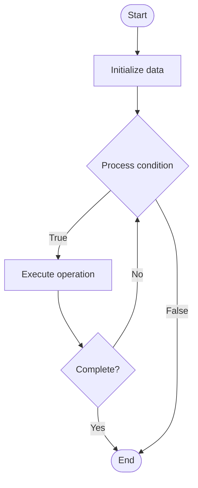

# SIMD Optimization

Name of Algorithm  

## Code Files


## Algorithm Visualization

### Flowchart (ASCII)


```
SIMD Optimization Flowchart:

┌─────────────┐
│   Start     │
└──────┬──────┘
       │
       ▼
┌─────────────┐
│  Initialize │
│   data      │
└──────┬──────┘
       │
       ▼
┌─────────────┐      Yes
│  Process   ├──────┐
│  condition?│      │
└──────┬──────┘      │
       │ No          │
       ▼             │
┌─────────────┐      │
│  Execute   │      │
│  operation │      │
└──────┬──────┘      │
       │             │
       └─────────────┘
       │
       ▼
┌─────────────┐
│    End      │
└─────────────┘
```


### Step-by-Step Execution


```
SIMD Optimization Step-by-Step Execution:

Input: [example data]

Step 1: Initialize
State: [initial state]

Step 2: Process
State: [intermediate state]

Step 3: Finalize
State: [final state]

Result: [output]
```


### Interactive Flowchart (Mermaid)





> **Note**: Mermaid diagrams are rendered automatically on GitHub. For local viewing, use a Mermaid-compatible Markdown viewer.
- [Python Implementation](/code/semester_09/lecture_58_parallel_computing/simd_optimization/algorithm.py)
- [Java Implementation](/code/semester_09/lecture_58_parallel_computing/simd_optimization/Algorithm.java)
- [Python Tests](/code/semester_09/lecture_58_parallel_computing/simd_optimization/test_algorithm.py)


   SIMD Optimization

What problem does it solve? (1 sentence)  
   Utilizes Single Instruction, Multiple Data (SIMD) instructions to perform the same operation on multiple data elements simultaneously, accelerating vectorized computations on modern CPUs.

Intuition (plain-language explanation)  
   Like a production line: SIMD optimization is like a production line where one instruction (like 'add 5') is applied to multiple items (data elements) simultaneously - instead of adding 5 to each number one by one (scalar), you load 8 numbers into a wide register (vector), add 5 to all 8 at once (SIMD instruction), and get 8 results - it's like having a wide paintbrush that paints 8 pixels at once instead of painting them one by one.

Inputs & Outputs  
   - Input: Vector data, SIMD instructions, data alignment, vector width, computation patterns.  
   - Output: Vectorized computation, accelerated processing, improved throughput, optimized performance.

Step-by-step description (5–10 lines max)  
Identify vectorization: identify operations that can be vectorized (same operation on multiple elements).
Check alignment: ensure data is properly aligned for SIMD operations.
Load vectors: load multiple data elements into SIMD registers (128-bit, 256-bit, 512-bit).
Execute SIMD: execute SIMD instruction on vector (add, multiply, compare, etc.).
Store results: store vector results back to memory.
Handle remainder: process remaining elements that don't fit in vector (scalar loop).
Optimize: optimize memory access patterns, minimize data movement, use fused operations.
Compile: use compiler auto-vectorization or explicit SIMD intrinsics.
Measure: benchmark performance improvement over scalar code.
Tune: adjust vectorization strategy based on hardware and data characteristics.

Tiny example (hand-simulated)  
   SIMD optimization: add arrays A + B = C, 1000 elements → scalar: loop 1000 times, 1 add per iteration → SIMD: load 8 elements of A and B into 256-bit registers → add 8 elements at once → store 8 results → repeat 125 times (1000/8) → remainder: process last 0 elements → speedup: 6-8x faster → SIMD optimization.

Time & Space Complexity  
   - Time: O(n/v) where n is data size, v is vector width (theoretical), actual depends on memory bandwidth and instruction throughput.  
   - Space: O(n) where n is data size (same as scalar, but may require alignment padding).

Strengths  
- Performance: significant speedup for vectorizable operations (4-8x typical).
- Efficiency: better utilization of CPU execution units.
- Widely available: SIMD instructions available on most modern CPUs.

Weaknesses / limitations  
- Suitability: only effective for data-parallel, regular computations.
- Alignment: requires data alignment which may add complexity.
- Portability: SIMD code may not be portable across different CPU architectures.

Compare with alternatives  
    Alternatives: Scalar Code, GPU Computing, Multi-threading, Compiler Auto-vectorization

30-second explanation (your own words)  
    Utilizes Single Instruction, Multiple Data (SIMD) instructions to perform the same operation on multiple data elements simultaneously, accelerating vectorized computations on modern CPUs.

*Sources: Adapted from standard university textbooks and Wikipedia summaries.*
