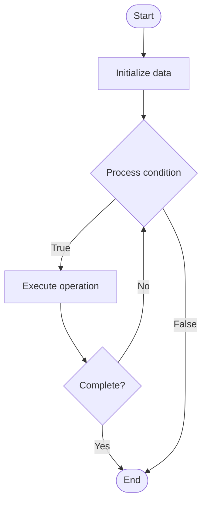

# Vectorization

## Учебные материалы

- [Школьный уровень](school.ru.md)
- [Университетский уровень](univer.ru.md)

## Algorithm Visualization

### Flowchart (ASCII)

```
Vectorization Flowchart:

┌─────────────┐
│   Start     │
└──────┬──────┘
       │
       ▼
┌─────────────┐
│  Initialize │
│   data      │
└──────┬──────┘
       │
       ▼
┌─────────────┐      Yes
│  Process   ├──────┐
│  condition?│      │
└──────┬──────┘      │
       │ No          │
       ▼             │
┌─────────────┐      │
│  Execute   │      │
│  operation │      │
└──────┬──────┘      │
       │             │
       └─────────────┘
       │
       ▼
┌─────────────┐
│    End      │
└─────────────┘
```

### Step-by-Step Execution

```
Vectorization Step-by-Step Execution:

Input: [example data]

Step 1: Initialize
State: [initial state]

Step 2: Process
State: [intermediate state]

Step 3: Finalize
State: [final state]

Result: [output]
```

### Interactive Flowchart (Mermaid)



> **Note**: Mermaid diagrams are rendered automatically on GitHub. For local viewing, use a Mermaid-compatible Markdown viewer.

- [Python Implementation](/code/semester_09/lecture_58_parallel_computing/vectorization/algorithm.py)
- [Java Implementation](/code/semester_09/lecture_58_parallel_computing/vectorization/Algorithm.java)
- [Python Tests](/code/semester_09/lecture_58_parallel_computing/vectorization/test_algorithm.py)

What problem does it solve? (1 sentence)  
   Transforms scalar operations (operating on single values) into vector operations (operating on multiple values simultaneously), enabling SIMD instructions and compiler optimizations to improve performance.

Intuition (plain-language explanation)  
   Like processing items in batches: vectorization is like processing items in batches instead of one at a time - instead of adding 5 to each number individually (scalar: add 5 to number 1, then add 5 to number 2, ...), you load multiple numbers into a wide register and add 5 to all of them at once (vector: add 5 to numbers 1-8 simultaneously) - it's like using a wide brush to paint multiple pixels at once instead of painting them one by one.

Inputs & Outputs  

  - Input: Scalar code, loops, data arrays, computation patterns, vector width.  
  - Output: Vectorized code, SIMD instructions, improved performance, parallelized operations.

Step-by-step description (5–10 lines max)  
Identify loops: find loops with independent iterations.
Check dependencies: verify no data dependencies between iterations.
Analyze operations: identify operations that can be vectorized.
Transform: convert scalar operations to vector operations.
Use SIMD: generate or use SIMD instructions (SSE, AVX, NEON).
Handle alignment: ensure data alignment for SIMD operations.
Process vectors: process multiple elements per iteration.
Handle remainder: process remaining elements that don't fit in vector.
Optimize: optimize memory access patterns for vectorization.
Measure: benchmark performance improvement.

Tiny example (hand-simulated)  
   Vectorization: scalar loop: for i in range(1000): C[i] = A[i] + B[i] → vectorized: load 8 elements of A and B → add 8 elements at once → store 8 results → repeat 125 times → remainder: process last 0 elements → speedup: 6-8x → vectorization successful.

Time & Space Complexity  

  - Time: O(n/v) where n is data size, v is vector width (theoretical), actual depends on memory bandwidth.  
  - Space: O(n) where n is data size (same as scalar, may require alignment padding).

Strengths  

- Performance: significant speedup for vectorizable code (4-8x typical).
- Efficiency: better CPU utilization and instruction throughput.
- Compiler support: modern compilers can auto-vectorize many loops.

Weaknesses / limitations  

- Suitability: only effective for data-parallel, regular computations.
- Dependencies: data dependencies prevent vectorization.
- Alignment: requires data alignment which may add complexity.

Compare with alternatives  
    Alternatives: Scalar Code, Manual SIMD, GPU Computing, Multi-threading

30-second explanation (your own words)  
    Transforms scalar operations (operating on single values) into vector operations (operating on multiple values simultaneously), enabling SIMD instructions and compiler optimizations to improve performance.

*Sources: Adapted from standard university textbooks and Wikipedia summaries.*


## References

- [Vectorization](https://en.wikipedia.org/wiki/Vectorization) - Wikipedia
