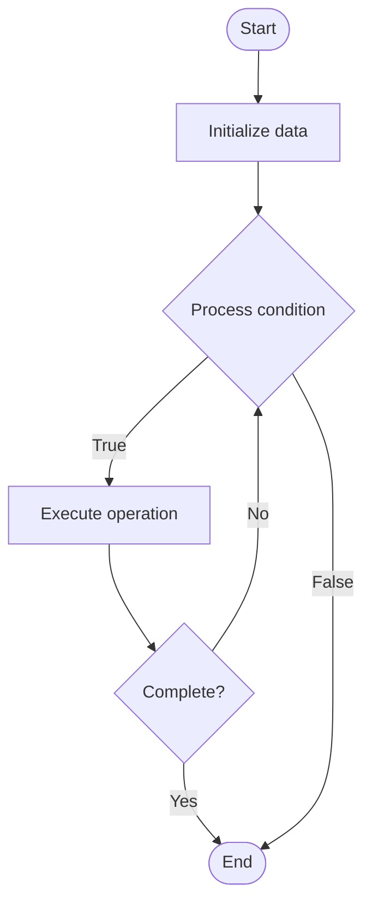

# Byzantine Fault Tolerance (BFT)

## Учебные материалы

- [Школьный уровень](school.ru.md)
- [Университетский уровень](univer.ru.md)

## Algorithm Visualization

### Flowchart (ASCII)

```
Byzantine Fault Tolerance (BFT) Flowchart:

┌─────────────┐
│   Start     │
└──────┬──────┘
       │
       ▼
┌─────────────┐
│  Initialize │
│   data      │
└──────┬──────┘
       │
       ▼
┌─────────────┐      Yes
│  Process   ├──────┐
│  condition?│      │
└──────┬──────┘      │
       │ No          │
       ▼             │
┌─────────────┐      │
│  Execute   │      │
│  operation │      │
└──────┬──────┘      │
       │             │
       └─────────────┘
       │
       ▼
┌─────────────┐
│    End      │
└─────────────┘
```

### Step-by-Step Execution

```
Byzantine Fault Tolerance (BFT) Step-by-Step Execution:

Input: [example data]

Step 1: Initialize
State: [initial state]

Step 2: Process
State: [intermediate state]

Step 3: Finalize
State: [final state]

Result: [output]
```

### Interactive Flowchart (Mermaid)



> **Note**: Mermaid diagrams are rendered automatically on GitHub. For local viewing, use a Mermaid-compatible Markdown viewer.

- [Python Implementation](/code/semester_09/lecture_59_distributed_systems_advanced/byzantine_fault_tolerance/algorithm.py)
- [Java Implementation](/code/semester_09/lecture_59_distributed_systems_advanced/byzantine_fault_tolerance/Algorithm.java)
- [Python Tests](/code/semester_09/lecture_59_distributed_systems_advanced/byzantine_fault_tolerance/test_algorithm.py)

   Byzantine Fault Tolerance (BFT)

What problem does it solve? (1 sentence)  
   Enables distributed systems to reach consensus and maintain correctness even when some nodes are Byzantine (arbitrarily faulty, malicious, or compromised), tolerating up to f faulty nodes in a system of 3f+1 nodes.

Intuition (plain-language explanation)  
   Like a group decision with untrustworthy members: Byzantine fault tolerance is like making a group decision when some members might lie, cheat, or act maliciously - you need enough honest members (2f+1 out of 3f+1) to outvote the faulty ones (f) - even if faulty members send conflicting messages to different people (like a traitor telling different lies to different allies), the honest majority can still reach the correct decision through voting and message verification.

Inputs & Outputs  

  - Input: Node messages, proposals, votes, system of 3f+1 nodes, f faulty nodes.  
  - Output: Consensus decision, agreement among honest nodes, fault-tolerant system.

Step-by-step description (5–10 lines max)  
Propose: a node proposes a value to all nodes.
Broadcast: nodes broadcast messages to all other nodes.
Collect: each node collects messages from other nodes.
Verify: nodes verify message authenticity and consistency.
Vote: nodes vote on proposed values.
Count: count votes, need 2f+1 votes for agreement.
Decide: if 2f+1 nodes agree, system reaches consensus.
Tolerate: system tolerates up to f Byzantine faults.
Verify: verify final decision is correct despite faulty nodes.
Commit: commit decision that all honest nodes agree on.

Tiny example (hand-simulated)  
   BFT system: 4 nodes (f=1, need 3f+1=4) → node 1 proposes value X → all nodes broadcast → node 2 (Byzantine) sends X to node 3, Y to node 4 → nodes collect: node 3 gets [X, X, X], node 4 gets [X, X, Y] → voting: 3 nodes vote X → consensus: X (2f+1=3 votes) → Byzantine node cannot break consensus → BFT achieved.

Time & Space Complexity  

  - Time: O(n²) message complexity where n is number of nodes (all-to-all communication).  
  - Space: O(n) where n is number of nodes (message storage per node).

Strengths  

- Security: tolerates malicious and arbitrary faults.
- Correctness: ensures correctness even with Byzantine nodes.
- Resilience: provides strong fault tolerance guarantees.

Weaknesses / limitations  

- Overhead: high message complexity (O(n²) messages).
- Scalability: requires 3f+1 nodes (more nodes than crash fault tolerance).
- Complexity: more complex than crash fault tolerance algorithms.

Compare with alternatives  
    Alternatives: Crash Fault Tolerance, Raft, PBFT, Tendermint

30-second explanation (your own words)  
    Enables distributed systems to reach consensus and maintain correctness even when some nodes are Byzantine (arbitrarily faulty, malicious, or compromised), tolerating up to f faulty nodes in a system of 3f+1 nodes.

*Sources: Adapted from standard university textbooks and Wikipedia summaries.*


## Historical Context

A Byzantine fault is a condition of a system, particularly a distributed computing system, where a fault occurs such that different symptoms are presented to different observers, including imperfect information on whether a system component has failed. The term takes its name from an allegory, the "


## References

- [Byzantine fault](https://en.wikipedia.org/wiki/Byzantine_fault) - Wikipedia
