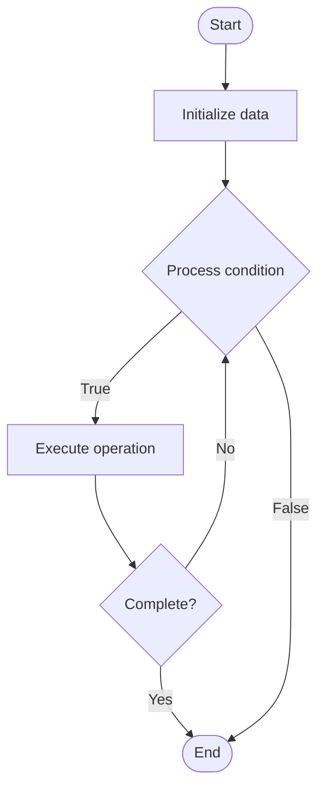

# Consensus Algorithms

## Учебные материалы

- [Школьный уровень](school.ru.md)
- [Университетский уровень](univer.ru.md)

## Algorithm Visualization

### Flowchart (ASCII)

```
Consensus Algorithms Flowchart:

┌─────────────┐
│   Start     │
└──────┬──────┘
       │
       ▼
┌─────────────┐
│  Initialize │
│   data      │
└──────┬──────┘
       │
       ▼
┌─────────────┐      Yes
│  Process   ├──────┐
│  condition?│      │
└──────┬──────┘      │
       │ No          │
       ▼             │
┌─────────────┐      │
│  Execute   │      │
│  operation │      │
└──────┬──────┘      │
       │             │
       └─────────────┘
       │
       ▼
┌─────────────┐
│    End      │
└─────────────┘
```

### Step-by-Step Execution

```
Consensus Algorithms Step-by-Step Execution:

Input: [example data]

Step 1: Initialize
State: [initial state]

Step 2: Process
State: [intermediate state]

Step 3: Finalize
State: [final state]

Result: [output]
```

### Interactive Flowchart (Mermaid)



> **Note**: Mermaid diagrams are rendered automatically on GitHub. For local viewing, use a Mermaid-compatible Markdown viewer.

- [Python Implementation](/code/semester_09/lecture_59_distributed_systems_advanced/consensus_algorithms/algorithm.py)
- [Java Implementation](/code/semester_09/lecture_59_distributed_systems_advanced/consensus_algorithms/Algorithm.java)
- [Python Tests](/code/semester_09/lecture_59_distributed_systems_advanced/consensus_algorithms/test_algorithm.py)

What problem does it solve? (1 sentence)  
   Enables multiple distributed nodes to agree on a single value or decision despite network failures, node failures, and message delays, ensuring consistency in distributed systems.

Intuition (plain-language explanation)  
   Like a group vote: consensus algorithms are like getting a group of people to agree on a decision - even if some people are absent (node failures), messages are delayed (network issues), or people disagree initially, It ensures everyone eventually agrees on the same decision - it's like a democratic process where you need a majority vote, but it handles cases where votes might arrive late or some voters might be unavailable.

Inputs & Outputs  

  - Input: Node proposals, votes, network messages, node states, failure models.  
  - Output: Agreed value, consensus decision, consistent state across nodes.

Step-by-step description (5–10 lines max)  
Propose: nodes propose values they want to agree on.
Communicate: nodes exchange proposals and votes via network.
Collect: each node collects proposals from other nodes.
Vote: nodes vote on proposed values.
Count: count votes, determine if majority reached.
Decide: if majority agrees, nodes decide on agreed value.
Commit: nodes commit to the decided value.
Propagate: propagate decision to all nodes.
Handle failures: tolerate node failures and network partitions.
Ensure safety: guarantee all nodes agree on same value (safety).
Ensure liveness: guarantee system eventually reaches consensus (liveness).

Tiny example (hand-simulated)  
   Consensus: 5 nodes, 3 propose X, 2 propose Y → voting: 3 votes for X, 2 votes for Y → majority: X (3 > 5/2) → decision: all nodes agree on X → commit: all nodes commit X → consistency: all nodes have same value → consensus achieved.

Time & Space Complexity  

  - Time: O(n) to O(n²) depending on algorithm where n is number of nodes.  
  - Space: O(n) where n is number of nodes (state storage per node).

Strengths  

- Consistency: ensures all nodes agree on same value.
- Fault tolerance: tolerates node and network failures.
- Fundamental: essential for distributed systems consistency.

Weaknesses / limitations  

- Latency: may have high latency due to message exchanges.
- Complexity: consensus algorithms can be complex.
- Trade-offs: must balance between safety, liveness, and performance.

Compare with alternatives  
    Alternatives: Raft, Paxos, PBFT, Tendermint, Two-Phase Commit

30-second explanation (your own words)  
    Enables multiple distributed nodes to agree on a single value or decision despite network failures, node failures, and message delays, ensuring consistency in distributed systems.

*Sources: Adapted from standard university textbooks and Wikipedia summaries.*
