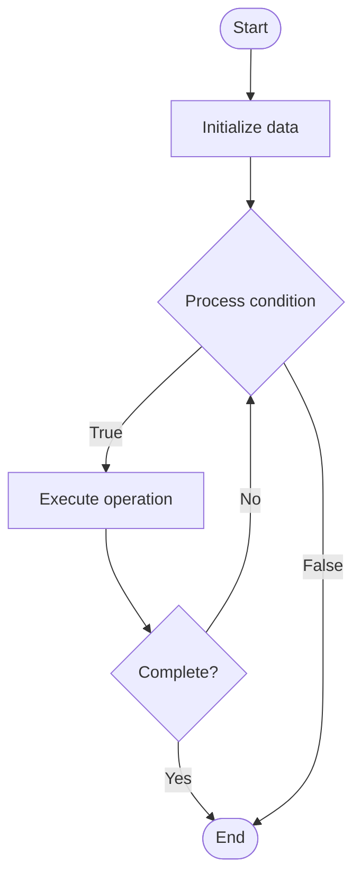

# Conflict-Free Replicated Data Types (CRDTs)

1. **Name of Algorithm**  

## Code Files


## Algorithm Visualization

### Flowchart (ASCII)


```
Conflict-Free Replicated Data Types (CRDTs) Flowchart:

┌─────────────┐
│   Start     │
└──────┬──────┘
       │
       ▼
┌─────────────┐
│  Initialize │
│   data      │
└──────┬──────┘
       │
       ▼
┌─────────────┐      Yes
│  Process   ├──────┐
│  condition?│      │
└──────┬──────┘      │
       │ No          │
       ▼             │
┌─────────────┐      │
│  Execute   │      │
│  operation │      │
└──────┬──────┘      │
       │             │
       └─────────────┘
       │
       ▼
┌─────────────┐
│    End      │
└─────────────┘
```


### Step-by-Step Execution


```
Conflict-Free Replicated Data Types (CRDTs) Step-by-Step Execution:

Input: [example data]

Step 1: Initialize
State: [initial state]

Step 2: Process
State: [intermediate state]

Step 3: Finalize
State: [final state]

Result: [output]
```


### Interactive Flowchart (Mermaid)





> **Note**: Mermaid diagrams are rendered automatically on GitHub. For local viewing, use a Mermaid-compatible Markdown viewer.
- [Python Implementation](semester_09/lecture_59_distributed_systems_advanced/crdt/algorithm.py)
- [Java Implementation](semester_09/lecture_59_distributed_systems_advanced/crdt/Algorithm.java)
- [Python Tests](semester_09/lecture_59_distributed_systems_advanced/crdt/test_algorithm.py)


   Conflict-Free Replicated Data Types (CRDTs)

2. **What problem does it solve? (1 sentence)**  
   Provides data structures that automatically resolve conflicts in distributed systems without coordination, enabling eventual consistency through mathematical properties (commutativity, associativity, idempotency).

3. **Intuition (plain-language explanation)**  
   Like a shared document that auto-merges: CRDTs are like a shared document where multiple people can edit simultaneously, and the system automatically merges changes without conflicts - even if two people edit the same paragraph at the same time, the CRDT ensures both edits are preserved and merged correctly - it's like having a smart merge that always works, no matter what order changes arrive in, because the operations are designed to be commutative (order doesn't matter).

4. **Inputs & Outputs**  
   - Input: Operations (add, remove, update), replicas, operation timestamps, vector clocks.  
   - Output: Merged state, conflict-free replication, eventual consistency, convergent data.

5. **Step-by-step description (5–10 lines max)**  
1. Define CRDT: choose appropriate CRDT type (G-Counter, PN-Counter, G-Set, OR-Set, etc.).
2. Apply locally: apply operation to local replica immediately.
3. Tag operation: tag operation with metadata (timestamp, vector clock, unique ID).
4. Replicate: send operation to other replicas asynchronously.
5. Receive: receive operations from other replicas.
6. Merge: merge received operations into local state (commutative merge).
7. Resolve: automatically resolve conflicts using CRDT properties.
8. Converge: all replicas converge to same state eventually.
9. Query: query CRDT state (always returns consistent view).
10. Validate: ensure CRDT properties maintained (commutativity, associativity, idempotency).

6. **Tiny example (hand-simulated)**  
   CRDT: G-Counter (grow-only counter) → replica A: increment by 5 → replica B: increment by 3 → merge: A gets +3, B gets +5 → both converge to 8 → commutative: order doesn't matter → conflict-free: no coordination needed → CRDT ensures consistency.

7. **Time & Space Complexity**  
   - Time: O(1) for operations, O(n) for merge where n is number of replicas or operations.  
   - Space: O(r) or O(o) depending on CRDT type where r is replicas, o is operations (metadata overhead).

8. **Strengths**  
- No coordination: operations don't require coordination between replicas.
- Automatic merge: conflicts resolved automatically without manual intervention.
- Low latency: local operations are immediate (no network wait).

9. **Weaknesses / limitations**  
- Limited operations: not all operations can be expressed as CRDTs.
- Metadata overhead: CRDTs may require metadata (timestamps, vector clocks).
- Complexity: some CRDT types are complex to understand and implement.

10. **Compare with alternatives**  
    Alternatives: Eventual Consistency, Strong Consistency, Operational Transformation, Last-Write-Wins

11. **30-second explanation (your own words)**  
    Provides data structures that automatically resolve conflicts in distributed systems without coordination, enabling eventual consistency through mathematical properties (commutativity, associativity, idempotency).

*Sources: Adapted from standard university textbooks and Wikipedia summaries.*
