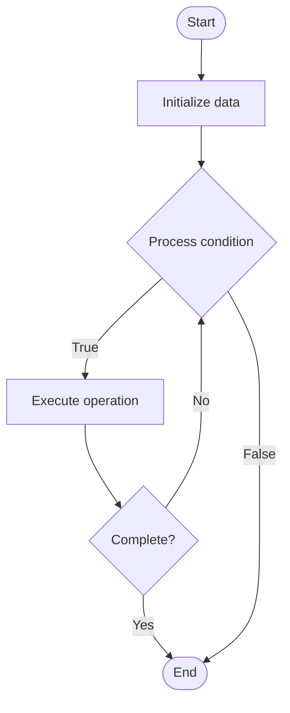

# Distributed Transactions

1. **Name of Algorithm**  

## Code Files


## Algorithm Visualization

### Flowchart (ASCII)


```
Distributed Transactions Flowchart:

┌─────────────┐
│   Start     │
└──────┬──────┘
       │
       ▼
┌─────────────┐
│  Initialize │
│   data      │
└──────┬──────┘
       │
       ▼
┌─────────────┐      Yes
│  Process   ├──────┐
│  condition?│      │
└──────┬──────┘      │
       │ No          │
       ▼             │
┌─────────────┐      │
│  Execute   │      │
│  operation │      │
└──────┬──────┘      │
       │             │
       └─────────────┘
       │
       ▼
┌─────────────┐
│    End      │
└─────────────┘
```


### Step-by-Step Execution


```
Distributed Transactions Step-by-Step Execution:

Input: [example data]

Step 1: Initialize
State: [initial state]

Step 2: Process
State: [intermediate state]

Step 3: Finalize
State: [final state]

Result: [output]
```


### Interactive Flowchart (Mermaid)





> **Note**: Mermaid diagrams are rendered automatically on GitHub. For local viewing, use a Mermaid-compatible Markdown viewer.
- [Python Implementation](semester_09/lecture_59_distributed_systems_advanced/distributed_transactions/algorithm.py)
- [Java Implementation](semester_09/lecture_59_distributed_systems_advanced/distributed_transactions/Algorithm.java)
- [Python Tests](semester_09/lecture_59_distributed_systems_advanced/distributed_transactions/test_algorithm.py)


   Distributed Transactions

2. **What problem does it solve? (1 sentence)**  
   Ensures atomicity and consistency of transactions that span multiple distributed databases or services, coordinating commit or abort decisions across all participants.

3. **Intuition (plain-language explanation)**  
   Like a group purchase: distributed transactions are like a group purchase where everyone must agree - if you're buying something that requires payment from multiple people (distributed resources), either everyone pays (commit) or no one pays (abort) - you can't have a situation where some pay and others don't (partial commit) - the transaction coordinator ensures all participants agree before finalizing the transaction.

4. **Inputs & Outputs**  
   - Input: Transaction operations, distributed resources, participants, coordinator, transaction ID.  
   - Output: Committed or aborted transaction, consistent state across all participants, transaction result.

5. **Step-by-step description (5–10 lines max)**  
1. Begin: start distributed transaction, assign transaction ID.
2. Execute: execute operations on distributed resources (databases, services).
3. Prepare: coordinator sends prepare message to all participants.
4. Vote: each participant votes commit (ready) or abort (not ready).
5. Collect: coordinator collects votes from all participants.
6. Decide: if all vote commit, coordinator decides commit, else abort.
7. Commit/Abort: coordinator sends commit or abort message to all participants.
8. Acknowledge: participants acknowledge commit/abort completion.
9. Complete: transaction completes, all participants have consistent state.
10. Handle failures: handle participant or coordinator failures (two-phase commit, three-phase commit).

6. **Tiny example (hand-simulated)**  
   Distributed transaction: transfer $100 from Bank A to Bank B → begin transaction → debit $100 from Bank A → credit $100 to Bank B → prepare: both banks vote commit → decide: coordinator decides commit → commit: both banks commit → result: $100 transferred atomically → if Bank B fails: abort, Bank A rollback → atomicity maintained.

7. **Time & Space Complexity**  
   - Time: O(n) where n is number of participants (message rounds: prepare, commit/abort).  
   - Space: O(n) where n is number of participants (transaction state per participant).

8. **Strengths**  
- Atomicity: ensures all-or-nothing execution across distributed resources.
- Consistency: maintains consistency across distributed systems.
- Reliability: provides strong guarantees for distributed operations.

9. **Weaknesses / limitations**  
- Latency: high latency due to multiple message rounds.
- Blocking: participants may block waiting for coordinator.
- Complexity: handling failures and recovery is complex.

10. **Compare with alternatives**  
    Alternatives: Saga Pattern, Eventual Consistency, Compensating Transactions, Two-Phase Commit

11. **30-second explanation (your own words)**  
    Ensures atomicity and consistency of transactions that span multiple distributed databases or services, coordinating commit or abort decisions across all participants.

*Sources: Adapted from standard university textbooks and Wikipedia summaries.*
