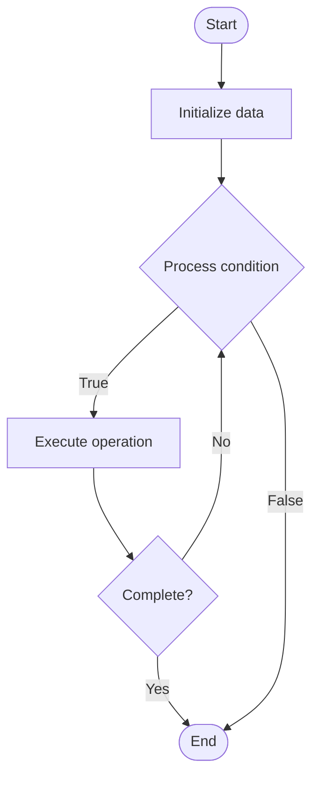

# Eventual Consistency

## Учебные материалы

- [Школьный уровень](school.ru.md)
- [Университетский уровень](univer.ru.md)

## Algorithm Visualization

### Flowchart (ASCII)

```
Eventual Consistency Flowchart:

┌─────────────┐
│   Start     │
└──────┬──────┘
       │
       ▼
┌─────────────┐
│  Initialize │
│   data      │
└──────┬──────┘
       │
       ▼
┌─────────────┐      Yes
│  Process   ├──────┐
│  condition?│      │
└──────┬──────┘      │
       │ No          │
       ▼             │
┌─────────────┐      │
│  Execute   │      │
│  operation │      │
└──────┬──────┘      │
       │             │
       └─────────────┘
       │
       ▼
┌─────────────┐
│    End      │
└─────────────┘
```

### Step-by-Step Execution

```
Eventual Consistency Step-by-Step Execution:

Input: [example data]

Step 1: Initialize
State: [initial state]

Step 2: Process
State: [intermediate state]

Step 3: Finalize
State: [final state]

Result: [output]
```

### Interactive Flowchart (Mermaid)



> **Note**: Mermaid diagrams are rendered automatically on GitHub. For local viewing, use a Mermaid-compatible Markdown viewer.

- [Python Implementation](/code/semester_09/lecture_59_distributed_systems_advanced/eventual_consistency/algorithm.py)
- [Java Implementation](/code/semester_09/lecture_59_distributed_systems_advanced/eventual_consistency/Algorithm.java)
- [Python Tests](/code/semester_09/lecture_59_distributed_systems_advanced/eventual_consistency/test_algorithm.py)

What problem does it solve? (1 sentence)  
   Allows distributed systems to have temporary inconsistencies between replicas, with the guarantee that all replicas will eventually converge to the same consistent state without requiring immediate synchronization.

Intuition (plain-language explanation)  
   Like syncing files across devices: eventual consistency is like syncing files across your phone, laptop, and cloud - if you edit a file on your phone, it might take a few seconds for the change to appear on your laptop (temporary inconsistency), but eventually all devices will have the same version (eventual consistency) - you don't wait for all devices to sync before continuing (no immediate synchronization), which makes the system faster and more available.

Inputs & Outputs  

  - Input: Updates, replicas, replication mechanism, conflict resolution strategy, time.  
  - Output: Eventually consistent state, replicated data, converged replicas, consistent final state.

Step-by-step description (5–10 lines max)  
Update locally: apply update to local replica immediately (no wait).
Replicate: asynchronously replicate update to other replicas.
Propagate: updates propagate through network to all replicas.
Apply: each replica applies received updates.
Resolve conflicts: resolve conflicts if updates conflict (last-write-wins, CRDTs, etc.).
Converge: replicas gradually converge to same state.
Eventually consistent: after propagation time, all replicas have consistent state.
Handle partitions: handle network partitions gracefully (continue operating, sync when reconnected).
Monitor: monitor replication lag and convergence.
Guarantee: guarantee eventual consistency (all replicas converge eventually).

Tiny example (hand-simulated)  
   Eventual consistency: 3 replicas → user updates data on replica A → replica A: updated immediately → replicate: update sent to replicas B and C asynchronously → replica B: receives update after 100ms → replica C: receives update after 200ms → eventually: all replicas have same data → temporary inconsistency: 0-200ms → eventual consistency: after 200ms → high availability maintained.

Time & Space Complexity  

  - Time: O(1) for local updates, O(n) for replication where n is number of replicas.  
  - Space: O(n) where n is number of replicas (each replica stores full copy).

Strengths  

- Availability: high availability (no blocking on network delays).
- Performance: low latency for local operations.
- Scalability: scales well to many replicas and geographic distribution.

Weaknesses / limitations  

- Temporary inconsistency: replicas may have different values temporarily.
- Conflict resolution: requires conflict resolution strategies.
- Complexity: managing eventual consistency can be complex.

Compare with alternatives  
    Alternatives: Strong Consistency, Weak Consistency, CRDTs, Causal Consistency

30-second explanation (your own words)  
    Allows distributed systems to have temporary inconsistencies between replicas, with the guarantee that all replicas will eventually converge to the same consistent state without requiring immediate synchronization.

*Sources: Adapted from standard university textbooks and Wikipedia summaries.*


## References

- [Eventual consistency](https://en.wikipedia.org/wiki/Eventual_consistency) - Wikipedia
