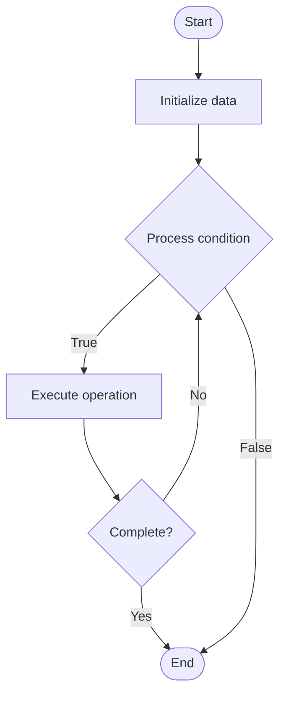

# Vector Clocks

## Учебные материалы

- [Школьный уровень](school.ru.md)
- [Университетский уровень](univer.ru.md)

## Algorithm Visualization

### Flowchart (ASCII)

```
Vector Clocks Flowchart:

┌─────────────┐
│   Start     │
└──────┬──────┘
       │
       ▼
┌─────────────┐
│  Initialize │
│   data      │
└──────┬──────┘
       │
       ▼
┌─────────────┐      Yes
│  Process   ├──────┐
│  condition?│      │
└──────┬──────┘      │
       │ No          │
       ▼             │
┌─────────────┐      │
│  Execute   │      │
│  operation │      │
└──────┬──────┘      │
       │             │
       └─────────────┘
       │
       ▼
┌─────────────┐
│    End      │
└─────────────┘
```

### Step-by-Step Execution

```
Vector Clocks Step-by-Step Execution:

Input: [example data]

Step 1: Initialize
State: [initial state]

Step 2: Process
State: [intermediate state]

Step 3: Finalize
State: [final state]

Result: [output]
```

### Interactive Flowchart (Mermaid)



> **Note**: Mermaid diagrams are rendered automatically on GitHub. For local viewing, use a Mermaid-compatible Markdown viewer.

- [Python Implementation](/code/semester_09/lecture_59_distributed_systems_advanced/vector_clocks/algorithm.py)
- [Java Implementation](/code/semester_09/lecture_59_distributed_systems_advanced/vector_clocks/Algorithm.java)
- [Python Tests](/code/semester_09/lecture_59_distributed_systems_advanced/vector_clocks/test_algorithm.py)

What problem does it solve? (1 sentence)  
   Tracks causal relationships between events in distributed systems by assigning vector timestamps to events, enabling detection of happened-before relationships and causal ordering without global clocks.

Intuition (plain-language explanation)  
   Like a timeline with multiple tracks: vector clocks are like a timeline where each person (node) has their own track, and you mark when events happen on each track - when events from different tracks interact (like sending a message), you combine the timelines - this lets you figure out which events happened before others (causality) even though there's no single global clock - it's like having multiple synchronized watches that track not just time, but also who saw what when.

Inputs & Outputs  

  - Input: Events, node identifiers, messages, vector timestamps, causal relationships.  
  - Output: Vector timestamps, causal ordering, happened-before relationships, event ordering.

Step-by-step description (5–10 lines max)  
Initialize: each node starts with vector clock [0, 0, ..., 0] (one entry per node).
Local event: on local event, increment own clock entry.
Send message: when sending message, include current vector clock.
Receive message: when receiving message, merge with received vector clock.
Update: update own clock entry, and take maximum for each other node's entry.
Compare: compare vector clocks to determine happened-before relationships.
Order: use vector clocks to order events causally.
Detect: detect concurrent events (events with incomparable vector clocks).
Track: track causal dependencies across distributed system.
Use: use for causal consistency, debugging, and event ordering.

Tiny example (hand-simulated)  
   Vector clocks: 3 nodes (A, B, C) → A: event E1, clock [1,0,0] → A sends to B: message with [1,0,0] → B: receives, updates to [1,1,0] → B: event E2, clock [1,2,0] → B sends to C: [1,2,0] → C: receives, updates to [1,2,1] → compare: [1,0,0] < [1,2,0] → E1 happened before E2 → vector clocks track causality.

Time & Space Complexity  

  - Time: O(n) for clock operations where n is number of nodes.  
  - Space: O(n) per event where n is number of nodes (vector size).

Strengths  

- Causality: accurately tracks causal relationships between events.
- No global clock: doesn't require synchronized global clocks.
- Concurrency detection: can detect concurrent events.

Weaknesses / limitations  

- Space: vector size grows with number of nodes.
- Scalability: may not scale well to very large numbers of nodes.
- Complexity: more complex than scalar timestamps.

Compare with alternatives  
    Alternatives: Logical Clocks, Lamport Timestamps, Hybrid Logical Clocks, TrueTime

30-second explanation (your own words)  
    Tracks causal relationships between events in distributed systems by assigning vector timestamps to events, enabling detection of happened-before relationships and causal ordering without global clocks.

*Sources: Adapted from standard university textbooks and Wikipedia summaries.*
