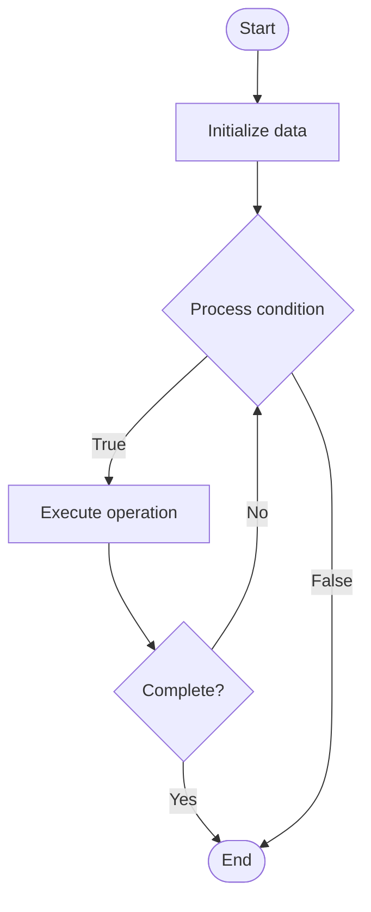

# API Gateway

1. **Name of Algorithm**  

## Code Files


## Algorithm Visualization

### Flowchart (ASCII)


```
API Gateway Flowchart:

┌─────────────┐
│   Start     │
└──────┬──────┘
       │
       ▼
┌─────────────┐
│  Initialize │
│   data      │
└──────┬──────┘
       │
       ▼
┌─────────────┐      Yes
│  Process   ├──────┐
│  condition?│      │
└──────┬──────┘      │
       │ No          │
       ▼             │
┌─────────────┐      │
│  Execute   │      │
│  operation │      │
└──────┬──────┘      │
       │             │
       └─────────────┘
       │
       ▼
┌─────────────┐
│    End      │
└─────────────┘
```


### Step-by-Step Execution


```
API Gateway Step-by-Step Execution:

Input: [example data]

Step 1: Initialize
State: [initial state]

Step 2: Process
State: [intermediate state]

Step 3: Finalize
State: [final state]

Result: [output]
```


### Interactive Flowchart (Mermaid)





> **Note**: Mermaid diagrams are rendered automatically on GitHub. For local viewing, use a Mermaid-compatible Markdown viewer.
- [Python Implementation](semester_09/lecture_60_system_design_advanced/api_gateway/algorithm.py)
- [Java Implementation](semester_09/lecture_60_system_design_advanced/api_gateway/Algorithm.java)
- [Python Tests](semester_09/lecture_60_system_design_advanced/api_gateway/test_algorithm.py)


   API Gateway

2. **What problem does it solve? (1 sentence)**  
   Provides a single entry point for client requests to multiple backend services, handling routing, authentication, rate limiting, and other cross-cutting concerns, simplifying client interactions and service management.

3. **Intuition (plain-language explanation)**  
   Like a receptionist: API Gateway is like a receptionist at a building - instead of clients going directly to each office (service), they go to the receptionist (gateway) who routes them to the right office, checks their ID (authentication), and handles common tasks (rate limiting, logging) - this makes it easier for clients (they only need to know one address) and easier to manage the building (centralized control).

4. **Inputs & Outputs**  
   - Input: Client requests, routing rules, authentication tokens, rate limit policies, service endpoints.  
   - Output: Routed requests, authenticated sessions, rate-limited traffic, aggregated responses, service calls.

5. **Step-by-step description (5–10 lines max)**  
1. Receive request: receive client request at gateway.
2. Authenticate: authenticate client (validate token, check credentials).
3. Authorize: authorize request (check permissions, policies).
4. Rate limit: check and enforce rate limits.
5. Route: route request to appropriate backend service based on URL/path.
6. Transform: optionally transform request (protocol conversion, data format).
7. Forward: forward request to backend service.
8. Aggregate: optionally aggregate responses from multiple services.
9. Transform response: transform response if needed.
10. Return: return response to client.

6. **Tiny example (hand-simulated)**  
   API Gateway: client request: GET /api/users/123 → gateway: authenticate token → authorize: check permissions → rate limit: check quota → route: forward to user-service → service: returns user data → gateway: transform response → return: JSON response to client → API Gateway operational.

7. **Time & Space Complexity**  
   - Time: O(1) for routing and basic operations, O(n) for aggregation where n is number of services.  
   - Space: O(r + c) where r is routing rules, c is cache size (request/response caching).

8. **Strengths**  
- Simplification: simplifies client interactions with multiple services.
- Centralization: centralizes cross-cutting concerns (auth, rate limiting).
- Flexibility: enables service composition and aggregation.

9. **Weaknesses / limitations**  
- Single point of failure: gateway failure affects all services.
- Latency: adds latency to requests (extra hop).
- Complexity: gateway can become complex with many features.

10. **Compare with alternatives**  
    Alternatives: Direct Service Access, Service Mesh, Load Balancer, Reverse Proxy

11. **30-second explanation (your own words)**  
    Provides a single entry point for client requests to multiple backend services, handling routing, authentication, rate limiting, and other cross-cutting concerns, simplifying client interactions and service management.

*Sources: Adapted from standard university textbooks and Wikipedia summaries.*
