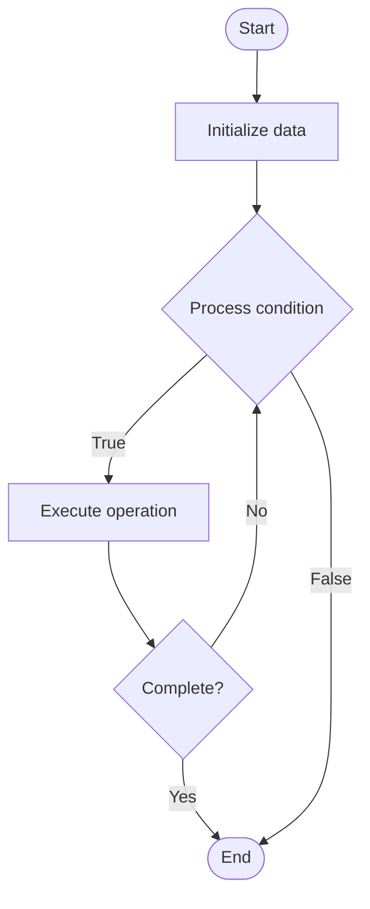

# Advanced CQRS (Command Query Responsibility Segregation)

## Учебные материалы

- [Школьный уровень](school.ru.md)
- [Университетский уровень](univer.ru.md)

## Algorithm Visualization

### Flowchart (ASCII)

```
Advanced CQRS (Command Query Responsibility Segregation) Flowchart:

┌─────────────┐
│   Start     │
└──────┬──────┘
       │
       ▼
┌─────────────┐
│  Initialize │
│   data      │
└──────┬──────┘
       │
       ▼
┌─────────────┐      Yes
│  Process   ├──────┐
│  condition?│      │
└──────┬──────┘      │
       │ No          │
       ▼             │
┌─────────────┐      │
│  Execute   │      │
│  operation │      │
└──────┬──────┘      │
       │             │
       └─────────────┘
       │
       ▼
┌─────────────┐
│    End      │
└─────────────┘
```

### Step-by-Step Execution

```
Advanced CQRS (Command Query Responsibility Segregation) Step-by-Step Execution:

Input: [example data]

Step 1: Initialize
State: [initial state]

Step 2: Process
State: [intermediate state]

Step 3: Finalize
State: [final state]

Result: [output]
```

### Interactive Flowchart (Mermaid)



> **Note**: Mermaid diagrams are rendered automatically on GitHub. For local viewing, use a Mermaid-compatible Markdown viewer.

- [Python Implementation](/code/semester_09/lecture_60_system_design_advanced/cqrs_advanced/algorithm.py)
- [Java Implementation](/code/semester_09/lecture_60_system_design_advanced/cqrs_advanced/Algorithm.java)
- [Python Tests](/code/semester_09/lecture_60_system_design_advanced/cqrs_advanced/test_algorithm.py)

   Advanced CQRS (Command Query Responsibility Segregation)

What problem does it solve? (1 sentence)  
   Separates read and write operations into different models and data stores, enabling independent scaling, optimization, and evolution of read and write sides for complex domain models.

Intuition (plain-language explanation)  
   Like separate libraries: Advanced CQRS is like having separate libraries for reading and writing - the reading library (query side) is optimized for fast lookups with indexes and denormalized data, while the writing library (command side) is optimized for data integrity and business rules - they're separate but synchronized, allowing each to be optimized for its purpose without compromising the other.

Inputs & Outputs  

  - Input: Commands (writes), queries (reads), domain events, read models, write models, synchronization mechanisms.  
  - Output: Separated read/write models, optimized queries, validated commands, synchronized data, scalable architecture.

Step-by-step description (5–10 lines max)  
Separate models: create separate read and write models.
Command side: handle commands (writes) through command handlers.
Validate: validate commands using business rules.
Execute: execute commands and update write model.
Publish events: publish domain events after command execution.
Query side: handle queries (reads) through query handlers.
Project: project events to read models (eventual consistency).
Optimize: optimize read models for query performance (denormalization, indexes).
Synchronize: synchronize read and write models through events.
Scale: scale read and write sides independently.

Tiny example (hand-simulated)  
   Advanced CQRS: command: CreateOrder → command handler: validate, execute → write model: update order aggregate → event: OrderCreated → query side: project event → read model: update order view (denormalized) → query: GetOrders → query handler: read from optimized read model → result: fast queries, optimized writes → Advanced CQRS operational.

Time & Space Complexity  

  - Time: O(1) for writes (command), O(log n) or O(1) for reads (optimized query models).  
  - Space: O(w + r) where w is write model size, r is read model size (separate storage).

Strengths  

- Scalability: enables independent scaling of read and write operations.
- Optimization: allows optimization of each side for its purpose.
- Flexibility: read models can be optimized for specific queries.

Weaknesses / limitations  

- Complexity: more complex than traditional CRUD architecture.
- Consistency: eventual consistency between read and write models.
- Synchronization: requires event handling and synchronization logic.

Compare with alternatives  
    Alternatives: Traditional CRUD, Event Sourcing, Read Replicas, CQRS Basic

30-second explanation (your own words)  
    Separates read and write operations into different models and data stores, enabling independent scaling, optimization, and evolution of read and write sides for complex domain models.

*Sources: Adapted from standard university textbooks and Wikipedia summaries.*


## References

- [Cqrs Advanced - Wikipedia](https://en.wikipedia.org/wiki/Cqrs%20Advanced)
