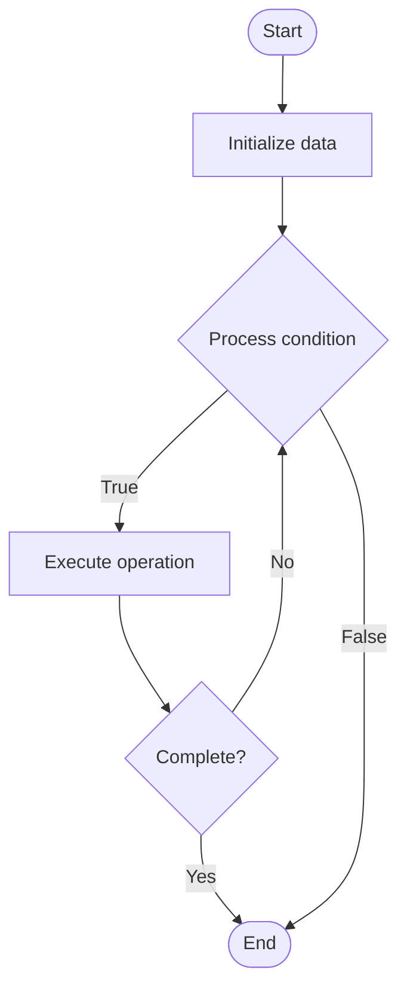

# Event-Driven Architecture

## Учебные материалы

- [Школьный уровень](school.ru.md)
- [Университетский уровень](univer.ru.md)

## Algorithm Visualization

### Flowchart (ASCII)

```
Event-Driven Architecture Flowchart:

┌─────────────┐
│   Start     │
└──────┬──────┘
       │
       ▼
┌─────────────┐
│  Initialize │
│   data      │
└──────┬──────┘
       │
       ▼
┌─────────────┐      Yes
│  Process   ├──────┐
│  condition?│      │
└──────┬──────┘      │
       │ No          │
       ▼             │
┌─────────────┐      │
│  Execute   │      │
│  operation │      │
└──────┬──────┘      │
       │             │
       └─────────────┘
       │
       ▼
┌─────────────┐
│    End      │
└─────────────┘
```

### Step-by-Step Execution

```
Event-Driven Architecture Step-by-Step Execution:

Input: [example data]

Step 1: Initialize
State: [initial state]

Step 2: Process
State: [intermediate state]

Step 3: Finalize
State: [final state]

Result: [output]
```

### Interactive Flowchart (Mermaid)



> **Note**: Mermaid diagrams are rendered automatically on GitHub. For local viewing, use a Mermaid-compatible Markdown viewer.

- [Python Implementation](/code/semester_09/lecture_60_system_design_advanced/event_driven_architecture/algorithm.py)
- [Java Implementation](/code/semester_09/lecture_60_system_design_advanced/event_driven_architecture/Algorithm.java)
- [Python Tests](/code/semester_09/lecture_60_system_design_advanced/event_driven_architecture/test_algorithm.py)

   Event-Driven Architecture

What problem does it solve? (1 sentence)  
   Designs systems where components communicate through events, enabling loose coupling, scalability, and responsiveness to changes, making systems more flexible and resilient.

Intuition (plain-language explanation)  
   Like a news broadcast: Event-Driven Architecture is like a news broadcast system - when something happens (event occurs), it's broadcast to everyone who's interested (subscribers) - they can react independently without knowing about each other - just as news stations broadcast events and listeners tune in to what they care about, event-driven systems broadcast events and services react to what they're interested in, creating a loosely coupled, responsive system.

Inputs & Outputs  

  - Input: Events, event producers, event consumers, event bus/broker, event schemas, routing rules.  
  - Output: Published events, consumed events, reactive behaviors, decoupled services, scalable system.

Step-by-step description (5–10 lines max)  
Define events: define event types and schemas.
Publish: producers publish events to event bus.
Route: event bus routes events to interested consumers.
Subscribe: consumers subscribe to event types they care about.
Receive: consumers receive events from event bus.
Process: consumers process events and perform actions.
React: consumers react to events independently.
Scale: scale producers and consumers independently.
Monitor: monitor event flow and processing.
Handle failures: handle event processing failures (retry, dead letter queue).

Tiny example (hand-simulated)  
   Event-Driven Architecture: user registers → producer: publish UserRegistered event → event bus: route to subscribers → email service: subscribe, send welcome email → analytics service: subscribe, track registration → notification service: subscribe, send notification → services react independently → Event-Driven Architecture operational.

Time & Space Complexity  

  - Time: O(1) for event publishing, O(n) for routing where n is number of subscribers.  
  - Space: O(e + s) where e is event storage, s is subscriber state (event queue per subscriber).

Strengths  

- Decoupling: loose coupling between producers and consumers.
- Scalability: enables horizontal scaling of consumers.
- Responsiveness: systems react to events in real-time.

Weaknesses / limitations  

- Complexity: event flow can be complex to understand and debug.
- Consistency: eventual consistency challenges.
- Event ordering: maintaining event order can be challenging.

Compare with alternatives  
    Alternatives: Request-Response, Message Queue, Publish-Subscribe, Synchronous Communication

30-second explanation (your own words)  
    Designs systems where components communicate through events, enabling loose coupling, scalability, and responsiveness to changes, making systems more flexible and resilient.

*Sources: Adapted from standard university textbooks and Wikipedia summaries.*
