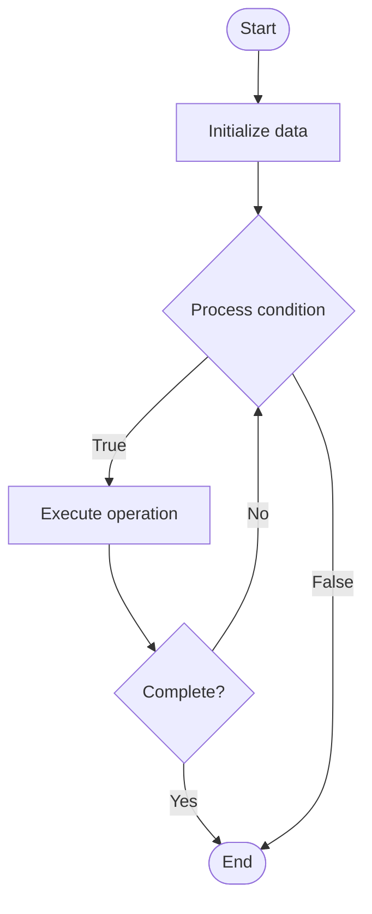

# Advanced Event Sourcing

1. **Name of Algorithm**  

## Code Files


## Algorithm Visualization

### Flowchart (ASCII)


```
Advanced Event Sourcing Flowchart:

┌─────────────┐
│   Start     │
└──────┬──────┘
       │
       ▼
┌─────────────┐
│  Initialize │
│   data      │
└──────┬──────┘
       │
       ▼
┌─────────────┐      Yes
│  Process   ├──────┐
│  condition?│      │
└──────┬──────┘      │
       │ No          │
       ▼             │
┌─────────────┐      │
│  Execute   │      │
│  operation │      │
└──────┬──────┘      │
       │             │
       └─────────────┘
       │
       ▼
┌─────────────┐
│    End      │
└─────────────┘
```


### Step-by-Step Execution


```
Advanced Event Sourcing Step-by-Step Execution:

Input: [example data]

Step 1: Initialize
State: [initial state]

Step 2: Process
State: [intermediate state]

Step 3: Finalize
State: [final state]

Result: [output]
```


### Interactive Flowchart (Mermaid)





> **Note**: Mermaid diagrams are rendered automatically on GitHub. For local viewing, use a Mermaid-compatible Markdown viewer.
- [Python Implementation](semester_09/lecture_60_system_design_advanced/event_sourcing_advanced/algorithm.py)
- [Java Implementation](semester_09/lecture_60_system_design_advanced/event_sourcing_advanced/Algorithm.java)
- [Python Tests](semester_09/lecture_60_system_design_advanced/event_sourcing_advanced/test_algorithm.py)


   Advanced Event Sourcing

2. **What problem does it solve? (1 sentence)**  
   Stores all changes to application state as a sequence of events, enabling time travel, audit trails, and rebuilding state from events, providing complete history and flexibility.

3. **Intuition (plain-language explanation)**  
   Like a video recording: Advanced Event Sourcing is like recording everything that happens in a video - instead of just taking snapshots (current state), you record every action (event) - you can replay the video (replay events) to see any point in time, or fast-forward to the current state - just as video recordings let you see history and replay events, event sourcing lets you see all changes and rebuild state from events.

4. **Inputs & Outputs**  
   - Input: Domain events, event store, aggregates, snapshots, replay mechanisms, projection logic.  
   - Output: Event stream, reconstructed state, historical views, audit trail, time-travel queries.

5. **Step-by-step description (5–10 lines max)**  
1. Capture events: capture all state changes as events.
2. Store: store events in event store (append-only log).
3. Replay: replay events to rebuild current state.
4. Snapshot: optionally create snapshots for faster replay.
5. Project: project events to read models for queries.
6. Query: query current state or historical state.
7. Time travel: query state at any point in time.
8. Audit: use event stream as audit trail.
9. Optimize: optimize event storage and replay performance.
10. Version: handle event schema evolution.

6. **Tiny example (hand-simulated)**  
   Advanced Event Sourcing: command: TransferMoney → event: MoneyTransferred → store: append to event stream → replay: replay all events to get current balance → query: get balance at any time → audit: see all money transfers → time travel: see balance yesterday → Advanced Event Sourcing operational.

7. **Time & Space Complexity**  
   - Time: O(n) for replay where n is number of events (optimized with snapshots to O(k) where k is events since snapshot).  
   - Space: O(e) where e is total events stored (append-only, grows over time).

8. **Strengths**  
- History: complete history of all changes.
- Audit: natural audit trail from events.
- Flexibility: can rebuild state and create new projections.

9. **Weaknesses / limitations**  
- Storage: event store grows over time.
- Replay: replaying many events can be slow.
- Complexity: more complex than traditional state storage.

10. **Compare with alternatives**  
    Alternatives: Traditional State Storage, Snapshot-Based, Event Log, CQRS

11. **30-second explanation (your own words)**  
    Stores all changes to application state as a sequence of events, enabling time travel, audit trails, and rebuilding state from events, providing complete history and flexibility.

*Sources: Adapted from standard university textbooks and Wikipedia summaries.*
