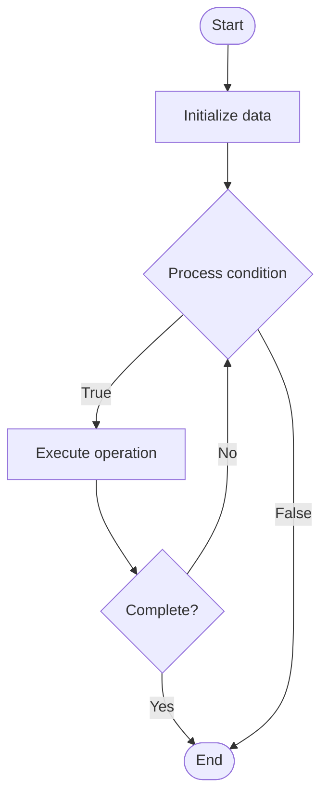

# Microservices Architecture

## Учебные материалы

- [Школьный уровень](school.ru.md)
- [Университетский уровень](univer.ru.md)

## Algorithm Visualization

### Flowchart (ASCII)

```
Microservices Architecture Flowchart:

┌─────────────┐
│   Start     │
└──────┬──────┘
       │
       ▼
┌─────────────┐
│  Initialize │
│   data      │
└──────┬──────┘
       │
       ▼
┌─────────────┐      Yes
│  Process   ├──────┐
│  condition?│      │
└──────┬──────┘      │
       │ No          │
       ▼             │
┌─────────────┐      │
│  Execute   │      │
│  operation │      │
└──────┬──────┘      │
       │             │
       └─────────────┘
       │
       ▼
┌─────────────┐
│    End      │
└─────────────┘
```

### Step-by-Step Execution

```
Microservices Architecture Step-by-Step Execution:

Input: [example data]

Step 1: Initialize
State: [initial state]

Step 2: Process
State: [intermediate state]

Step 3: Finalize
State: [final state]

Result: [output]
```

### Interactive Flowchart (Mermaid)



> **Note**: Mermaid diagrams are rendered automatically on GitHub. For local viewing, use a Mermaid-compatible Markdown viewer.

- [Python Implementation](/code/semester_09/lecture_60_system_design_advanced/microservices_architecture/algorithm.py)
- [Java Implementation](/code/semester_09/lecture_60_system_design_advanced/microservices_architecture/Algorithm.java)
- [Python Tests](/code/semester_09/lecture_60_system_design_advanced/microservices_architecture/test_algorithm.py)

What problem does it solve? (1 sentence)  
   Structures applications as a collection of small, independent services that communicate over well-defined APIs, enabling independent development, deployment, and scaling of services.

Intuition (plain-language explanation)  
   Like a team of specialists: Microservices Architecture is like a team of specialists where each person (service) has a specific expertise (domain) and works independently - they communicate when needed (API calls) but can work on their own schedule (independent deployment) - just as a team of specialists can work faster and more flexibly than one person doing everything, microservices can develop and scale faster than monolithic applications.

Inputs & Outputs  

  - Input: Service definitions, API contracts, service boundaries, communication protocols, deployment units.  
  - Output: Independent services, service APIs, distributed system, scalable architecture, flexible deployment.

Step-by-step description (5–10 lines max)  
Identify boundaries: identify service boundaries (domain-driven design).
Design services: design small, focused services (single responsibility).
Define APIs: define APIs for service communication.
Implement: implement services independently.
Deploy: deploy services independently.
Communicate: services communicate via APIs (REST, gRPC, messaging).
Scale: scale services independently based on load.
Monitor: monitor services independently.
Update: update services independently without affecting others.
Orchestrate: orchestrate services for complex operations.

Tiny example (hand-simulated)  
   Microservices: user-service (user management) → order-service (orders) → payment-service (payments) → each service: independent, deployable, scalable → communicate: via REST APIs → scale: user-service scales for login spikes → update: update payment-service without affecting others → Microservices Architecture operational.

Time & Space Complexity  

  - Time: O(1) per service operation, O(n) for orchestration where n is number of services.  
  - Space: O(s) where s is total service storage (distributed across services).

Strengths  

- Independence: services can be developed and deployed independently.
- Scalability: scale services independently based on needs.
- Technology diversity: use different technologies per service.

Weaknesses / limitations  

- Complexity: distributed system complexity (networking, coordination).
- Data consistency: maintaining consistency across services is challenging.
- Operational overhead: more services to manage and monitor.

Compare with alternatives  
    Alternatives: Monolithic Architecture, Service-Oriented Architecture, Modular Monolith, Serverless

30-second explanation (your own words)  
    Structures applications as a collection of small, independent services that communicate over well-defined APIs, enabling independent development, deployment, and scaling of services.

*Sources: Adapted from standard university textbooks and Wikipedia summaries.*


## References

- [Microservices](https://en.wikipedia.org/wiki/Microservices) - Wikipedia


## Historical Context

This pattern is characterized by the ability to develop and deploy services independently, improving modularity, scalability, and adaptability
