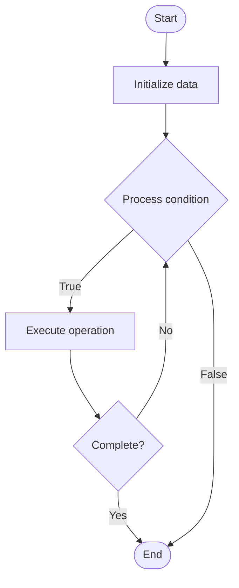

# Service Mesh

1. **Name of Algorithm**  

## Code Files


## Algorithm Visualization

### Flowchart (ASCII)


```
Service Mesh Flowchart:

┌─────────────┐
│   Start     │
└──────┬──────┘
       │
       ▼
┌─────────────┐
│  Initialize │
│   data      │
└──────┬──────┘
       │
       ▼
┌─────────────┐      Yes
│  Process   ├──────┐
│  condition?│      │
└──────┬──────┘      │
       │ No          │
       ▼             │
┌─────────────┐      │
│  Execute   │      │
│  operation │      │
└──────┬──────┘      │
       │             │
       └─────────────┘
       │
       ▼
┌─────────────┐
│    End      │
└─────────────┘
```


### Step-by-Step Execution


```
Service Mesh Step-by-Step Execution:

Input: [example data]

Step 1: Initialize
State: [initial state]

Step 2: Process
State: [intermediate state]

Step 3: Finalize
State: [final state]

Result: [output]
```


### Interactive Flowchart (Mermaid)





> **Note**: Mermaid diagrams are rendered automatically on GitHub. For local viewing, use a Mermaid-compatible Markdown viewer.
- [Python Implementation](semester_09/lecture_60_system_design_advanced/service_mesh/algorithm.py)
- [Java Implementation](semester_09/lecture_60_system_design_advanced/service_mesh/Algorithm.java)
- [Python Tests](semester_09/lecture_60_system_design_advanced/service_mesh/test_algorithm.py)


   Service Mesh

2. **What problem does it solve? (1 sentence)**  
   Provides a dedicated infrastructure layer for handling service-to-service communication, managing traffic, security, and observability without modifying application code.

3. **Intuition (plain-language explanation)**  
   Like a traffic management system: Service Mesh is like a traffic management system for services - instead of each service handling its own traffic rules (routing, security, monitoring), there's a dedicated system (mesh) that manages all service-to-service communication - just as traffic lights and signs manage road traffic, a service mesh manages service traffic, making it easier to control, secure, and monitor all service communications.

4. **Inputs & Outputs**  
   - Input: Service deployments, traffic policies, security policies, routing rules, observability config.  
   - Output: Managed service communication, secured traffic, observable traffic, load-balanced requests, resilient connections.

5. **Step-by-step description (5–10 lines max)**  
1. Deploy: deploy services with sidecar proxies (service mesh).
2. Configure: configure service mesh with policies.
3. Route: mesh routes traffic between services.
4. Secure: mesh handles mTLS and authentication.
5. Load balance: mesh load balances requests.
6. Retry: mesh handles retries and circuit breaking.
7. Monitor: mesh collects metrics and traces.
8. Policy: enforce traffic and security policies.
9. Update: update policies without changing services.
10. Observe: observe service communication through mesh.

6. **Tiny example (hand-simulated)**  
   Service Mesh: service A → sidecar proxy → mesh → sidecar proxy → service B → mesh: routes, secures (mTLS), load balances, retries, monitors → services: focus on business logic → Service Mesh operational.

7. **Time & Space Complexity**  
   - Time: O(1) for routing per request, O(n) for policy evaluation where n is policy rules.  
   - Space: O(p + s) where p is proxy overhead per service, s is mesh control plane storage.

8. **Strengths**  
- Separation: separates communication concerns from business logic.
- Consistency: consistent communication patterns across services.
- Observability: built-in observability for all service communication.

9. **Weaknesses / limitations**  
- Overhead: adds latency and resource overhead (sidecar proxies).
- Complexity: service mesh itself adds operational complexity.
- Learning curve: requires understanding mesh concepts and tools.

10. **Compare with alternatives**  
    Alternatives: Direct Service Communication, API Gateway, Load Balancer, Service Discovery

11. **30-second explanation (your own words)**  
    Provides a dedicated infrastructure layer for handling service-to-service communication, managing traffic, security, and observability without modifying application code.

*Sources: Adapted from standard university textbooks and Wikipedia summaries.*
