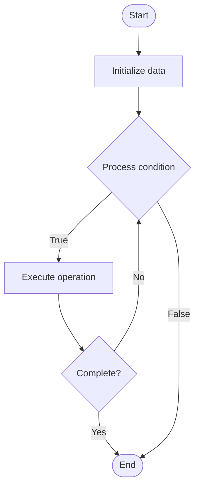

# Configuration Management

## Учебные материалы

- [Школьный уровень](school.ru.md)
- [Университетский уровень](univer.ru.md)

## Algorithm Visualization

### Flowchart (ASCII)

```
Configuration Management Flowchart:

┌─────────────┐
│   Start     │
└──────┬──────┘
       │
       ▼
┌─────────────┐
│  Initialize │
│   data      │
└──────┬──────┘
       │
       ▼
┌─────────────┐      Yes
│  Process   ├──────┐
│  condition?│      │
└──────┬──────┘      │
       │ No          │
       ▼             │
┌─────────────┐      │
│  Execute   │      │
│  operation │      │
└──────┬──────┘      │
       │             │
       └─────────────┘
       │
       ▼
┌─────────────┐
│    End      │
└─────────────┘
```

### Step-by-Step Execution

```
Configuration Management Step-by-Step Execution:

Input: [example data]

Step 1: Initialize
State: [initial state]

Step 2: Process
State: [intermediate state]

Step 3: Finalize
State: [final state]

Result: [output]
```

### Interactive Flowchart (Mermaid)



> **Note**: Mermaid diagrams are rendered automatically on GitHub. For local viewing, use a Mermaid-compatible Markdown viewer.

- [Python Implementation](/code/semester_09/lecture_61_cloud_native/config_management/algorithm.py)
- [Java Implementation](/code/semester_09/lecture_61_cloud_native/config_management/Algorithm.java)
- [Python Tests](/code/semester_09/lecture_61_cloud_native/config_management/test_algorithm.py)

What problem does it solve? (1 sentence)  
   Centralizes and manages application configuration across environments, enabling dynamic configuration updates, environment-specific settings, and secure configuration distribution.

Intuition (plain-language explanation)  
   Like a master control panel: configuration management is like a master control panel for all your application settings - instead of hardcoding settings in code (like wiring switches directly), you store them in a central place (configuration store) and applications read from there - you can change settings (like turning on/off features) without changing code, and different environments (dev, staging, prod) can have different settings - it's like having a remote control for your application settings.

Inputs & Outputs  

  - Input: Configuration values, environment variables, secrets, configuration files, update requests.  
  - Output: Managed configuration, environment-specific settings, dynamic updates, secure configuration.

Step-by-step description (5–10 lines max)  
Define configuration: identify configuration parameters (database URLs, API keys, feature flags).
Store centrally: store configuration in centralized system (config server, environment variables, secrets manager).
Organize: organize configuration by environment, application, or service.
Secure: encrypt sensitive configuration (secrets, passwords, API keys).
Distribute: distribute configuration to applications at runtime.
Update: allow dynamic configuration updates without application restart.
Version: version configuration changes for rollback capability.
Validate: validate configuration values and schema.
Monitor: monitor configuration usage and changes.
Audit: audit configuration access and modifications.

Tiny example (hand-simulated)  
   Config management: application needs database URL, API key, feature flags → store in config server → dev environment: localhost DB, test API key, all features on → prod environment: production DB, real API key, selective features → application reads config at startup → update: change feature flag → application reloads config → no restart needed → config managed.

Time & Space Complexity  

  - Time: O(1) for config retrieval, O(n) for updates where n is number of applications.  
  - Space: O(c) where c is configuration size (storage for config values).

Strengths  

- Flexibility: enables dynamic configuration without code changes.
- Centralization: centralizes configuration management.
- Security: provides secure storage and distribution of secrets.

Weaknesses / limitations  

- Complexity: adds complexity to application architecture.
- Dependency: applications depend on configuration service availability.
- Overhead: configuration retrieval adds latency.

Compare with alternatives  
    Alternatives: Hardcoded Configuration, Environment Variables, Configuration Files, Feature Flags

30-second explanation (your own words)  
    Centralizes and manages application configuration across environments, enabling dynamic configuration updates, environment-specific settings, and secure configuration distribution.

*Sources: Adapted from standard university textbooks and Wikipedia summaries.*
