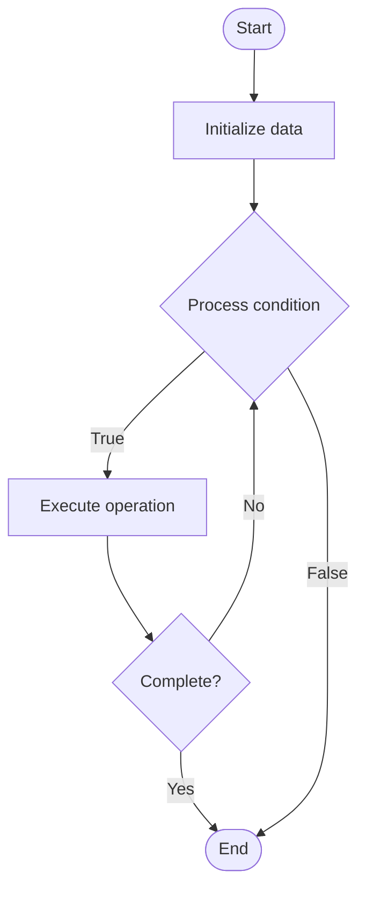

# Container Orchestration

Name of Algorithm  

## Code Files


## Algorithm Visualization

### Flowchart (ASCII)


```
Container Orchestration Flowchart:

┌─────────────┐
│   Start     │
└──────┬──────┘
       │
       ▼
┌─────────────┐
│  Initialize │
│   data      │
└──────┬──────┘
       │
       ▼
┌─────────────┐      Yes
│  Process   ├──────┐
│  condition?│      │
└──────┬──────┘      │
       │ No          │
       ▼             │
┌─────────────┐      │
│  Execute   │      │
│  operation │      │
└──────┬──────┘      │
       │             │
       └─────────────┘
       │
       ▼
┌─────────────┐
│    End      │
└─────────────┘
```


### Step-by-Step Execution


```
Container Orchestration Step-by-Step Execution:

Input: [example data]

Step 1: Initialize
State: [initial state]

Step 2: Process
State: [intermediate state]

Step 3: Finalize
State: [final state]

Result: [output]
```


### Interactive Flowchart (Mermaid)





> **Note**: Mermaid diagrams are rendered automatically on GitHub. For local viewing, use a Mermaid-compatible Markdown viewer.
- [Python Implementation](/code/semester_09/lecture_61_cloud_native/container_orchestration/algorithm.py)
- [Java Implementation](/code/semester_09/lecture_61_cloud_native/container_orchestration/Algorithm.java)
- [Python Tests](/code/semester_09/lecture_61_cloud_native/container_orchestration/test_algorithm.py)


   Container Orchestration

What problem does it solve? (1 sentence)  
   Manages and coordinates containerized applications across clusters, handling deployment, scaling, load balancing, health monitoring, and service discovery automatically.

Intuition (plain-language explanation)  
   Like a conductor for containers: Container Orchestration is like a conductor for an orchestra - you have many containers (musicians) that need to work together, and the orchestrator (conductor) coordinates them - it decides where to place containers (scheduling), scales them up/down (dynamic scaling), balances load (distributes work), and ensures they're healthy (monitoring) - just as a conductor ensures the orchestra plays harmoniously, container orchestration ensures containers work together efficiently.

Inputs & Outputs  
   - Input: Container images, deployment specs, scaling policies, service definitions, cluster resources, health checks.  
   - Output: Orchestrated containers, scaled services, load-balanced traffic, healthy deployments, service discovery, managed infrastructure.

Step-by-step description (5–10 lines max)  
Define: define container deployments and services.
Schedule: schedule containers on cluster nodes.
Deploy: deploy containers to nodes.
Scale: scale containers based on demand.
Balance: load balance traffic across containers.
Monitor: monitor container health and performance.
Restart: restart failed containers automatically.
Update: update containers with rolling updates.
Discover: enable service discovery.
Manage: manage container lifecycle.

Tiny example (hand-simulated)  
   Container Orchestration: app: web service → deploy: 3 replicas → schedule: distribute across nodes → scale: auto-scale to 10 replicas → balance: load balance traffic → monitor: health checks → result: highly available, scalable service → Container Orchestration operational.

Time & Space Complexity  
   - Time: O(n·s) where n is nodes, s is scheduling time (distributed scheduling).  
   - Space: O(c + m) where c is container storage, m is metadata storage (orchestration state).

Strengths  
- Automation: automates container management tasks.
- Scalability: enables easy scaling of applications.
- Reliability: improves reliability through health monitoring and auto-recovery.

Weaknesses / limitations  
- Complexity: orchestration systems can be complex.
- Overhead: adds overhead to container operations.
- Learning: requires learning orchestration concepts.

Compare with alternatives  
    Alternatives: Manual Management, Container Runtimes, Simple Schedulers, Serverless

30-second explanation (your own words)  
    Manages and coordinates containerized applications across clusters, handling deployment, scaling, load balancing, health monitoring, and service discovery automatically.

*Sources: Adapted from standard university textbooks and Wikipedia summaries.*
