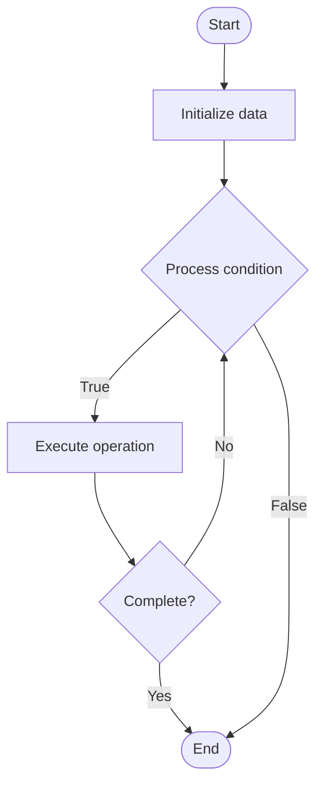

# Function as a Service (FaaS)

## Учебные материалы

- [Школьный уровень](school.ru.md)
- [Университетский уровень](univer.ru.md)

## Algorithm Visualization

### Flowchart (ASCII)

```
Function as a Service (FaaS) Flowchart:

┌─────────────┐
│   Start     │
└──────┬──────┘
       │
       ▼
┌─────────────┐
│  Initialize │
│   data      │
└──────┬──────┘
       │
       ▼
┌─────────────┐      Yes
│  Process   ├──────┐
│  condition?│      │
└──────┬──────┘      │
       │ No          │
       ▼             │
┌─────────────┐      │
│  Execute   │      │
│  operation │      │
└──────┬──────┘      │
       │             │
       └─────────────┘
       │
       ▼
┌─────────────┐
│    End      │
└─────────────┘
```

### Step-by-Step Execution

```
Function as a Service (FaaS) Step-by-Step Execution:

Input: [example data]

Step 1: Initialize
State: [initial state]

Step 2: Process
State: [intermediate state]

Step 3: Finalize
State: [final state]

Result: [output]
```

### Interactive Flowchart (Mermaid)



> **Note**: Mermaid diagrams are rendered automatically on GitHub. For local viewing, use a Mermaid-compatible Markdown viewer.

- [Python Implementation](/code/semester_09/lecture_61_cloud_native/function_as_service/algorithm.py)
- [Java Implementation](/code/semester_09/lecture_61_cloud_native/function_as_service/Algorithm.java)
- [Python Tests](/code/semester_09/lecture_61_cloud_native/function_as_service/test_algorithm.py)

   Function as a Service (FaaS)

What problem does it solve? (1 sentence)  
   Executes code in stateless functions that are triggered by events, automatically managing infrastructure, scaling, and resource allocation, enabling serverless computing.

Intuition (plain-language explanation)  
   Like a vending machine for code: Function as a Service is like a vending machine - you put in a request (coin/event), the machine (cloud) automatically prepares and serves your item (executes function), and you don't need to manage the machine (infrastructure) - the machine handles everything: getting the item ready (scaling), serving it (execution), and cleaning up (resource management) - you only pay for what you use (per invocation), not for keeping the machine running.

Inputs & Outputs  

  - Input: Function code, trigger events, input data, execution context, resource limits.  
  - Output: Function execution results, triggered functions, scaled execution, serverless output.

Step-by-step description (5–10 lines max)  
Write function: write stateless function code (handler function).
Deploy: deploy function to FaaS platform (AWS Lambda, Azure Functions, Google Cloud Functions).
Configure trigger: configure event triggers (HTTP, queue, database, schedule).
Wait: function waits for trigger event (no running infrastructure).
Trigger: event triggers function execution.
Scale: platform automatically scales to handle concurrent invocations.
Execute: platform executes function with provided input.
Return: function returns result.
Cleanup: platform automatically cleans up resources after execution.
Charge: platform charges based on execution time and resources used.

Tiny example (hand-simulated)  
   FaaS: image processing function → trigger: S3 upload event → S3 uploads image → triggers Lambda function → Lambda: resizes image → stores in S3 → returns URL → automatic scaling: 100 images uploaded → 100 functions execute in parallel → pay: only for execution time → no server management → FaaS operational.

Time & Space Complexity  

  - Time: O(f) where f is function execution time (varies by function logic).  
  - Space: O(m) where m is memory allocated per function execution (temporary, cleaned after execution).

Strengths  

- No infrastructure: no need to manage servers or infrastructure.
- Auto-scaling: automatically scales to handle any load.
- Cost-effective: pay only for actual execution time.

Weaknesses / limitations  

- Cold starts: first invocation may have latency (cold start).
- Time limits: functions have execution time limits.
- Stateless: functions must be stateless (no persistent state).

Compare with alternatives  
    Alternatives: Traditional Servers, Containers, Virtual Machines, Serverless Containers

30-second explanation (your own words)  
    Executes code in stateless functions that are triggered by events, automatically managing infrastructure, scaling, and resource allocation, enabling serverless computing.

*Sources: Adapted from standard university textbooks and Wikipedia summaries.*


## References

- [Function As Service - Wikipedia](https://en.wikipedia.org/wiki/Function%20As%20Service)
