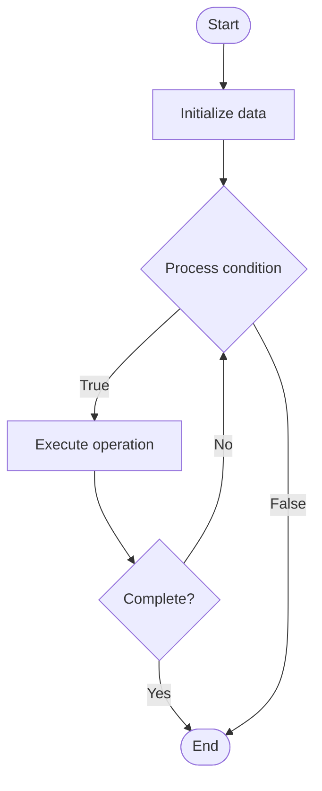

# Secrets Management

Name of Algorithm  

## Code Files


## Algorithm Visualization

### Flowchart (ASCII)


```
Secrets Management Flowchart:

┌─────────────┐
│   Start     │
└──────┬──────┘
       │
       ▼
┌─────────────┐
│  Initialize │
│   data      │
└──────┬──────┘
       │
       ▼
┌─────────────┐      Yes
│  Process   ├──────┐
│  condition?│      │
└──────┬──────┘      │
       │ No          │
       ▼             │
┌─────────────┐      │
│  Execute   │      │
│  operation │      │
└──────┬──────┘      │
       │             │
       └─────────────┘
       │
       ▼
┌─────────────┐
│    End      │
└─────────────┘
```


### Step-by-Step Execution


```
Secrets Management Step-by-Step Execution:

Input: [example data]

Step 1: Initialize
State: [initial state]

Step 2: Process
State: [intermediate state]

Step 3: Finalize
State: [final state]

Result: [output]
```


### Interactive Flowchart (Mermaid)





> **Note**: Mermaid diagrams are rendered automatically on GitHub. For local viewing, use a Mermaid-compatible Markdown viewer.
- [Python Implementation](/code/semester_09/lecture_61_cloud_native/secrets_management/algorithm.py)
- [Java Implementation](/code/semester_09/lecture_61_cloud_native/secrets_management/Algorithm.java)
- [Python Tests](/code/semester_09/lecture_61_cloud_native/secrets_management/test_algorithm.py)


   Secrets Management

What problem does it solve? (1 sentence)  
   Securely stores, manages, and distributes sensitive information (passwords, API keys, certificates, tokens) to applications, preventing secrets from being exposed in code or configuration files.

Intuition (plain-language explanation)  
   Like a bank vault for secrets: secrets management is like a bank vault where you store valuable items (secrets) securely - instead of leaving them lying around (hardcoded in code), you put them in the vault (secrets manager) with proper security (encryption, access control) - when applications need secrets, they request them from the vault (API call) with proper authentication, and the vault gives them access - the vault also tracks who accessed what and when (audit logs).

Inputs & Outputs  
   - Input: Secrets (passwords, keys, tokens), access policies, encryption keys, authentication credentials.  
   - Output: Secured secrets, encrypted storage, access-controlled secrets, audit logs.

Step-by-step description (5–10 lines max)  
Store secrets: store secrets in secrets manager (HashiCorp Vault, AWS Secrets Manager, Azure Key Vault).
Encrypt: encrypt secrets at rest using encryption keys.
Define policies: define access policies (who can access which secrets).
Authenticate: applications authenticate to secrets manager.
Request: applications request secrets via API.
Authorize: secrets manager checks access policies.
Retrieve: if authorized, retrieve and decrypt secret.
Deliver: deliver secret to application securely (in-memory, not logged).
Rotate: periodically rotate secrets (change passwords, regenerate keys).
Audit: log all secret access for security auditing.

Tiny example (hand-simulated)  
   Secrets management: application needs database password → store in Vault → encrypt: AES-256 encryption → policy: only app-service can access → application: authenticates with service account → requests: GET /secret/db-password → Vault: checks policy → authorized → decrypts → returns password → application: uses password (never logged) → audit: access logged → secrets managed securely.

Time & Space Complexity  
   - Time: O(1) for secret retrieval, O(n) for rotation where n is number of applications using secret.  
   - Space: O(s) where s is total secrets size (encrypted storage).

Strengths  
- Security: provides secure storage and distribution of secrets.
- Centralization: centralizes secrets management.
- Auditability: provides audit trails for secret access.

Weaknesses / limitations  
- Dependency: applications depend on secrets manager availability.
- Latency: secret retrieval adds latency to application startup.
- Complexity: requires careful access policy management.

Compare with alternatives  
    Alternatives: Environment Variables, Configuration Files, Hardcoded Secrets, Encrypted Files

30-second explanation (your own words)  
    Securely stores, manages, and distributes sensitive information (passwords, API keys, certificates, tokens) to applications, preventing secrets from being exposed in code or configuration files.

*Sources: Adapted from standard university textbooks and Wikipedia summaries.*
