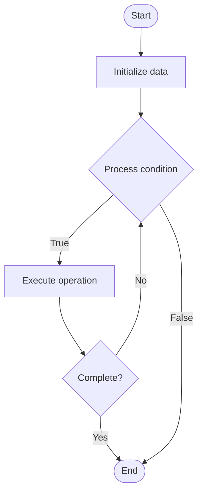

# Serverless Architecture

## Учебные материалы

- [Школьный уровень](school.ru.md)
- [Университетский уровень](univer.ru.md)

## Algorithm Visualization

### Flowchart (ASCII)

```
Serverless Architecture Flowchart:

┌─────────────┐
│   Start     │
└──────┬──────┘
       │
       ▼
┌─────────────┐
│  Initialize │
│   data      │
└──────┬──────┘
       │
       ▼
┌─────────────┐      Yes
│  Process   ├──────┐
│  condition?│      │
└──────┬──────┘      │
       │ No          │
       ▼             │
┌─────────────┐      │
│  Execute   │      │
│  operation │      │
└──────┬──────┘      │
       │             │
       └─────────────┘
       │
       ▼
┌─────────────┐
│    End      │
└─────────────┘
```

### Step-by-Step Execution

```
Serverless Architecture Step-by-Step Execution:

Input: [example data]

Step 1: Initialize
State: [initial state]

Step 2: Process
State: [intermediate state]

Step 3: Finalize
State: [final state]

Result: [output]
```

### Interactive Flowchart (Mermaid)



> **Note**: Mermaid diagrams are rendered automatically on GitHub. For local viewing, use a Mermaid-compatible Markdown viewer.

- [Python Implementation](/code/semester_09/lecture_61_cloud_native/serverless_architecture/algorithm.py)
- [Java Implementation](/code/semester_09/lecture_61_cloud_native/serverless_architecture/Algorithm.java)
- [Python Tests](/code/semester_09/lecture_61_cloud_native/serverless_architecture/test_algorithm.py)

What problem does it solve? (1 sentence)  
   Builds applications using serverless computing services (FaaS, managed databases, event-driven services) where developers don't manage servers, and the cloud provider handles infrastructure, scaling, and resource management automatically.

Intuition (plain-language explanation)  
   Like a fully managed restaurant: serverless architecture is like a fully managed restaurant where you just provide recipes (code) and ingredients (data), and the restaurant (cloud provider) handles everything else - cooking (execution), serving (scaling), cleaning (resource management), and maintenance (infrastructure) - you don't need to hire chefs, waiters, or manage the kitchen (servers) - you just focus on the food (business logic) and pay for what you serve (usage-based pricing).

Inputs & Outputs  

  - Input: Application code, event triggers, data, business logic, resource requirements.  
  - Output: Serverless application, auto-scaled services, managed infrastructure, event-driven system.

Step-by-step description (5–10 lines max)  
Design: design application using serverless services (functions, managed databases, event streams).
Write functions: write stateless functions for business logic.
Use managed services: use managed services (databases, storage, queues) instead of self-managed.
Configure triggers: configure event triggers for functions.
Deploy: deploy to serverless platform (no server provisioning).
Execute: functions execute when triggered by events.
Scale: platform automatically scales functions based on load.
Pay: pay only for actual usage (execution time, storage, requests).
Monitor: monitor application using serverless monitoring tools.
Update: update functions without managing infrastructure.

Tiny example (hand-simulated)  
   Serverless architecture: e-commerce app → API Gateway (managed) → Lambda functions (FaaS) → DynamoDB (managed database) → S3 (managed storage) → EventBridge (managed events) → no servers to manage → auto-scales: 10 requests → 10 functions, 1000 requests → 1000 functions → pay: only for actual usage → serverless architecture.

Time & Space Complexity  

  - Time: O(f) where f is function execution time (varies by business logic).  
  - Space: O(d) where d is data size (managed by cloud provider, no persistent server storage).

Strengths  

- No infrastructure: eliminates server management overhead.
- Auto-scaling: automatically scales to any load.
- Cost-effective: pay only for actual usage.

Weaknesses / limitations  

- Vendor lock-in: applications depend on cloud provider services.
- Cold starts: first invocation may have latency.
- Debugging: debugging distributed serverless applications can be challenging.

Compare with alternatives  
    Alternatives: Traditional Servers, Containers, Virtual Machines, Hybrid Architecture

30-second explanation (your own words)  
    Builds applications using serverless computing services (FaaS, managed databases, event-driven services) where developers don't manage servers, and the cloud provider handles infrastructure, scaling, and resource management automatically.

*Sources: Adapted from standard university textbooks and Wikipedia summaries.*


## References

- [Serverless computing](https://en.wikipedia.org/wiki/Serverless_computing) - Wikipedia
