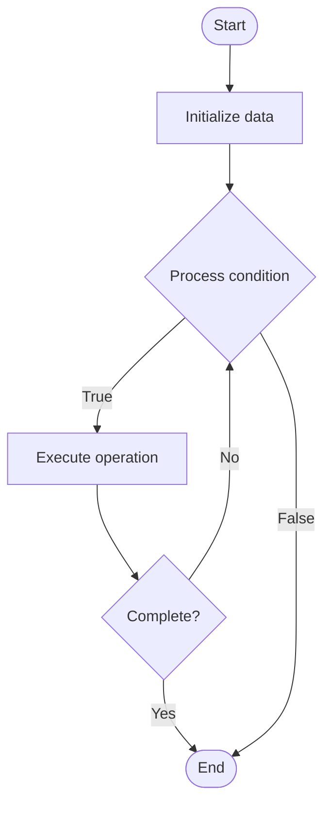

# Service Discovery

Name of Algorithm  

## Code Files


## Algorithm Visualization

### Flowchart (ASCII)


```
Service Discovery Flowchart:

┌─────────────┐
│   Start     │
└──────┬──────┘
       │
       ▼
┌─────────────┐
│  Initialize │
│   data      │
└──────┬──────┘
       │
       ▼
┌─────────────┐      Yes
│  Process   ├──────┐
│  condition?│      │
└──────┬──────┘      │
       │ No          │
       ▼             │
┌─────────────┐      │
│  Execute   │      │
│  operation │      │
└──────┬──────┘      │
       │             │
       └─────────────┘
       │
       ▼
┌─────────────┐
│    End      │
└─────────────┘
```


### Step-by-Step Execution


```
Service Discovery Step-by-Step Execution:

Input: [example data]

Step 1: Initialize
State: [initial state]

Step 2: Process
State: [intermediate state]

Step 3: Finalize
State: [final state]

Result: [output]
```


### Interactive Flowchart (Mermaid)





> **Note**: Mermaid diagrams are rendered automatically on GitHub. For local viewing, use a Mermaid-compatible Markdown viewer.
- [Python Implementation](/code/semester_09/lecture_61_cloud_native/service_discovery/algorithm.py)
- [Java Implementation](/code/semester_09/lecture_61_cloud_native/service_discovery/Algorithm.java)
- [Python Tests](/code/semester_09/lecture_61_cloud_native/service_discovery/test_algorithm.py)


   Service Discovery

What problem does it solve? (1 sentence)  
   Automatically locates and connects to service instances in a distributed system, handling dynamic service registration, health checking, and load balancing without hardcoded service addresses.

Intuition (plain-language explanation)  
   Like a phone directory service: service discovery is like a phone directory service for microservices - when a service wants to call another service, instead of knowing the exact phone number (IP address) which might change, it looks up the service name in the directory (service registry) and gets the current phone number (service instance address) - the directory automatically updates when services start, stop, or move (dynamic registration), and only lists services that are currently available (health checks).

Inputs & Outputs  
   - Input: Service registrations, service queries, health checks, service metadata, network topology.  
   - Output: Service locations, healthy service instances, load-balanced connections, dynamic routing.

Step-by-step description (5–10 lines max)  
Register: services register themselves with service registry on startup.
Store: registry stores service information (name, address, port, metadata).
Health check: registry periodically checks service health.
Update: registry updates service status (healthy, unhealthy, removed).
Query: client queries registry for service by name.
Resolve: registry returns available service instances.
Select: client selects service instance (round-robin, random, least connections).
Connect: client connects to selected service instance.
Cache: client may cache service locations for performance.
Update cache: client updates cache when service instances change.

Tiny example (hand-simulated)  
   Service discovery: user-service starts → registers: name='user-service', address='10.0.1.5:8080' → registry: stores registration → health check: user-service healthy → order-service: queries registry for 'user-service' → registry: returns ['10.0.1.5:8080', '10.0.1.6:8080'] → order-service: selects instance → connects → user-service fails → registry: removes from list → order-service: gets updated list → service discovery operational.

Time & Space Complexity  
   - Time: O(1) for service lookup, O(n) for health checks where n is number of services.  
   - Space: O(s) where s is number of service instances (registry storage).

Strengths  
- Dynamic: handles dynamic service instances (start, stop, scale).
- Resilience: automatically handles service failures and recovery.
- Decoupling: decouples services from specific network addresses.

Weaknesses / limitations  
- Dependency: services depend on service registry availability.
- Latency: service lookup adds latency (can be cached).
- Complexity: managing service registry adds operational complexity.

Compare with alternatives  
    Alternatives: Hardcoded Addresses, DNS, Load Balancer, Service Mesh

30-second explanation (your own words)  
    Automatically locates and connects to service instances in a distributed system, handling dynamic service registration, health checking, and load balancing without hardcoded service addresses.

*Sources: Adapted from standard university textbooks and Wikipedia summaries.*
