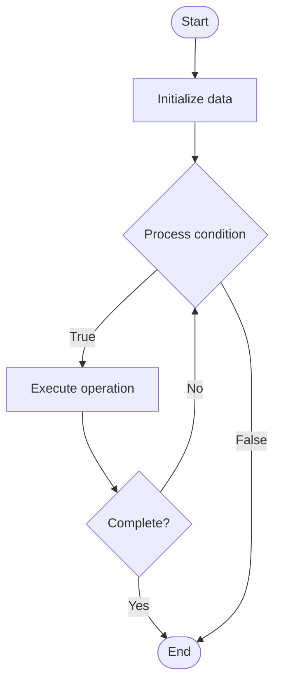

# Application Performance Monitoring (APM)

## Учебные материалы

- [Школьный уровень](school.ru.md)
- [Университетский уровень](univer.ru.md)

## Algorithm Visualization

### Flowchart (ASCII)

```
Application Performance Monitoring (APM) Flowchart:

┌─────────────┐
│   Start     │
└──────┬──────┘
       │
       ▼
┌─────────────┐
│  Initialize │
│   data      │
└──────┬──────┘
       │
       ▼
┌─────────────┐      Yes
│  Process   ├──────┐
│  condition?│      │
└──────┬──────┘      │
       │ No          │
       ▼             │
┌─────────────┐      │
│  Execute   │      │
│  operation │      │
└──────┬──────┘      │
       │             │
       └─────────────┘
       │
       ▼
┌─────────────┐
│    End      │
└─────────────┘
```

### Step-by-Step Execution

```
Application Performance Monitoring (APM) Step-by-Step Execution:

Input: [example data]

Step 1: Initialize
State: [initial state]

Step 2: Process
State: [intermediate state]

Step 3: Finalize
State: [final state]

Result: [output]
```

### Interactive Flowchart (Mermaid)



> **Note**: Mermaid diagrams are rendered automatically on GitHub. For local viewing, use a Mermaid-compatible Markdown viewer.

- [Python Implementation](/code/semester_09/lecture_62_observability_advanced/apm/algorithm.py)
- [Java Implementation](/code/semester_09/lecture_62_observability_advanced/apm/Algorithm.java)
- [Python Tests](/code/semester_09/lecture_62_observability_advanced/apm/test_algorithm.py)

   Application Performance Monitoring (APM)

What problem does it solve? (1 sentence)  
Monitors application performance in real-time, tracking response times, throughput, error rates, and resource usage to identify performance bottlenecks and optimize application behavior.

Intuition (plain-language explanation)  
Like a fitness tracker for applications: APM is like a fitness tracker that continuously monitors your application's health - it tracks how fast it responds (response time), how much work it does (throughput), how often it makes mistakes (error rate), and how much energy it uses (resource usage) - when something's wrong (like slow response), it alerts you and shows you exactly where the problem is (like which function is slow), helping you fix it quickly.

Inputs & Outputs  

  - Input: Application metrics, traces, logs, performance counters, user transactions.  
  - Output: Performance metrics, alerts, dashboards, optimization insights, performance reports.

Step-by-step description (5–10 lines max)  
Instrument: add APM agents or libraries to application.
Collect: collect performance data (response times, database queries, external calls).
Trace: trace requests through application (distributed tracing).
Measure: measure key metrics (latency, throughput, error rate, resource usage).
Aggregate: aggregate metrics over time windows.
Store: store metrics in time-series database.
Visualize: create dashboards showing performance trends.
Alert: configure alerts for performance thresholds.
Analyze: analyze performance patterns and identify bottlenecks.
Optimize: use insights to optimize application performance.

Tiny example (hand-simulated)  
   APM: web application → APM agent installed → collects: request latency, database query time, external API calls → trace: user request → frontend (50ms) → API (200ms) → database (150ms) → external API (300ms) → total: 700ms → alert: latency > 500ms → identify: external API is bottleneck → optimize: add caching → latency: 700ms → 250ms → APM guides optimization.

Time & Space Complexity  

  - Time: O(1) per metric collection, O(m) for analysis where m is number of metrics.  
  - Space: O(m·t) where m is metrics count, t is time period (time-series data storage).

Strengths  

- Visibility: provides comprehensive visibility into application performance.
- Proactive: identifies performance issues before users are affected.
- Optimization: enables data-driven performance optimization.

Weaknesses / limitations  

- Overhead: APM agents add some overhead to application.
- Cost: APM tools can be expensive for large-scale applications.
- Complexity: analyzing APM data requires expertise.

Compare with alternatives  
    Alternatives: Logging, Custom Metrics, Performance Testing, Profiling

30-second explanation (your own words)  
Monitors application performance in real-time, tracking response times, throughput, error rates, and resource usage to identify performance bottlenecks and optimize application behavior.

*Sources: Adapted from standard university textbooks and Wikipedia summaries.*
