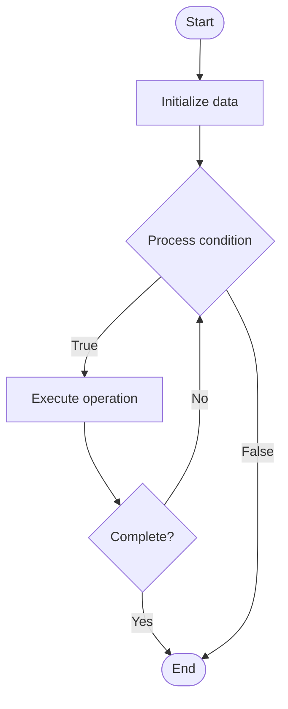

# Advanced Chaos Engineering

1. **Name of Algorithm**  

## Code Files


## Algorithm Visualization

### Flowchart (ASCII)


```
Advanced Chaos Engineering Flowchart:

┌─────────────┐
│   Start     │
└──────┬──────┘
       │
       ▼
┌─────────────┐
│  Initialize │
│   data      │
└──────┬──────┘
       │
       ▼
┌─────────────┐      Yes
│  Process   ├──────┐
│  condition?│      │
└──────┬──────┘      │
       │ No          │
       ▼             │
┌─────────────┐      │
│  Execute   │      │
│  operation │      │
└──────┬──────┘      │
       │             │
       └─────────────┘
       │
       ▼
┌─────────────┐
│    End      │
└─────────────┘
```


### Step-by-Step Execution


```
Advanced Chaos Engineering Step-by-Step Execution:

Input: [example data]

Step 1: Initialize
State: [initial state]

Step 2: Process
State: [intermediate state]

Step 3: Finalize
State: [final state]

Result: [output]
```


### Interactive Flowchart (Mermaid)





> **Note**: Mermaid diagrams are rendered automatically on GitHub. For local viewing, use a Mermaid-compatible Markdown viewer.
- [Python Implementation](semester_09/lecture_62_observability_advanced/chaos_engineering_advanced/algorithm.py)
- [Java Implementation](semester_09/lecture_62_observability_advanced/chaos_engineering_advanced/Algorithm.java)
- [Python Tests](semester_09/lecture_62_observability_advanced/chaos_engineering_advanced/test_algorithm.py)


   Advanced Chaos Engineering

2. **What problem does it solve? (1 sentence)**  
   Systematically experiments on distributed systems by injecting failures and disruptions to test resilience, identify weaknesses, and improve system reliability through controlled chaos experiments.

3. **Intuition (plain-language explanation)**  
   Like stress testing for systems: advanced chaos engineering is like stress testing a building by simulating earthquakes - you intentionally create controlled failures (like turning off a server, adding network latency, or corrupting data) to see how the system handles it - if the system breaks, you've found a weakness before real disasters happen - the goal is to make systems so resilient that they can handle any failure gracefully, like a building designed to withstand earthquakes.

4. **Inputs & Outputs**  
   - Input: System components, failure scenarios, experiment hypotheses, safety measures, monitoring tools.  
   - Output: Chaos experiments, resilience insights, system improvements, failure handling validation.

5. **Step-by-step description (5–10 lines max)**  
1. Define hypothesis: define what you expect to happen during experiment.
2. Design experiment: design controlled failure scenario (kill service, inject latency, corrupt data).
3. Set safety: establish safety measures (blast radius limits, automatic rollback).
4. Monitor: set up comprehensive monitoring before experiment.
5. Inject failure: inject controlled failure into system.
6. Observe: observe system behavior and response to failure.
7. Measure: measure impact (availability, latency, error rate).
8. Analyze: analyze results and compare to hypothesis.
9. Improve: identify weaknesses and improve system resilience.
10. Repeat: run experiments regularly to continuously improve resilience.

6. **Tiny example (hand-simulated)**  
   Chaos engineering: hypothesis: system handles database failure gracefully → experiment: kill database primary → observe: system switches to replica in 5s → measure: availability: 99.9% (target: 99.95%) → analyze: switchover too slow → improve: optimize failover → repeat: test again → resilience improved → chaos engineering successful.

7. **Time & Space Complexity**  
   - Time: O(e) where e is experiment duration (varies by experiment type).  
   - Space: O(m) where m is monitoring data size (metrics, logs during experiment).

8. **Strengths**  
- Resilience: improves system resilience through systematic testing.
- Proactive: finds weaknesses before real failures occur.
- Confidence: builds confidence in system reliability.

9. **Weaknesses / limitations**  
- Risk: experiments can cause real outages if not carefully controlled.
- Complexity: designing and running experiments requires expertise.
- Resource intensive: requires dedicated time and resources.

10. **Compare with alternatives**  
    Alternatives: Traditional Testing, Failure Injection, Disaster Recovery Drills, Load Testing

11. **30-second explanation (your own words)**  
    Systematically experiments on distributed systems by injecting failures and disruptions to test resilience, identify weaknesses, and improve system reliability through controlled chaos experiments.
*Sources: Adapted from standard university textbooks and Wikipedia summaries.*