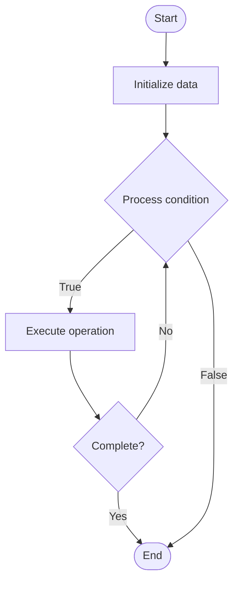

# Distributed Tracing

## Учебные материалы

- [Школьный уровень](school.ru.md)
- [Университетский уровень](univer.ru.md)

## Algorithm Visualization

### Flowchart (ASCII)

```
Distributed Tracing Flowchart:

┌─────────────┐
│   Start     │
└──────┬──────┘
       │
       ▼
┌─────────────┐
│  Initialize │
│   data      │
└──────┬──────┘
       │
       ▼
┌─────────────┐      Yes
│  Process   ├──────┐
│  condition?│      │
└──────┬──────┘      │
       │ No          │
       ▼             │
┌─────────────┐      │
│  Execute   │      │
│  operation │      │
└──────┬──────┘      │
       │             │
       └─────────────┘
       │
       ▼
┌─────────────┐
│    End      │
└─────────────┘
```

### Step-by-Step Execution

```
Distributed Tracing Step-by-Step Execution:

Input: [example data]

Step 1: Initialize
State: [initial state]

Step 2: Process
State: [intermediate state]

Step 3: Finalize
State: [final state]

Result: [output]
```

### Interactive Flowchart (Mermaid)



> **Note**: Mermaid diagrams are rendered automatically on GitHub. For local viewing, use a Mermaid-compatible Markdown viewer.

- [Python Implementation](/code/semester_09/lecture_62_observability_advanced/distributed_tracing/algorithm.py)
- [Java Implementation](/code/semester_09/lecture_62_observability_advanced/distributed_tracing/Algorithm.java)
- [Python Tests](/code/semester_09/lecture_62_observability_advanced/distributed_tracing/test_algorithm.py)

What problem does it solve? (1 sentence)  
   Tracks requests as they flow through distributed systems, creating end-to-end traces that show the complete path of a request across multiple services, enabling debugging and performance optimization.

Intuition (plain-language explanation)  
   Like a package tracking system: distributed tracing is like tracking a package as it moves through a shipping network - you get a tracking number (trace ID) that follows the package (request) as it goes through different facilities (services) - you can see exactly where it is at each step (spans), how long it spends at each facility (timing), and if there are any delays (bottlenecks) - this helps you understand the complete journey and find where things slow down or fail.

Inputs & Outputs  

  - Input: Requests, trace IDs, span data, service interactions, timing information.  
  - Output: Distributed traces, request flows, performance insights, debugging information.

Step-by-step description (5–10 lines max)  
Generate trace: generate unique trace ID for incoming request.
Create span: create span for each service operation (start time, operation name).
Propagate: propagate trace ID through service calls (HTTP headers, message metadata).
Record spans: each service records spans for its operations.
Add context: add context to spans (tags, logs, timing).
Correlate: correlate spans by trace ID to build complete trace.
Collect: collect spans from all services.
Assemble: assemble spans into complete trace (tree structure).
Visualize: visualize trace showing request flow and timing.
Analyze: analyze traces to identify bottlenecks and errors.

Tiny example (hand-simulated)  
   Distributed tracing: user request → trace ID: abc123 → frontend: span 1 (10ms) → API gateway: span 2 (5ms) → user-service: span 3 (50ms) → database: span 4 (30ms) → order-service: span 5 (200ms) → payment-service: span 6 (150ms) → trace: shows complete flow → identify: order-service is slow → optimize: add caching → trace: order-service 200ms → 50ms → distributed tracing guides optimization.

Time & Space Complexity  

  - Time: O(1) per span creation, O(s) for trace assembly where s is number of spans.  
  - Space: O(t·s) where t is number of traces, s is average spans per trace (trace storage).

Strengths  

- Visibility: provides complete visibility into request flows.
- Debugging: enables debugging of complex distributed systems.
- Performance: identifies performance bottlenecks across services.

Weaknesses / limitations  

- Overhead: tracing adds overhead to application performance.
- Storage: storing traces requires significant storage.
- Sampling: may need to sample traces to manage volume.

Compare with alternatives  
    Alternatives: Logging, APM, Custom Instrumentation, Request IDs

30-second explanation (your own words)  
    Tracks requests as they flow through distributed systems, creating end-to-end traces that show the complete path of a request across multiple services, enabling debugging and performance optimization.

*Sources: Adapted from standard university textbooks and Wikipedia summaries.*


## References

- [Distributed Tracing - Wikipedia](https://en.wikipedia.org/wiki/Distributed%20Tracing)
