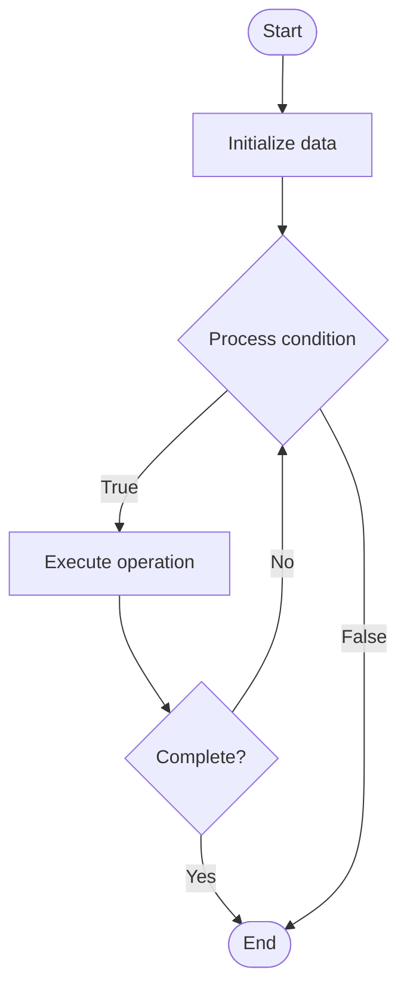

# Advanced Log Aggregation

Name of Algorithm  

## Code Files


## Algorithm Visualization

### Flowchart (ASCII)


```
Advanced Log Aggregation Flowchart:

┌─────────────┐
│   Start     │
└──────┬──────┘
       │
       ▼
┌─────────────┐
│  Initialize │
│   data      │
└──────┬──────┘
       │
       ▼
┌─────────────┐      Yes
│  Process   ├──────┐
│  condition?│      │
└──────┬──────┘      │
       │ No          │
       ▼             │
┌─────────────┐      │
│  Execute   │      │
│  operation │      │
└──────┬──────┘      │
       │             │
       └─────────────┘
       │
       ▼
┌─────────────┐
│    End      │
└─────────────┘
```


### Step-by-Step Execution


```
Advanced Log Aggregation Step-by-Step Execution:

Input: [example data]

Step 1: Initialize
State: [initial state]

Step 2: Process
State: [intermediate state]

Step 3: Finalize
State: [final state]

Result: [output]
```


### Interactive Flowchart (Mermaid)





> **Note**: Mermaid diagrams are rendered automatically on GitHub. For local viewing, use a Mermaid-compatible Markdown viewer.
- [Python Implementation](/code/semester_09/lecture_62_observability_advanced/log_aggregation_advanced/algorithm.py)
- [Java Implementation](/code/semester_09/lecture_62_observability_advanced/log_aggregation_advanced/Algorithm.java)
- [Python Tests](/code/semester_09/lecture_62_observability_advanced/log_aggregation_advanced/test_algorithm.py)


   Advanced Log Aggregation

What problem does it solve? (1 sentence)  
   Collects, centralizes, indexes, and analyzes logs from multiple distributed services, enabling search, correlation, and real-time analysis of application and system logs.

Intuition (plain-language explanation)  
   Like a central library for logs: advanced log aggregation is like a central library that collects books (logs) from many different sources (services), organizes them (indexes), and makes them searchable (search engine) - instead of searching through individual libraries (service logs), you go to the central library (log aggregator) and search across all books (all services) at once - you can also see patterns across books (correlation) and get alerts when certain books appear (real-time alerts).

Inputs & Outputs  
   - Input: Logs from services, log formats, timestamps, log levels, metadata.  
   - Output: Aggregated logs, searchable index, correlated events, log analytics, alerts.

Step-by-step description (5–10 lines max)  
Collect: collect logs from all services (agents, forwarders, APIs).
Parse: parse log formats and extract structured data.
Enrich: enrich logs with metadata (service name, environment, trace ID).
Index: index logs for fast searching (Elasticsearch, Splunk).
Store: store logs in centralized system (time-series database, object storage).
Search: enable full-text and structured search across all logs.
Correlate: correlate logs from different services by time, trace ID, user ID.
Analyze: analyze log patterns and trends.
Alert: configure alerts based on log patterns (errors, anomalies).
Retain: manage log retention policies (hot storage, cold storage, archival).

Tiny example (hand-simulated)  
   Log aggregation: 10 microservices → each produces logs → log forwarders: collect logs → aggregator: centralizes → parse: extract structured fields → index: Elasticsearch indexes → search: 'error' across all services → find: 50 errors in last hour → correlate: all from user-service → analyze: database connection timeout → alert: error rate > threshold → log aggregation operational.

Time & Space Complexity  
   - Time: O(n) for collection where n is log volume, O(log m) for search where m is indexed logs.  
   - Space: O(l) where l is total log volume (storage for aggregated logs).

Strengths  
- Centralization: centralizes logs from all services.
- Searchability: enables fast search across all logs.
- Correlation: enables correlation of events across services.

Weaknesses / limitations  
- Storage: requires significant storage for large log volumes.
- Cost: log aggregation systems can be expensive.
- Complexity: managing log aggregation infrastructure is complex.

Compare with alternatives  
    Alternatives: Local Logging, File-based Logs, Database Logging, Cloud Logging Services

30-second explanation (your own words)  
    Collects, centralizes, indexes, and analyzes logs from multiple distributed services, enabling search, correlation, and real-time analysis of application and system logs.

*Sources: Adapted from standard university textbooks and Wikipedia summaries.*
