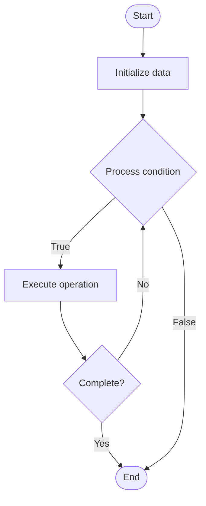

# Metrics Collection

Name of Algorithm  

## Code Files


## Algorithm Visualization

### Flowchart (ASCII)


```
Metrics Collection Flowchart:

┌─────────────┐
│   Start     │
└──────┬──────┘
       │
       ▼
┌─────────────┐
│  Initialize │
│   data      │
└──────┬──────┘
       │
       ▼
┌─────────────┐      Yes
│  Process   ├──────┐
│  condition?│      │
└──────┬──────┘      │
       │ No          │
       ▼             │
┌─────────────┐      │
│  Execute   │      │
│  operation │      │
└──────┬──────┘      │
       │             │
       └─────────────┘
       │
       ▼
┌─────────────┐
│    End      │
└─────────────┘
```


### Step-by-Step Execution


```
Metrics Collection Step-by-Step Execution:

Input: [example data]

Step 1: Initialize
State: [initial state]

Step 2: Process
State: [intermediate state]

Step 3: Finalize
State: [final state]

Result: [output]
```


### Interactive Flowchart (Mermaid)





> **Note**: Mermaid diagrams are rendered automatically on GitHub. For local viewing, use a Mermaid-compatible Markdown viewer.
- [Python Implementation](/code/semester_09/lecture_62_observability_advanced/metrics_collection/algorithm.py)
- [Java Implementation](/code/semester_09/lecture_62_observability_advanced/metrics_collection/Algorithm.java)
- [Python Tests](/code/semester_09/lecture_62_observability_advanced/metrics_collection/test_algorithm.py)


   Metrics Collection

What problem does it solve? (1 sentence)  
   Collects, aggregates, and stores time-series metrics from applications and infrastructure, enabling monitoring, alerting, and performance analysis through quantitative measurements.

Intuition (plain-language explanation)  
Like a weather monitoring system: metrics collection is like a weather monitoring system that continuously measures temperature, humidity, pressure (metrics) at different locations (services) and stores the measurements over time (time-series) - you can see trends (temperature rising), set alerts (temperature > 100°F), and analyze patterns (temperature higher in summer) - metrics give you quantitative data about your system's health and performance.

Inputs & Outputs  
   - Input: Metrics (counters, gauges, histograms), metric names, labels/tags, timestamps, collection intervals.  
   - Output: Time-series metrics, aggregated data, monitoring dashboards, alerts, performance insights.

Step-by-step description (5–10 lines max)  
Define metrics: identify metrics to collect (request rate, latency, error rate, CPU usage).
Instrument: add metric collection to applications (counters, gauges, timers).
Collect: collect metrics at regular intervals (scraping, pushing).
Aggregate: aggregate metrics (sum, average, percentiles).
Store: store metrics in time-series database (Prometheus, InfluxDB).
Label: label metrics with dimensions (service, environment, instance).
Query: enable querying metrics using query language (PromQL).
Visualize: create dashboards visualizing metrics over time.
Alert: configure alerts based on metric thresholds.
Analyze: analyze metrics to identify trends and anomalies.

Tiny example (hand-simulated)  
   Metrics collection: web application → metrics: request_rate, latency_p95, error_rate → collect: every 15s → store: Prometheus → query: request_rate > 1000/s → alert: error_rate > 1% → dashboard: shows latency trending up → analyze: latency spike at 2 PM → identify: database slow → metrics guide optimization.

Time & Space Complexity  
   - Time: O(1) per metric collection, O(m) for aggregation where m is number of metrics.  
   - Space: O(m·t) where m is metrics count, t is time period (time-series storage).

Strengths  
- Quantitative: provides quantitative measurements of system behavior.
- Efficient: metrics are lightweight compared to logs or traces.
- Scalability: can handle high volumes of metrics.

Weaknesses / limitations  
- Limited context: metrics don't provide detailed context like logs.
- Storage: long-term metric storage can be expensive.
- Cardinality: high cardinality metrics can cause storage issues.

Compare with alternatives  
    Alternatives: Logging, APM, Custom Monitoring, Cloud Metrics Services

30-second explanation (your own words)  
    Collects, aggregates, and stores time-series metrics from applications and infrastructure, enabling monitoring, alerting, and performance analysis through quantitative measurements.

*Sources: Adapted from standard university textbooks and Wikipedia summaries.*
