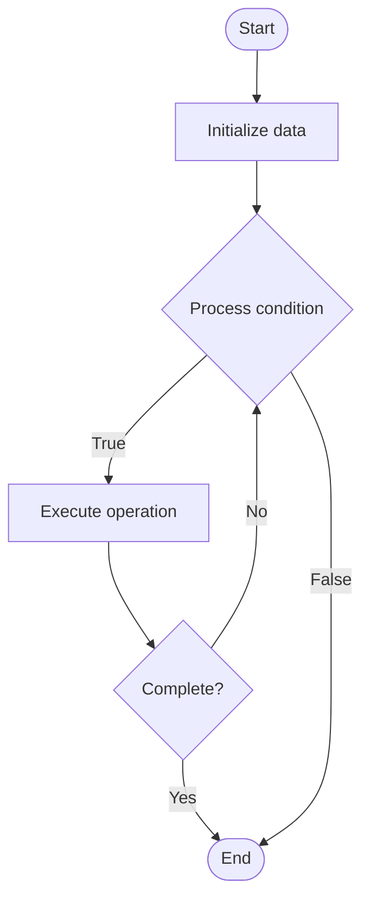

# Synthetic Monitoring

## Учебные материалы

- [Школьный уровень](school.ru.md)
- [Университетский уровень](univer.ru.md)

## Algorithm Visualization

### Flowchart (ASCII)

```
Synthetic Monitoring Flowchart:

┌─────────────┐
│   Start     │
└──────┬──────┘
       │
       ▼
┌─────────────┐
│  Initialize │
│   data      │
└──────┬──────┘
       │
       ▼
┌─────────────┐      Yes
│  Process   ├──────┐
│  condition?│      │
└──────┬──────┘      │
       │ No          │
       ▼             │
┌─────────────┐      │
│  Execute   │      │
│  operation │      │
└──────┬──────┘      │
       │             │
       └─────────────┘
       │
       ▼
┌─────────────┐
│    End      │
└─────────────┘
```

### Step-by-Step Execution

```
Synthetic Monitoring Step-by-Step Execution:

Input: [example data]

Step 1: Initialize
State: [initial state]

Step 2: Process
State: [intermediate state]

Step 3: Finalize
State: [final state]

Result: [output]
```

### Interactive Flowchart (Mermaid)



> **Note**: Mermaid diagrams are rendered automatically on GitHub. For local viewing, use a Mermaid-compatible Markdown viewer.

- [Python Implementation](/code/semester_09/lecture_62_observability_advanced/synthetic_monitoring/algorithm.py)
- [Java Implementation](/code/semester_09/lecture_62_observability_advanced/synthetic_monitoring/Algorithm.java)
- [Python Tests](/code/semester_09/lecture_62_observability_advanced/synthetic_monitoring/test_algorithm.py)

What problem does it solve? (1 sentence)  
   Proactively monitors application availability and performance by simulating user interactions and transactions, detecting issues before real users are affected.

Intuition (plain-language explanation)  
Like a robot tester: synthetic monitoring is like having a robot that continuously tests your application - the robot performs the same actions real users would do (like logging in, browsing products, making purchases) from different locations around the world - if the robot finds a problem (like slow response or error), it alerts you immediately, even if no real users have encountered it yet - it's like having a 24/7 quality assurance tester that never sleeps.

Inputs & Outputs  

  - Input: Test scripts, monitoring locations, test scenarios, frequency, thresholds.  
  - Output: Synthetic test results, availability metrics, performance measurements, proactive alerts.

Step-by-step description (5–10 lines max)  
Define scenarios: define user interaction scenarios to test (login, checkout, search).
Create scripts: create test scripts that simulate user actions.
Deploy: deploy synthetic monitors in multiple locations.
Schedule: schedule tests to run at regular intervals (every 5 minutes).
Execute: synthetic monitors execute test scripts.
Measure: measure response times, availability, and functionality.
Validate: validate that application responds correctly.
Alert: alert if tests fail or performance degrades.
Report: generate reports on availability and performance trends.
Optimize: use insights to improve application reliability.

Tiny example (hand-simulated)  
   Synthetic monitoring: e-commerce site → scenario: user login → script: POST /login, check response → deploy: monitors in 5 regions → schedule: run every 5 min → execute: monitors test login → measure: response time 200ms, success rate 100% → alert: response time > 500ms → detect: login fails in Asia region → alert: proactive detection → synthetic monitoring operational.

Time & Space Complexity  

  - Time: O(s) where s is scenario execution time (varies by test complexity).  
  - Space: O(r) where r is number of test results (result storage).

Strengths  

- Proactive: detects issues before real users are affected.
- Coverage: tests from multiple geographic locations.
- Consistency: provides consistent monitoring regardless of user traffic.

Weaknesses / limitations  

- Cost: running synthetic tests continuously can be expensive.
- Limited: may not catch all real user scenarios.
- Maintenance: test scripts need maintenance as application changes.

Compare with alternatives  
    Alternatives: Real User Monitoring, Uptime Monitoring, Health Checks, Load Testing

30-second explanation (your own words)  
    Proactively monitors application availability and performance by simulating user interactions and transactions, detecting issues before real users are affected.

*Sources: Adapted from standard university textbooks and Wikipedia summaries.*


## Historical Context

In software design, web design, and electronic product design, synthetic monitoring is a monitoring technique that is done by using a simulation or scripted recordings of transactions. Behavioral scripts are created to simulate an action or path that a customer or end user would take on a site, appl


## References

- [Synthetic monitoring](https://en.wikipedia.org/wiki/Synthetic_monitoring) - Wikipedia
