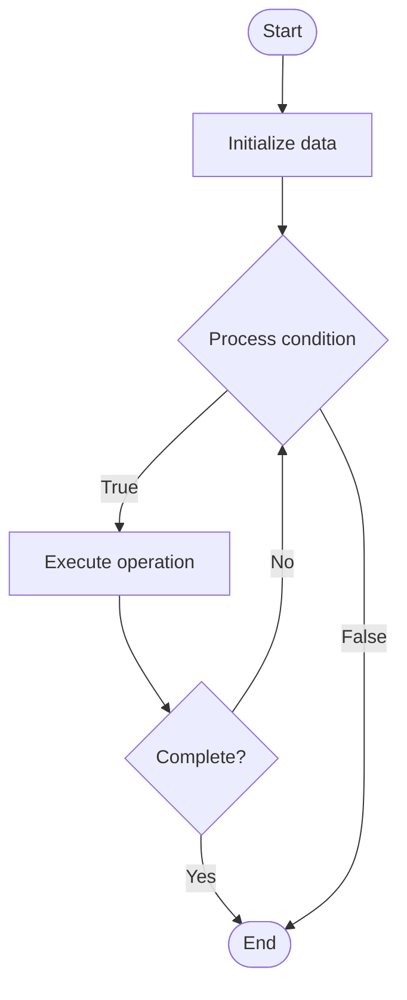

# Continual Learning

1. **Name of Algorithm**  

## Code Files


## Algorithm Visualization

### Flowchart (ASCII)


```
Continual Learning Flowchart:

┌─────────────┐
│   Start     │
└──────┬──────┘
       │
       ▼
┌─────────────┐
│  Initialize │
│   data      │
└──────┬──────┘
       │
       ▼
┌─────────────┐      Yes
│  Process   ├──────┐
│  condition?│      │
└──────┬──────┘      │
       │ No          │
       ▼             │
┌─────────────┐      │
│  Execute   │      │
│  operation │      │
└──────┬──────┘      │
       │             │
       └─────────────┘
       │
       ▼
┌─────────────┐
│    End      │
└─────────────┘
```


### Step-by-Step Execution


```
Continual Learning Step-by-Step Execution:

Input: [example data]

Step 1: Initialize
State: [initial state]

Step 2: Process
State: [intermediate state]

Step 3: Finalize
State: [final state]

Result: [output]
```


### Interactive Flowchart (Mermaid)





> **Note**: Mermaid diagrams are rendered automatically on GitHub. For local viewing, use a Mermaid-compatible Markdown viewer.
- [Python Implementation](semester_10/lecture_63_ai_advanced/continual_learning/algorithm.py)
- [Java Implementation](semester_10/lecture_63_ai_advanced/continual_learning/Algorithm.java)
- [Python Tests](semester_10/lecture_63_ai_advanced/continual_learning/test_algorithm.py)


   Continual Learning

2. **What problem does it solve? (1 sentence)**  
   Enables models to learn continuously from new data over time without forgetting previously learned knowledge, allowing AI systems to adapt to changing environments and accumulate knowledge.

3. **Intuition (plain-language explanation)**  
   Like lifelong learning: Continual Learning is like a person who keeps learning new things throughout life without forgetting what they already know - when you learn a new language, you don't forget your native language - continual learning does this for AI: it learns new tasks or data while preserving knowledge from previous tasks, allowing models to grow and adapt over time.

4. **Inputs & Outputs**  
   - Input: New data streams, previous model, memory mechanisms, learning strategies, task boundaries.  
   - Output: Updated model, preserved knowledge, accumulated learning, adaptive system, lifelong learner.

5. **Step-by-step description (5–10 lines max)**  
1. Receive: receive new data or task.
2. Protect: protect important previous knowledge (regularization, memory replay).
3. Learn: learn from new data while preserving old knowledge.
4. Update: update model parameters carefully.
5. Replay: optionally replay previous data to prevent forgetting.
6. Consolidate: consolidate new and old knowledge.
7. Evaluate: evaluate performance on both new and old tasks.
8. Adapt: adapt learning strategy based on performance.
9. Store: store important examples or patterns in memory.
10. Iterate: continue learning from subsequent data streams.

6. **Tiny example (hand-simulated)**  
   Continual Learning: task 1: learn to classify cats/dogs → task 2: learn to classify birds/fish → protect: use regularization to prevent forgetting cats/dogs → learn: learn birds/fish → replay: occasionally replay cat/dog examples → result: model knows all 4 classes → Continual Learning successful.

7. **Time & Space Complexity**  
   - Time: O(n + m) where n is new data size, m is replay data size (learning + replay overhead).  
   - Space: O(p + e) where p is model parameters, e is memory for examples (episodic memory).

8. **Strengths**  
- Adaptability: enables models to adapt to new data over time.
- Efficiency: avoids retraining on all data from scratch.
- Lifelong: supports lifelong learning scenarios.

9. **Weaknesses / limitations**  
- Catastrophic forgetting: risk of forgetting previous knowledge.
- Memory: requires memory mechanisms to prevent forgetting.
- Complexity: more complex than standard training.

10. **Compare with alternatives**  
    Alternatives: Retraining from Scratch, Multi-Task Learning, Transfer Learning, Elastic Weight Consolidation

11. **30-second explanation (your own words)**  
    Enables models to learn continuously from new data over time without forgetting previously learned knowledge, allowing AI systems to adapt to changing environments and accumulate knowledge.

*Sources: Adapted from standard university textbooks and Wikipedia summaries.*
