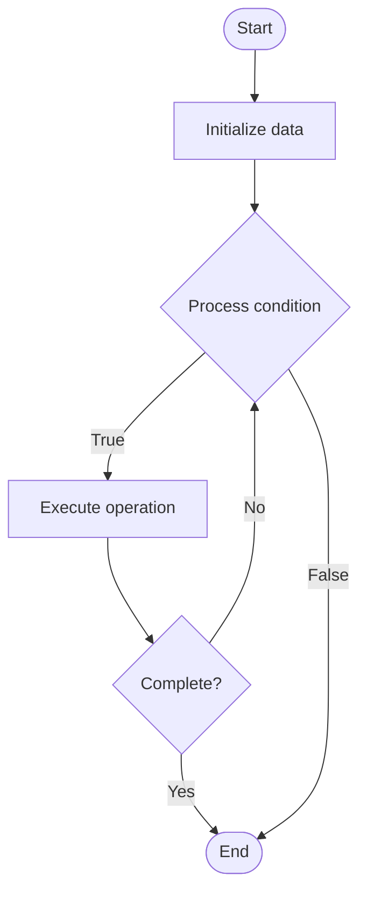

# Advanced Few-Shot Learning

## Учебные материалы

- [Школьный уровень](school.ru.md)
- [Университетский уровень](univer.ru.md)

## Algorithm Visualization

### Flowchart (ASCII)

```
Advanced Few-Shot Learning Flowchart:

┌─────────────┐
│   Start     │
└──────┬──────┘
       │
       ▼
┌─────────────┐
│  Initialize │
│   data      │
└──────┬──────┘
       │
       ▼
┌─────────────┐      Yes
│  Process   ├──────┐
│  condition?│      │
└──────┬──────┘      │
       │ No          │
       ▼             │
┌─────────────┐      │
│  Execute   │      │
│  operation │      │
└──────┬──────┘      │
       │             │
       └─────────────┘
       │
       ▼
┌─────────────┐
│    End      │
└─────────────┘
```

### Step-by-Step Execution

```
Advanced Few-Shot Learning Step-by-Step Execution:

Input: [example data]

Step 1: Initialize
State: [initial state]

Step 2: Process
State: [intermediate state]

Step 3: Finalize
State: [final state]

Result: [output]
```

### Interactive Flowchart (Mermaid)



> **Note**: Mermaid diagrams are rendered automatically on GitHub. For local viewing, use a Mermaid-compatible Markdown viewer.

- [Python Implementation](/code/semester_10/lecture_63_ai_advanced/few_shot_learning_advanced/algorithm.py)
- [Java Implementation](/code/semester_10/lecture_63_ai_advanced/few_shot_learning_advanced/Algorithm.java)
- [Python Tests](/code/semester_10/lecture_63_ai_advanced/few_shot_learning_advanced/test_algorithm.py)

   Advanced Few-Shot Learning

What problem does it solve? (1 sentence)  
   Enables models to learn new tasks from very few examples (often just 1-5 examples) using advanced techniques like meta-learning, metric learning, and prompt engineering, making AI systems highly data-efficient.

Intuition (plain-language explanation)  
   Like learning from one example: Advanced Few-Shot Learning is like learning to recognize a new animal from just one picture - you use your general knowledge about animals (pre-trained knowledge) and the one example to quickly understand the new animal - advanced few-shot learning does this for AI: it uses pre-trained knowledge and sophisticated learning techniques to learn new tasks from just a few examples.

Inputs & Outputs  

  - Input: Few examples (1-5), pre-trained model, task description, learning strategy, support set.  
- Output: Learned task, adapted model, few-shot predictions, efficient learning, data-efficient system.

Step-by-step description (5–10 lines max)  
Pre-train: pre-train model on diverse tasks (meta-learning setup).
Receive: receive few examples for new task (support set).
Encode: encode examples into representations.
Compare: compare new examples with learned prototypes or embeddings.
Adapt: adapt model quickly to new task (fine-tuning, prompt tuning).
Learn: learn task-specific patterns from few examples.
Generalize: generalize to new examples (query set).
Optimize: optimize for few-shot performance.
Evaluate: evaluate on test examples.
Iterate: iterate to improve few-shot learning.

Tiny example (hand-simulated)  
   Advanced Few-Shot Learning: pre-train: on many classification tasks → new task: classify 3 types of flowers → examples: 1 example per flower (3 total) → encode: encode examples → compare: compare with learned patterns → adapt: quickly adapt model → predict: classify new flower images → result: 85% accuracy with just 3 examples → Advanced Few-Shot Learning successful.

Time & Space Complexity  

  - Time: O(e + a) where e is encoding time, a is adaptation time (much faster than full training).  
  - Space: O(m + p) where m is model size, p is prototype/embedding storage.

Strengths  

- Data efficiency: learns from very few examples.
- Speed: fast adaptation to new tasks.
- Flexibility: handles diverse tasks with minimal data.

Weaknesses / limitations  

- Pre-training: requires extensive pre-training on diverse tasks.
- Task similarity: performance depends on similarity to pre-training tasks.
- Limitations: may struggle with very different or complex tasks.

Compare with alternatives  
    Alternatives: Standard Training, Transfer Learning, Zero-Shot Learning, Meta-Learning

30-second explanation (your own words)  
    Enables models to learn new tasks from very few examples (often just 1-5 examples) using advanced techniques like meta-learning, metric learning, and prompt engineering, making AI systems highly data-efficient.

*Sources: Adapted from standard university textbooks and Wikipedia summaries.*


## References

- [Few Shot Learning Advanced - Wikipedia](https://en.wikipedia.org/wiki/Few%20Shot%20Learning%20Advanced)
