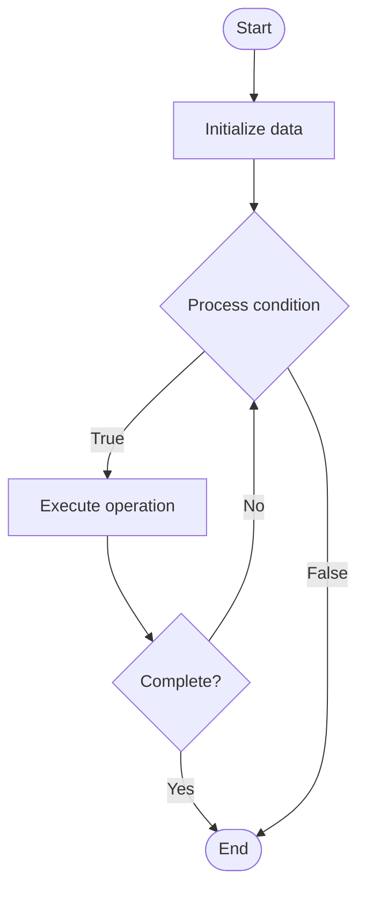

# Lifelong Learning

Name of Algorithm  

## Code Files


## Algorithm Visualization

### Flowchart (ASCII)


```
Lifelong Learning Flowchart:

┌─────────────┐
│   Start     │
└──────┬──────┘
       │
       ▼
┌─────────────┐
│  Initialize │
│   data      │
└──────┬──────┘
       │
       ▼
┌─────────────┐      Yes
│  Process   ├──────┐
│  condition?│      │
└──────┬──────┘      │
       │ No          │
       ▼             │
┌─────────────┐      │
│  Execute   │      │
│  operation │      │
└──────┬──────┘      │
       │             │
       └─────────────┘
       │
       ▼
┌─────────────┐
│    End      │
└─────────────┘
```


### Step-by-Step Execution


```
Lifelong Learning Step-by-Step Execution:

Input: [example data]

Step 1: Initialize
State: [initial state]

Step 2: Process
State: [intermediate state]

Step 3: Finalize
State: [final state]

Result: [output]
```


### Interactive Flowchart (Mermaid)





> **Note**: Mermaid diagrams are rendered automatically on GitHub. For local viewing, use a Mermaid-compatible Markdown viewer.
- [Python Implementation](/code/semester_10/lecture_63_ai_advanced/lifelong_learning/algorithm.py)
- [Java Implementation](/code/semester_10/lecture_63_ai_advanced/lifelong_learning/Algorithm.java)
- [Python Tests](/code/semester_10/lecture_63_ai_advanced/lifelong_learning/test_algorithm.py)


   Lifelong Learning

What problem does it solve? (1 sentence)  
   Enables AI systems to learn continuously throughout their operational lifetime, accumulating knowledge from multiple tasks and experiences while maintaining performance on previously learned tasks.

Intuition (plain-language explanation)  
   Like human learning: Lifelong Learning is like how humans learn throughout life - you learn math in school, then programming, then new technologies, and you remember and use all of it - lifelong learning does this for AI: it learns new tasks continuously, remembers old tasks, and uses all knowledge together, creating systems that grow smarter over time.

Inputs & Outputs  
   - Input: Continuous data streams, multiple tasks, previous knowledge, memory systems, learning mechanisms.  
   - Output: Accumulated knowledge, multi-task capability, adaptive system, lifelong learner, growing intelligence.

Step-by-step description (5–10 lines max)  
Learn task 1: learn first task and store knowledge.
Learn task 2: learn second task while preserving task 1 knowledge.
Consolidate: consolidate knowledge from multiple tasks.
Transfer: transfer knowledge between related tasks.
Protect: protect important knowledge from forgetting.
Replay: replay previous tasks to maintain performance.
Adapt: adapt to new tasks using accumulated knowledge.
Generalize: generalize across tasks using shared knowledge.
Update: update knowledge base continuously.
Evolve: evolve system capabilities over time.

Tiny example (hand-simulated)  
   Lifelong Learning: task 1: image classification → task 2: object detection → task 3: image segmentation → learn: each task sequentially → protect: prevent forgetting → transfer: use classification knowledge for detection → consolidate: shared visual features → result: system knows all 3 tasks → Lifelong Learning successful.

Time & Space Complexity  
   - Time: O(Σn_i + r) where n_i is data per task, r is replay overhead (accumulated learning).  
   - Space: O(m + k) where m is model size, k is knowledge base size (grows over time).

Strengths  
- Accumulation: accumulates knowledge over time.
- Efficiency: reuses knowledge across tasks.
- Adaptability: adapts to new tasks continuously.

Weaknesses / limitations  
- Forgetting: risk of catastrophic forgetting.
- Scalability: knowledge base grows over time.
- Complexity: managing multiple tasks is complex.

Compare with alternatives  
    Alternatives: Task-Specific Models, Multi-Task Learning, Continual Learning, Transfer Learning

30-second explanation (your own words)  
    Enables AI systems to learn continuously throughout their operational lifetime, accumulating knowledge from multiple tasks and experiences while maintaining performance on previously learned tasks.

*Sources: Adapted from standard university textbooks and Wikipedia summaries.*
