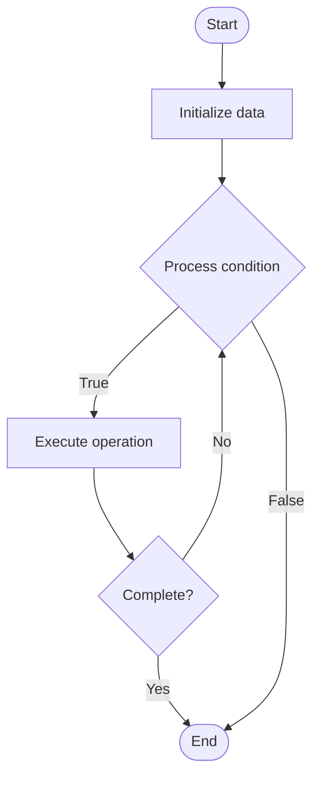

# Meta-Learning (Learning to Learn)

Name of Algorithm  

## Code Files


## Algorithm Visualization

### Flowchart (ASCII)


```
Meta-Learning (Learning to Learn) Flowchart:

┌─────────────┐
│   Start     │
└──────┬──────┘
       │
       ▼
┌─────────────┐
│  Initialize │
│   data      │
└──────┬──────┘
       │
       ▼
┌─────────────┐      Yes
│  Process   ├──────┐
│  condition?│      │
└──────┬──────┘      │
       │ No          │
       ▼             │
┌─────────────┐      │
│  Execute   │      │
│  operation │      │
└──────┬──────┘      │
       │             │
       └─────────────┘
       │
       ▼
┌─────────────┐
│    End      │
└─────────────┘
```


### Step-by-Step Execution


```
Meta-Learning (Learning to Learn) Step-by-Step Execution:

Input: [example data]

Step 1: Initialize
State: [initial state]

Step 2: Process
State: [intermediate state]

Step 3: Finalize
State: [final state]

Result: [output]
```


### Interactive Flowchart (Mermaid)





> **Note**: Mermaid diagrams are rendered automatically on GitHub. For local viewing, use a Mermaid-compatible Markdown viewer.
- [Python Implementation](/code/semester_10/lecture_63_ai_advanced/meta_learning/algorithm.py)
- [Java Implementation](/code/semester_10/lecture_63_ai_advanced/meta_learning/Algorithm.java)
- [Python Tests](/code/semester_10/lecture_63_ai_advanced/meta_learning/test_algorithm.py)


   Meta-Learning (Learning to Learn)

What problem does it solve? (1 sentence)  
   Trains models to learn how to learn, enabling them to quickly adapt to new tasks with minimal data by leveraging experience from learning many previous tasks.

Intuition (plain-language explanation)  
   Like learning study techniques: Meta-Learning is like learning how to study effectively - once you know good study techniques (meta-knowledge), you can quickly learn any new subject - meta-learning does this for AI: it learns general learning strategies from many tasks, then uses those strategies to quickly learn new tasks with little data.

Inputs & Outputs  
- Input: Multiple training tasks, few examples per task, meta-learning algorithm, adaptation mechanism.
- Output: Meta-learned model, fast adaptation, learning strategies, few-shot capability, efficient learner.

Step-by-step description (5–10 lines max)  
Sample tasks: sample multiple tasks from task distribution.
Split: split each task into support (training) and query (test) sets.
Train: train model on support set of each task.
Test: test on query set to compute loss.
Meta-update: update meta-parameters based on performance across tasks.
Learn strategy: learn general learning strategy from many tasks.
New task: receive new task with few examples.
Adapt: quickly adapt using learned strategy.
Predict: make predictions on new task.
Iterate: iterate meta-learning to improve strategy.

Tiny example (hand-simulated)  
   Meta-Learning: tasks: 100 different classification tasks → learn: learn general learning strategy → new task: classify 5 types of birds with 1 example each → adapt: use learned strategy to adapt quickly → predict: classify new bird images → result: 90% accuracy with 5 examples → Meta-Learning successful.

Time & Space Complexity  
   - Time: O(t·(n + a)) where t is number of tasks, n is training time per task, a is adaptation time (meta-training phase).  
   - Space: O(m + s) where m is model size, s is strategy storage (meta-parameters).

Strengths  
- Fast adaptation: enables rapid adaptation to new tasks.
- Data efficiency: learns from few examples using prior experience.
- Generalization: learns generalizable learning strategies.

Weaknesses / limitations  
- Pre-training: requires extensive pre-training on many tasks.
- Task distribution: performance depends on similarity of new tasks to training tasks.
- Complexity: meta-learning algorithms can be complex to design and train.

Compare with alternatives  
    Alternatives: Transfer Learning, Few-Shot Learning, Multi-Task Learning, Pre-training

30-second explanation (your own words)  
    Trains models to learn how to learn, enabling them to quickly adapt to new tasks with minimal data by leveraging experience from learning many previous tasks.

*Sources: Adapted from standard university textbooks and Wikipedia summaries.*
