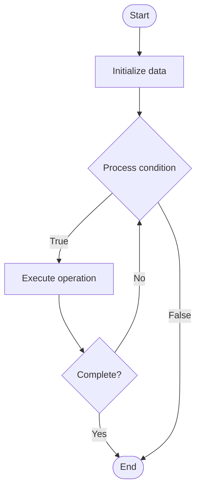

# Advanced Transfer Learning

## Учебные материалы

- [Школьный уровень](school.ru.md)
- [Университетский уровень](univer.ru.md)

## Algorithm Visualization

### Flowchart (ASCII)

```
Advanced Transfer Learning Flowchart:

┌─────────────┐
│   Start     │
└──────┬──────┘
       │
       ▼
┌─────────────┐
│  Initialize │
│   data      │
└──────┬──────┘
       │
       ▼
┌─────────────┐      Yes
│  Process   ├──────┐
│  condition?│      │
└──────┬──────┘      │
       │ No          │
       ▼             │
┌─────────────┐      │
│  Execute   │      │
│  operation │      │
└──────┬──────┘      │
       │             │
       └─────────────┘
       │
       ▼
┌─────────────┐
│    End      │
└─────────────┘
```

### Step-by-Step Execution

```
Advanced Transfer Learning Step-by-Step Execution:

Input: [example data]

Step 1: Initialize
State: [initial state]

Step 2: Process
State: [intermediate state]

Step 3: Finalize
State: [final state]

Result: [output]
```

### Interactive Flowchart (Mermaid)



> **Note**: Mermaid diagrams are rendered automatically on GitHub. For local viewing, use a Mermaid-compatible Markdown viewer.

- [Python Implementation](/code/semester_10/lecture_63_ai_advanced/transfer_learning_advanced/algorithm.py)
- [Java Implementation](/code/semester_10/lecture_63_ai_advanced/transfer_learning_advanced/Algorithm.java)
- [Python Tests](/code/semester_10/lecture_63_ai_advanced/transfer_learning_advanced/test_algorithm.py)

What problem does it solve? (1 sentence)  
   Applies sophisticated transfer learning techniques including domain adaptation, multi-task transfer, and progressive transfer to leverage knowledge from source domains and tasks for improved performance on target tasks.

Intuition (plain-language explanation)  
Like learning from related experiences: advanced transfer learning is like a doctor who learned general medicine and then specializes - they transfer their general knowledge (source domain) to their specialty (target domain), adapting what's relevant and learning what's new - advanced transfer learning does this systematically: it identifies what knowledge transfers well, adapts it to the new domain, and progressively refines it, making learning much more efficient than starting from scratch.

Inputs & Outputs  

  - Input: Source model, source data, target data, domain adaptation strategies, transfer techniques.  
  - Output: Transferred model, adapted knowledge, improved target task performance, domain-aligned model.

Step-by-step description (5–10 lines max)  
Select source: choose pre-trained source model on related task or domain.
Analyze domains: analyze similarities and differences between source and target domains.
Choose strategy: select transfer strategy (feature extraction, fine-tuning, domain adaptation).
Extract features: extract transferable features from source model.
Adapt: adapt features to target domain (domain adaptation, adversarial training).
Fine-tune: fine-tune model on target task with small learning rate.
Progressive transfer: progressively transfer knowledge (curriculum learning, gradual unfreezing).
Multi-task: optionally transfer from multiple source tasks (multi-task transfer).
Validate: validate transfer effectiveness on target task.
Optimize: optimize transfer strategy based on performance.

Tiny example (hand-simulated)  
   Advanced transfer learning: source: ImageNet pre-trained ResNet → target: medical X-ray classification → domain gap: natural images vs medical images → strategy: domain adaptation + fine-tuning → adapt: use adversarial domain adaptation → fine-tune: on X-ray dataset → result: 90% accuracy vs 60% from scratch → advanced transfer learning successful.

Time & Space Complexity  

  - Time: O(n_t) for fine-tuning where n_t is target data size (much less than training from scratch).  
  - Space: O(m) where m is model size (same as source model, may add adaptation layers).

Strengths  

- Efficiency: requires much less target data than training from scratch.
- Performance: often achieves better performance with less data.
- Flexibility: supports various transfer strategies for different scenarios.

Weaknesses / limitations  

- Domain gap: large domain gaps may limit transfer effectiveness.
- Negative transfer: inappropriate source may hurt performance.
- Complexity: advanced techniques add complexity to training.

Compare with alternatives  
    Alternatives: Training from Scratch, Basic Transfer Learning, Domain Adaptation, Multi-Task Learning

30-second explanation (your own words)  
    Applies sophisticated transfer learning techniques including domain adaptation, multi-task transfer, and progressive transfer to leverage knowledge from source domains and tasks for improved performance on target tasks.

*Sources: Adapted from standard university textbooks and Wikipedia summaries.*
