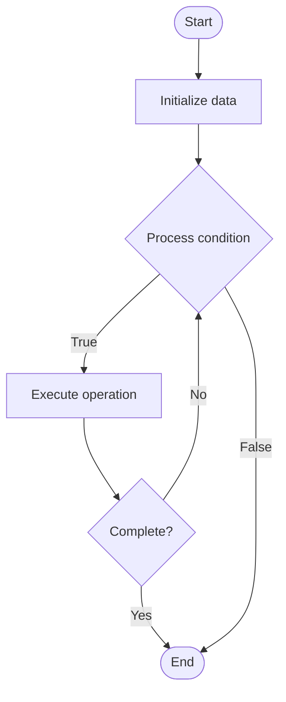

# LLM Compression

## Учебные материалы

- [Школьный уровень](school.ru.md)
- [Университетский уровень](univer.ru.md)

## Algorithm Visualization

### Flowchart (ASCII)

```
LLM Compression Flowchart:

┌─────────────┐
│   Start     │
└──────┬──────┘
       │
       ▼
┌─────────────┐
│  Initialize │
│   data      │
└──────┬──────┘
       │
       ▼
┌─────────────┐      Yes
│  Process   ├──────┐
│  condition?│      │
└──────┬──────┘      │
       │ No          │
       ▼             │
┌─────────────┐      │
│  Execute   │      │
│  operation │      │
└──────┬──────┘      │
       │             │
       └─────────────┘
       │
       ▼
┌─────────────┐
│    End      │
└─────────────┘
```

### Step-by-Step Execution

```
LLM Compression Step-by-Step Execution:

Input: [example data]

Step 1: Initialize
State: [initial state]

Step 2: Process
State: [intermediate state]

Step 3: Finalize
State: [final state]

Result: [output]
```

### Interactive Flowchart (Mermaid)



> **Note**: Mermaid diagrams are rendered automatically on GitHub. For local viewing, use a Mermaid-compatible Markdown viewer.

- [Python Implementation](/code/semester_10/lecture_64_llm_architecture_advanced/llm_compression/algorithm.py)
- [Java Implementation](/code/semester_10/lecture_64_llm_architecture_advanced/llm_compression/Algorithm.java)
- [Python Tests](/code/semester_10/lecture_64_llm_architecture_advanced/llm_compression/test_algorithm.py)

   LLM Compression

What problem does it solve? (1 sentence)  
   Reduces the size and computational requirements of large language models through techniques like quantization, pruning, distillation, and low-rank factorization while maintaining acceptable performance.

Intuition (plain-language explanation)  
   Like compressing a large file: LLM compression is like compressing a large file to make it smaller and faster to use - you can reduce file size (model size) by removing unnecessary parts (pruning), using less precise numbers (quantization), or creating a smaller summary version (distillation) - the compressed version is much smaller and faster, but still contains the essential information, making it practical to deploy on devices with limited resources.

Inputs & Outputs  

  - Input: Large language model, compression technique, target size, performance requirements, deployment constraints.  
  - Output: Compressed model, reduced size, faster inference, maintained performance.

Step-by-step description (5–10 lines max)  
Analyze model: analyze model structure, parameters, and importance.
Choose technique: select compression technique (quantization, pruning, distillation, factorization).
Quantize: reduce precision of weights (FP32 → FP16 → INT8) if using quantization.
Prune: remove less important weights or neurons if using pruning.
Distill: train smaller student model to mimic larger teacher if using distillation.
Factorize: decompose weight matrices into low-rank factors if using factorization.
Fine-tune: fine-tune compressed model to recover performance.
Validate: validate compressed model performance on benchmarks.
Optimize: optimize compression strategy to balance size and performance.
Deploy: deploy compressed model for inference.

Tiny example (hand-simulated)  
   LLM compression: GPT-3 (175B parameters, 700GB) → quantization: FP32 → INT8 → size: 175GB (4x reduction) → pruning: remove 50% weights → size: 87.5GB (8x reduction) → distillation: train 7B student → size: 14GB (50x reduction) → performance: 95% of original → compressed model deployable.

Time & Space Complexity  

  - Time: O(m) for compression where m is model size, O(n) for fine-tuning where n is fine-tuning data size.  
  - Space: O(c) where c is compressed model size (significantly smaller than original).

Strengths  

- Efficiency: dramatically reduces model size and inference cost.
- Deployability: enables deployment on resource-constrained devices.
- Speed: faster inference due to smaller model and lower precision.

Weaknesses / limitations  

- Performance: may have some performance degradation.
- Complexity: compression techniques can be complex to apply.
- Trade-offs: requires balancing compression ratio and performance.

Compare with alternatives  
Alternatives: Full Precision Models, Model Distillation, Knowledge Distillation, Efficient Architectures

30-second explanation (your own words)  
    Reduces the size and computational requirements of large language models through techniques like quantization, pruning, distillation, and low-rank factorization while maintaining acceptable performance.

*Sources: Adapted from standard university textbooks and Wikipedia summaries.*


## References

- [Llm Compression - Wikipedia](https://en.wikipedia.org/wiki/Llm%20Compression)
