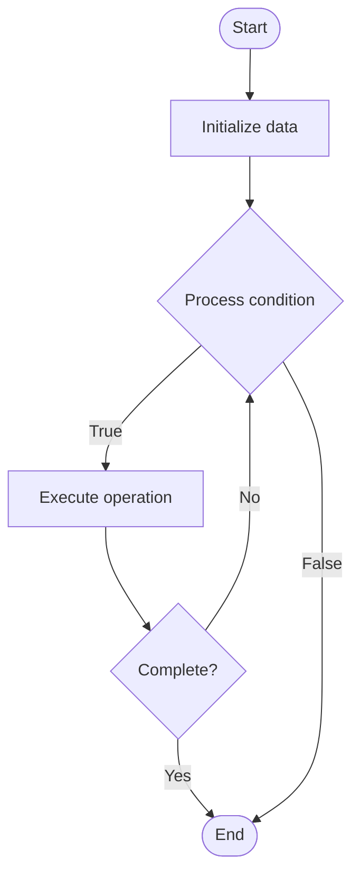

# Long Context Models

1. **Name of Algorithm**  

## Code Files


## Algorithm Visualization

### Flowchart (ASCII)


```
Long Context Models Flowchart:

┌─────────────┐
│   Start     │
└──────┬──────┘
       │
       ▼
┌─────────────┐
│  Initialize │
│   data      │
└──────┬──────┘
       │
       ▼
┌─────────────┐      Yes
│  Process   ├──────┐
│  condition?│      │
└──────┬──────┘      │
       │ No          │
       ▼             │
┌─────────────┐      │
│  Execute   │      │
│  operation │      │
└──────┬──────┘      │
       │             │
       └─────────────┘
       │
       ▼
┌─────────────┐
│    End      │
└─────────────┘
```


### Step-by-Step Execution


```
Long Context Models Step-by-Step Execution:

Input: [example data]

Step 1: Initialize
State: [initial state]

Step 2: Process
State: [intermediate state]

Step 3: Finalize
State: [final state]

Result: [output]
```


### Interactive Flowchart (Mermaid)





> **Note**: Mermaid diagrams are rendered automatically on GitHub. For local viewing, use a Mermaid-compatible Markdown viewer.
- [Python Implementation](semester_10/lecture_64_llm_architecture_advanced/long_context_models/algorithm.py)
- [Java Implementation](semester_10/lecture_64_llm_architecture_advanced/long_context_models/Algorithm.java)
- [Python Tests](semester_10/lecture_64_llm_architecture_advanced/long_context_models/test_algorithm.py)


   Long Context Models

2. **What problem does it solve? (1 sentence)**  
Enables language models to process and understand very long sequences (tens of thousands to millions of tokens) through efficient attention mechanisms, context compression, and memory management techniques.

3. **Intuition (plain-language explanation)**  
Like reading a very long book: long context models are like being able to read and remember an entire book at once - instead of only remembering the last few pages (short context), you can remember and reference information from hundreds of pages ago (long context) - this is achieved through efficient memory systems (like bookmarks and summaries) that let you quickly find and use information from anywhere in the book without re-reading everything.

4. **Inputs & Outputs**  
   - Input: Long sequences, context window, attention mechanism, memory systems, compression techniques.  
- Output: Long-context understanding, extended memory, efficient processing, context-aware generation.

5. **Step-by-step description (5–10 lines max)**  
1. Design architecture: design model architecture for long contexts (sparse attention, sliding window).
2. Implement attention: implement efficient attention mechanism (sparse, sliding window, hierarchical).
3. Manage memory: implement memory management (external memory, key-value cache compression).
4. Compress context: compress or summarize earlier context to save memory.
5. Process chunks: process long sequences in chunks with context preservation.
6. Retrieve: retrieve relevant context from memory when needed.
7. Attend: attend to relevant parts of long context efficiently.
8. Generate: generate text with awareness of full long context.
9. Optimize: optimize for memory efficiency and computational cost.
10. Scale: scale context length to desired size (32K, 128K, 1M+ tokens).

6. **Tiny example (hand-simulated)**  
   Long context model: input: 100K token document → architecture: sparse attention (attend to 2K tokens) → memory: compress first 98K tokens to summary → process: attend to summary + recent 2K tokens → generate: answer question using full context → context: 100K tokens processed efficiently → long context model operational.

7. **Time & Space Complexity**  
   - Time: O(n·d) with sparse attention where n is sequence length, d is attention window (much better than O(n²) full attention).  
   - Space: O(n) where n is context length (may use compression to reduce to O(k) where k << n).

8. **Strengths**  
- Long context: enables processing of very long documents and conversations.
- Efficiency: efficient attention mechanisms make long contexts feasible.
- Understanding: better understanding through access to full context.

9. **Weaknesses / limitations**  
- Complexity: long context models are more complex to design and train.
- Memory: still requires significant memory for very long contexts.
- Quality: context compression may lose some information.

10. **Compare with alternatives**  
    Alternatives: Short Context Models, Hierarchical Attention, Retrieval-Augmented Generation, Sliding Window

11. **30-second explanation (your own words)**  
Enables language models to process and understand very long sequences (tens of thousands to millions of tokens) through efficient attention mechanisms, context compression, and memory management techniques.

*Sources: Adapted from standard university textbooks and Wikipedia summaries.*
