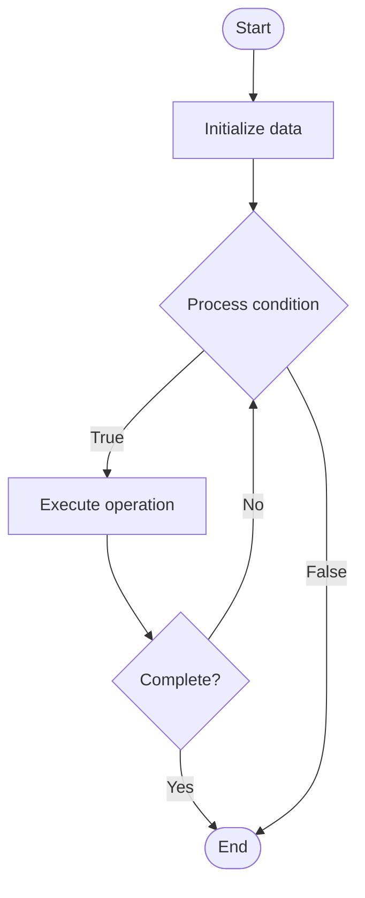

# Mixture of Experts (MoE)

## Учебные материалы

- [Школьный уровень](school.ru.md)
- [Университетский уровень](univer.ru.md)

## Algorithm Visualization

### Flowchart (ASCII)

```
Mixture of Experts (MoE) Flowchart:

┌─────────────┐
│   Start     │
└──────┬──────┘
       │
       ▼
┌─────────────┐
│  Initialize │
│   data      │
└──────┬──────┘
       │
       ▼
┌─────────────┐      Yes
│  Process   ├──────┐
│  condition?│      │
└──────┬──────┘      │
       │ No          │
       ▼             │
┌─────────────┐      │
│  Execute   │      │
│  operation │      │
└──────┬──────┘      │
       │             │
       └─────────────┘
       │
       ▼
┌─────────────┐
│    End      │
└─────────────┘
```

### Step-by-Step Execution

```
Mixture of Experts (MoE) Step-by-Step Execution:

Input: [example data]

Step 1: Initialize
State: [initial state]

Step 2: Process
State: [intermediate state]

Step 3: Finalize
State: [final state]

Result: [output]
```

### Interactive Flowchart (Mermaid)



> **Note**: Mermaid diagrams are rendered automatically on GitHub. For local viewing, use a Mermaid-compatible Markdown viewer.

- [Python Implementation](/code/semester_10/lecture_64_llm_architecture_advanced/mixture_of_experts/algorithm.py)
- [Java Implementation](/code/semester_10/lecture_64_llm_architecture_advanced/mixture_of_experts/Algorithm.java)
- [Python Tests](/code/semester_10/lecture_64_llm_architecture_advanced/mixture_of_experts/test_algorithm.py)

   Mixture of Experts (MoE)

What problem does it solve? (1 sentence)  
   Scales model capacity by using multiple expert networks where only a subset of experts are activated for each input, enabling very large models with manageable computational cost.

Intuition (plain-language explanation)  
   Like a team of specialists: Mixture of Experts is like having a team of specialists where each expert handles different types of problems - when a question comes in, a router (gating network) decides which 1-2 experts are best suited (like routing a medical question to a doctor, not a lawyer) - only those experts process the input, so you get the benefit of many specialists (large model capacity) without the cost of consulting all of them (computational efficiency).

Inputs & Outputs  

  - Input: Input tokens, expert networks, gating/router network, number of active experts, expert capacity.  
- Output: Expert-selected outputs, routed computations, scaled model capacity, efficient processing.

Step-by-step description (5–10 lines max)  
Create experts: create multiple expert networks (feedforward layers).
Create router: create gating network that routes inputs to experts.
Route: router determines which experts to activate for each token.
Select: select top-k experts (typically 1-2) for each token.
Process: each selected expert processes the token independently.
Combine: combine outputs from selected experts (weighted sum or concatenation).
Load balance: ensure experts are used evenly (load balancing loss).
Train: train experts and router jointly.
Scale: scale model by adding more experts without proportional compute increase.
Optimize: optimize routing and expert utilization.

Tiny example (hand-simulated)  
   MoE: 8 experts, router selects top-2 → input token → router: scores experts → select: expert 3 (0.6), expert 7 (0.4) → process: both experts process token → combine: weighted sum (0.6·expert3 + 0.4·expert7) → output → capacity: 8 experts, compute: only 2 active → MoE scales efficiently.

Time & Space Complexity  

  - Time: O(e·d) where e is number of active experts (typically 1-2), d is expert dimension (much less than O(E·d) for all experts).  
  - Space: O(E·d) where E is total experts, d is expert size (all experts stored, but only few active).

Strengths  

- Scalability: enables very large models (trillions of parameters) with manageable compute.
- Efficiency: only activates subset of experts, reducing computation.
- Specialization: experts can specialize in different patterns or domains.

Weaknesses / limitations  

- Routing: routing decisions can be suboptimal.
- Load balancing: requires careful load balancing to use experts evenly.
- Complexity: more complex than dense models.

Compare with alternatives  
    Alternatives: Dense Models, Sparse Models, Conditional Computation, Switch Transformers

30-second explanation (your own words)  
    Scales model capacity by using multiple expert networks where only a subset of experts are activated for each input, enabling very large models with manageable computational cost.

*Sources: Adapted from standard university textbooks and Wikipedia summaries.*
