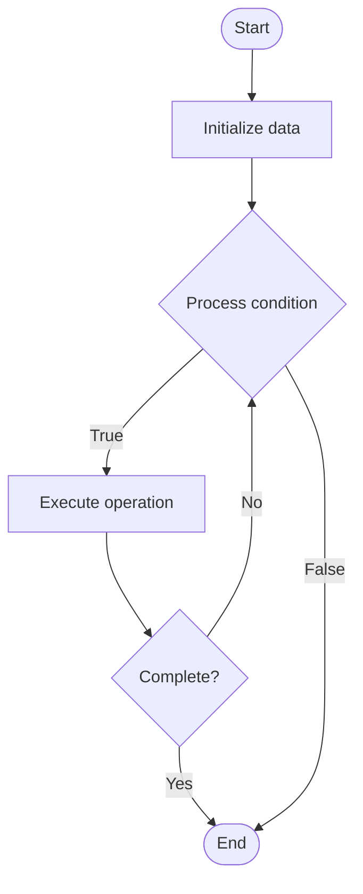

# Multimodal Large Language Models

1. **Name of Algorithm**  

## Code Files


## Algorithm Visualization

### Flowchart (ASCII)


```
Multimodal Large Language Models Flowchart:

┌─────────────┐
│   Start     │
└──────┬──────┘
       │
       ▼
┌─────────────┐
│  Initialize │
│   data      │
└──────┬──────┘
       │
       ▼
┌─────────────┐      Yes
│  Process   ├──────┐
│  condition?│      │
└──────┬──────┘      │
       │ No          │
       ▼             │
┌─────────────┐      │
│  Execute   │      │
│  operation │      │
└──────┬──────┘      │
       │             │
       └─────────────┘
       │
       ▼
┌─────────────┐
│    End      │
└─────────────┘
```


### Step-by-Step Execution


```
Multimodal Large Language Models Step-by-Step Execution:

Input: [example data]

Step 1: Initialize
State: [initial state]

Step 2: Process
State: [intermediate state]

Step 3: Finalize
State: [final state]

Result: [output]
```


### Interactive Flowchart (Mermaid)





> **Note**: Mermaid diagrams are rendered automatically on GitHub. For local viewing, use a Mermaid-compatible Markdown viewer.
- [Python Implementation](semester_10/lecture_64_llm_architecture_advanced/multimodal_llms/algorithm.py)
- [Java Implementation](semester_10/lecture_64_llm_architecture_advanced/multimodal_llms/Algorithm.java)
- [Python Tests](semester_10/lecture_64_llm_architecture_advanced/multimodal_llms/test_algorithm.py)


   Multimodal Large Language Models

2. **What problem does it solve? (1 sentence)**  
   Extends language models to understand and generate content across multiple modalities (text, images, audio, video) by learning unified representations and cross-modal understanding.

3. **Intuition (plain-language explanation)**  
   Like a multilingual person who also understands pictures: multimodal LLMs are like someone who speaks multiple languages and also understands images, sounds, and videos - they can read text, look at an image, listen to audio, and understand how they all relate - when you show them a picture and ask 'what's in this image?', they can describe it in text, or when you describe something in text, they can generate an image - they understand the connections between different types of information.

4. **Inputs & Outputs**  
   - Input: Text, images, audio, video, multimodal inputs, cross-modal queries.  
   - Output: Multimodal understanding, cross-modal generation, unified representations, multimodal responses.

5. **Step-by-step description (5–10 lines max)**  
1. Encode modalities: encode each modality into embeddings (text encoder, vision encoder, audio encoder).
2. Align: align embeddings from different modalities into unified space.
3. Fuse: fuse multimodal inputs into combined representation.
4. Process: process fused representation with language model.
5. Understand: understand relationships between modalities.
6. Generate: generate responses in any modality (text, image, etc.).
7. Cross-modal: perform cross-modal tasks (image captioning, text-to-image, visual QA).
8. Train: train on multimodal datasets with contrastive or generative objectives.
9. Fine-tune: fine-tune for specific multimodal tasks.
10. Deploy: deploy for multimodal applications.

6. **Tiny example (hand-simulated)**  
   Multimodal LLM: input: image of cat + text 'describe this' → encode: vision encoder extracts image features → align: align with text embeddings → fuse: combine image and text → process: LLM processes fused representation → generate: 'A fluffy orange cat sitting on a windowsill' → multimodal understanding → can also: text → image, audio → text, etc.

7. **Time & Space Complexity**  
   - Time: O(n + m) where n is text length, m is image/audio size (encoding + LLM processing).  
   - Space: O(m + n) where m is model size, n is multimodal input size (encoders + LLM).

8. **Strengths**  
- Versatility: handles multiple input and output modalities.
- Understanding: understands relationships between different modalities.
- Applications: enables diverse applications (image captioning, visual QA, text-to-image).

9. **Weaknesses / limitations**  
- Complexity: more complex than text-only models.
- Training: requires large multimodal datasets.
- Compute: higher computational requirements for multimodal processing.

10. **Compare with alternatives**  
    Alternatives: Text-Only LLMs, Separate Modality Models, Multimodal Fusion, Cross-Modal Retrieval

11. **30-second explanation (your own words)**  
    Extends language models to understand and generate content across multiple modalities (text, images, audio, video) by learning unified representations and cross-modal understanding.

*Sources: Adapted from standard university textbooks and Wikipedia summaries.*
