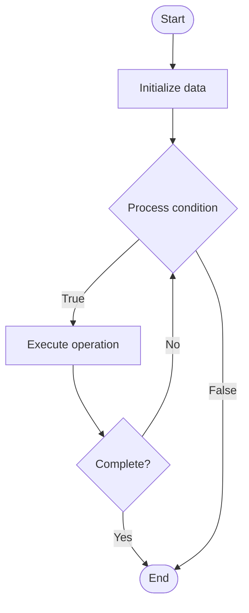

# Sparse Attention

## Учебные материалы

- [Школьный уровень](school.ru.md)
- [Университетский уровень](univer.ru.md)

## Algorithm Visualization

### Flowchart (ASCII)

```
Sparse Attention Flowchart:

┌─────────────┐
│   Start     │
└──────┬──────┘
       │
       ▼
┌─────────────┐
│  Initialize │
│   data      │
└──────┬──────┘
       │
       ▼
┌─────────────┐      Yes
│  Process   ├──────┐
│  condition?│      │
└──────┬──────┘      │
       │ No          │
       ▼             │
┌─────────────┐      │
│  Execute   │      │
│  operation │      │
└──────┬──────┘      │
       │             │
       └─────────────┘
       │
       ▼
┌─────────────┐
│    End      │
└─────────────┘
```

### Step-by-Step Execution

```
Sparse Attention Step-by-Step Execution:

Input: [example data]

Step 1: Initialize
State: [initial state]

Step 2: Process
State: [intermediate state]

Step 3: Finalize
State: [final state]

Result: [output]
```

### Interactive Flowchart (Mermaid)



> **Note**: Mermaid diagrams are rendered automatically on GitHub. For local viewing, use a Mermaid-compatible Markdown viewer.

- [Python Implementation](/code/semester_10/lecture_64_llm_architecture_advanced/sparse_attention/algorithm.py)
- [Java Implementation](/code/semester_10/lecture_64_llm_architecture_advanced/sparse_attention/Algorithm.java)
- [Python Tests](/code/semester_10/lecture_64_llm_architecture_advanced/sparse_attention/test_algorithm.py)

What problem does it solve? (1 sentence)  
Reduces the quadratic complexity of attention mechanisms by computing attention only over a sparse subset of positions, enabling efficient processing of long sequences while maintaining model performance.

Intuition (plain-language explanation)  
   Like selective reading: sparse attention is like reading a book but only paying close attention to important pages - instead of reading every word carefully (full attention, O(n²)), you skim most pages and focus on key sections (sparse attention, O(n√n) or O(n log n)) - you still understand the book, but much faster, and you can handle much longer books (sequences) this way.

Inputs & Outputs  

  - Input: Query, key, value matrices, attention pattern, sparsity strategy, sequence length.  
- Output: Sparse attention output, efficient computation, reduced memory, long sequence processing.

Step-by-step description (5–10 lines max)  
Choose pattern: select sparse attention pattern (local, strided, random, learned).
Compute scores: compute attention scores for query-key pairs.
Select: select top-k positions or use pattern to determine sparse set.
Mask: apply mask to zero out attention to non-selected positions.
Attend: compute attention only over selected sparse positions.
Aggregate: aggregate attention outputs from sparse positions.
Optimize: optimize attention pattern for task (learned sparse attention).
Scale: scale to very long sequences with sparse attention.
Validate: validate that sparse attention maintains performance.
Deploy: deploy for efficient long-sequence processing.

Tiny example (hand-simulated)  
   Sparse attention: sequence length 10K → full attention: 10K×10K = 100M operations → sparse: local window (512) + strided (every 64th) → attend to: 512 + 156 = 668 positions → operations: 10K×668 = 6.68M (15x reduction) → performance: 95% of full attention → sparse attention efficient.

Time & Space Complexity  

  - Time: O(n·k) where n is sequence length, k is sparse attention size (k << n), vs O(n²) for full attention.  
  - Space: O(n·k) where k is sparse attention size (much less than O(n²) for full attention matrix).

Strengths  

- Efficiency: dramatically reduces computational and memory requirements.
- Scalability: enables processing of much longer sequences.
- Performance: can maintain good performance with careful pattern design.

Weaknesses / limitations  

- Pattern design: requires careful design of attention patterns.
- Information loss: may miss some long-range dependencies.
- Complexity: implementing efficient sparse attention can be complex.

Compare with alternatives  
    Alternatives: Full Attention, Local Attention, Sliding Window, Linear Attention

30-second explanation (your own words)  
Reduces the quadratic complexity of attention mechanisms by computing attention only over a sparse subset of positions, enabling efficient processing of long sequences while maintaining model performance.

*Sources: Adapted from standard university textbooks and Wikipedia summaries.*
