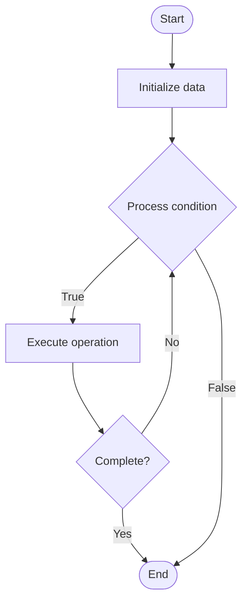

# Transformer Optimization

1. **Name of Algorithm**  

## Code Files


## Algorithm Visualization

### Flowchart (ASCII)


```
Transformer Optimization Flowchart:

┌─────────────┐
│   Start     │
└──────┬──────┘
       │
       ▼
┌─────────────┐
│  Initialize │
│   data      │
└──────┬──────┘
       │
       ▼
┌─────────────┐      Yes
│  Process   ├──────┐
│  condition?│      │
└──────┬──────┘      │
       │ No          │
       ▼             │
┌─────────────┐      │
│  Execute   │      │
│  operation │      │
└──────┬──────┘      │
       │             │
       └─────────────┘
       │
       ▼
┌─────────────┐
│    End      │
└─────────────┘
```


### Step-by-Step Execution


```
Transformer Optimization Step-by-Step Execution:

Input: [example data]

Step 1: Initialize
State: [initial state]

Step 2: Process
State: [intermediate state]

Step 3: Finalize
State: [final state]

Result: [output]
```


### Interactive Flowchart (Mermaid)





> **Note**: Mermaid diagrams are rendered automatically on GitHub. For local viewing, use a Mermaid-compatible Markdown viewer.
- [Python Implementation](semester_10/lecture_64_llm_architecture_advanced/transformer_optimization/algorithm.py)
- [Java Implementation](semester_10/lecture_64_llm_architecture_advanced/transformer_optimization/Algorithm.java)
- [Python Tests](semester_10/lecture_64_llm_architecture_advanced/transformer_optimization/test_algorithm.py)


   Transformer Optimization

2. **What problem does it solve? (1 sentence)**  
   Optimizes transformer architectures for efficiency, speed, and scalability through architectural improvements, algorithmic optimizations, and hardware-aware design while maintaining model quality.

3. **Intuition (plain-language explanation)**  
   Like optimizing a car engine: transformer optimization is like optimizing a car engine for better performance and fuel efficiency - you improve the engine design (architecture), use better fuel (algorithms), and tune it for the road conditions (hardware) - the goal is to make the transformer faster, use less memory, and scale better while still delivering the same quality (like a car that goes faster, uses less fuel, but still drives smoothly).

4. **Inputs & Outputs**  
   - Input: Transformer model, optimization objectives, hardware constraints, performance requirements, quality targets.  
   - Output: Optimized transformer, improved efficiency, faster inference, reduced memory, maintained quality.

5. **Step-by-step description (5–10 lines max)**  
1. Analyze: analyze transformer bottlenecks (attention, feedforward, memory).
2. Choose optimizations: select optimization techniques (Flash Attention, activation checkpointing, quantization).
3. Optimize attention: optimize attention mechanism (Flash Attention, sparse attention, linear attention).
4. Optimize feedforward: optimize feedforward layers (GLU variants, SwiGLU, gated mechanisms).
5. Reduce memory: reduce memory usage (gradient checkpointing, activation offloading).
6. Quantize: quantize weights and activations (INT8, INT4 quantization).
7. Optimize kernels: use optimized CUDA kernels or specialized hardware.
8. Architecture: improve architecture (better normalization, activation functions, layer design).
9. Validate: validate optimized model maintains quality.
10. Deploy: deploy optimized transformer for production.

6. **Tiny example (hand-simulated)**  
   Transformer optimization: GPT-3 → Flash Attention: 2x faster attention → gradient checkpointing: 50% memory reduction → INT8 quantization: 4x model size reduction → optimized kernels: 1.5x speedup → result: 3x faster inference, 8x smaller model, 95% quality → transformer optimized.

7. **Time & Space Complexity**  
   - Time: O(n²/d) or O(n log n) with optimizations where n is sequence length, d is optimization factor (improved from O(n²)).  
   - Space: O(n/d) where d is memory optimization factor (reduced from O(n) through checkpointing, quantization).

8. **Strengths**  
- Efficiency: significantly improves inference speed and reduces memory.
- Scalability: enables larger models and longer sequences.
- Deployability: makes transformers practical for resource-constrained deployments.

9. **Weaknesses / limitations**  
- Complexity: optimization techniques add implementation complexity.
- Trade-offs: some optimizations may have quality trade-offs.
- Hardware-specific: some optimizations are hardware-specific.

10. **Compare with alternatives**  
Alternatives: Standard Transformers, Efficient Architectures, Model Compression, Hardware Acceleration

11. **30-second explanation (your own words)**  
    Optimizes transformer architectures for efficiency, speed, and scalability through architectural improvements, algorithmic optimizations, and hardware-aware design while maintaining model quality.

*Sources: Adapted from standard university textbooks and Wikipedia summaries.*
