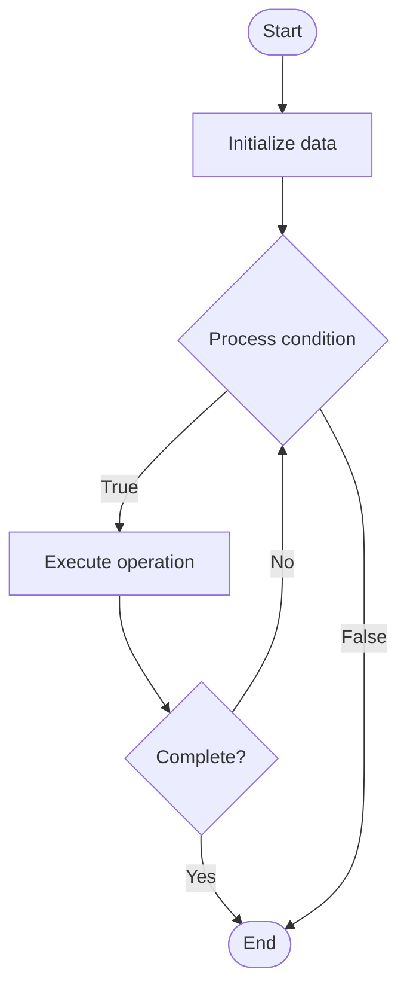

# Distributed Training for LLMs

## Учебные материалы

- [Школьный уровень](school.ru.md)
- [Университетский уровень](univer.ru.md)

## Algorithm Visualization

### Flowchart (ASCII)

```
Distributed Training for LLMs Flowchart:

┌─────────────┐
│   Start     │
└──────┬──────┘
       │
       ▼
┌─────────────┐
│  Initialize │
│   data      │
└──────┬──────┘
       │
       ▼
┌─────────────┐      Yes
│  Process   ├──────┐
│  condition?│      │
└──────┬──────┘      │
       │ No          │
       ▼             │
┌─────────────┐      │
│  Execute   │      │
│  operation │      │
└──────┬──────┘      │
       │             │
       └─────────────┘
       │
       ▼
┌─────────────┐
│    End      │
└─────────────┘
```

### Step-by-Step Execution

```
Distributed Training for LLMs Step-by-Step Execution:

Input: [example data]

Step 1: Initialize
State: [initial state]

Step 2: Process
State: [intermediate state]

Step 3: Finalize
State: [final state]

Result: [output]
```

### Interactive Flowchart (Mermaid)



> **Note**: Mermaid diagrams are rendered automatically on GitHub. For local viewing, use a Mermaid-compatible Markdown viewer.

- [Python Implementation](/code/semester_10/lecture_65_llm_training_advanced/distributed_training_llm/algorithm.py)
- [Java Implementation](/code/semester_10/lecture_65_llm_training_advanced/distributed_training_llm/Algorithm.java)
- [Python Tests](/code/semester_10/lecture_65_llm_training_advanced/distributed_training_llm/test_algorithm.py)

   Distributed Training for LLMs

What problem does it solve? (1 sentence)  
   Trains large language models across multiple GPUs or machines using data parallelism, model parallelism, and pipeline parallelism to handle models that don't fit on a single device.

Intuition (plain-language explanation)  
   Like a team building a huge structure: distributed training for LLMs is like building a huge structure with a team - instead of one person trying to build everything (single GPU), you divide the work: some people work on different parts of the structure simultaneously (data parallelism), some people work on different sections of the same part (model parallelism), and work flows through the team like an assembly line (pipeline parallelism) - together, the team can build structures (train models) that no single person could handle alone.

Inputs & Outputs  

  - Input: Large model, training data, multiple GPUs/machines, parallelism strategy, communication infrastructure.  
- Output: Trained model, distributed training, scaled computation, efficient resource utilization.

Step-by-step description (5–10 lines max)  
Partition model: partition model across devices if using model parallelism.
Partition data: partition data across devices if using data parallelism.
Distribute: distribute model parts and data to different GPUs/machines.
Forward pass: each device performs forward pass on its portion.
Communicate: devices communicate activations and gradients (all-reduce, all-gather).
Backward pass: each device performs backward pass and computes gradients.
Synchronize: synchronize gradients across devices (gradient averaging).
Update: update model parameters (may require gradient synchronization).
Pipeline: if using pipeline parallelism, overlap computation and communication.
Optimize: optimize communication patterns and load balancing.

Tiny example (hand-simulated)  
   Distributed LLM training: GPT-3 (175B parameters) → 8 GPUs → model parallelism: split model across 8 GPUs (22B params each) → data parallelism: 8 data batches → forward: each GPU processes its layer + batch → communicate: all-reduce gradients → backward: compute gradients → update: synchronized parameter update → 8x throughput → distributed training operational.

Time & Space Complexity  

  - Time: O(n/(p·d)) where n is training time, p is parallelism degree, d is devices (theoretical speedup, limited by communication).  
  - Space: O(m/p) per device where m is model size, p is number of devices (model partitioned).

Strengths  

- Scalability: enables training models too large for single device.
- Speed: parallel training reduces training time.
- Feasibility: makes training very large models feasible.

Weaknesses / limitations  

- Communication: communication overhead can limit speedup.
- Complexity: distributed training is complex to set up and debug.
- Synchronization: requires careful synchronization and load balancing.

Compare with alternatives  
    Alternatives: Single Device Training, Model Parallelism, Data Parallelism, Pipeline Parallelism

30-second explanation (your own words)  
    Trains large language models across multiple GPUs or machines using data parallelism, model parallelism, and pipeline parallelism to handle models that don't fit on a single device.

*Sources: Adapted from standard university textbooks and Wikipedia summaries.*


## References

- [Distributed Training Llm - Wikipedia](https://en.wikipedia.org/wiki/Distributed%20Training%20Llm)
