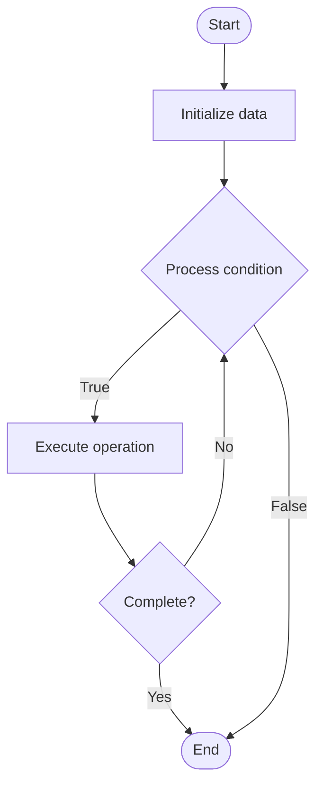

# Gradient Checkpointing

1. **Name of Algorithm**  

## Code Files


## Algorithm Visualization

### Flowchart (ASCII)


```
Gradient Checkpointing Flowchart:

┌─────────────┐
│   Start     │
└──────┬──────┘
       │
       ▼
┌─────────────┐
│  Initialize │
│   data      │
└──────┬──────┘
       │
       ▼
┌─────────────┐      Yes
│  Process   ├──────┐
│  condition?│      │
└──────┬──────┘      │
       │ No          │
       ▼             │
┌─────────────┐      │
│  Execute   │      │
│  operation │      │
└──────┬──────┘      │
       │             │
       └─────────────┘
       │
       ▼
┌─────────────┐
│    End      │
└─────────────┘
```


### Step-by-Step Execution


```
Gradient Checkpointing Step-by-Step Execution:

Input: [example data]

Step 1: Initialize
State: [initial state]

Step 2: Process
State: [intermediate state]

Step 3: Finalize
State: [final state]

Result: [output]
```


### Interactive Flowchart (Mermaid)





> **Note**: Mermaid diagrams are rendered automatically on GitHub. For local viewing, use a Mermaid-compatible Markdown viewer.
- [Python Implementation](semester_10/lecture_65_llm_training_advanced/gradient_checkpointing/algorithm.py)
- [Java Implementation](semester_10/lecture_65_llm_training_advanced/gradient_checkpointing/Algorithm.java)
- [Python Tests](semester_10/lecture_65_llm_training_advanced/gradient_checkpointing/test_algorithm.py)


   Gradient Checkpointing

2. **What problem does it solve? (1 sentence)**  
   Reduces memory usage during backpropagation by trading computation for memory - storing only selected activations and recomputing others during backward pass, enabling training of larger models with limited GPU memory.

3. **Intuition (plain-language explanation)**  
   Like taking notes selectively: gradient checkpointing is like taking notes during a lecture - instead of writing down everything (storing all activations, uses lots of memory), you only write down key points (checkpoint activations) and reconstruct the details later when needed (recompute activations during backward pass) - you use more time (recomputation) but save space (memory), allowing you to handle longer lectures (larger models) with the same notebook (GPU memory).

4. **Inputs & Outputs**  
   - Input: Neural network, forward activations, memory budget, checkpoint strategy, recomputation schedule.  
   - Output: Memory-efficient training, reduced memory usage, larger model capacity, gradient computation.

5. **Step-by-step description (5–10 lines max)**  
1. Forward pass: perform forward pass through network.
2. Checkpoint: store activations only at selected checkpoints (every N layers).
3. Discard: discard non-checkpoint activations to save memory.
4. Backward pass: start backward pass from output.
5. Recompute: when needed, recompute activations from nearest checkpoint.
6. Compute gradients: compute gradients using recomputed activations.
7. Continue: continue backward pass, recomputing as needed.
8. Optimize: optimize checkpoint placement for memory-compute trade-off.
9. Validate: validate that gradients are computed correctly.
10. Train: train model with reduced memory footprint.

6. **Tiny example (hand-simulated)**  
   Gradient checkpointing: 100-layer transformer → memory: store all activations = 40GB → checkpointing: checkpoint every 10 layers → store: 10 checkpoints (4GB) → backward: recompute activations between checkpoints → memory: 4GB + recomputation overhead → result: 10x memory reduction, 30% compute increase → larger models trainable.

7. **Time & Space Complexity**  
   - Time: O(n + r) where n is forward pass time, r is recomputation time (typically 30-50% overhead).  
   - Space: O(m/c) where m is total activation memory, c is checkpoint frequency (reduced from O(m)).

8. **Strengths**  
- Memory efficiency: dramatically reduces memory usage (5-10x reduction).
- Larger models: enables training models that don't fit in memory otherwise.
- Flexibility: can adjust checkpoint frequency for memory-compute trade-off.

9. **Weaknesses / limitations**  
- Compute overhead: recomputation adds 30-50% training time.
- Complexity: requires careful checkpoint placement.
- Trade-off: must balance memory savings vs compute cost.

10. **Compare with alternatives**  
    Alternatives: Full Activation Storage, CPU Offloading, Model Parallelism, Reduced Batch Size

11. **30-second explanation (your own words)**  
    Reduces memory usage during backpropagation by trading computation for memory - storing only selected activations and recomputing others during backward pass, enabling training of larger models with limited GPU memory.

*Sources: Adapted from standard university textbooks and Wikipedia summaries.*
