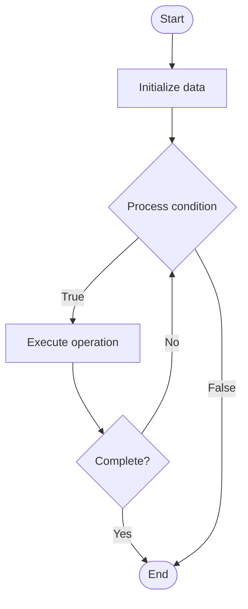

# Mixed Precision Training

## Учебные материалы

- [Школьный уровень](school.ru.md)
- [Университетский уровень](univer.ru.md)

## Algorithm Visualization

### Flowchart (ASCII)

```
Mixed Precision Training Flowchart:

┌─────────────┐
│   Start     │
└──────┬──────┘
       │
       ▼
┌─────────────┐
│  Initialize │
│   data      │
└──────┬──────┘
       │
       ▼
┌─────────────┐      Yes
│  Process   ├──────┐
│  condition?│      │
└──────┬──────┘      │
       │ No          │
       ▼             │
┌─────────────┐      │
│  Execute   │      │
│  operation │      │
└──────┬──────┘      │
       │             │
       └─────────────┘
       │
       ▼
┌─────────────┐
│    End      │
└─────────────┘
```

### Step-by-Step Execution

```
Mixed Precision Training Step-by-Step Execution:

Input: [example data]

Step 1: Initialize
State: [initial state]

Step 2: Process
State: [intermediate state]

Step 3: Finalize
State: [final state]

Result: [output]
```

### Interactive Flowchart (Mermaid)



> **Note**: Mermaid diagrams are rendered automatically on GitHub. For local viewing, use a Mermaid-compatible Markdown viewer.

- [Python Implementation](/code/semester_10/lecture_65_llm_training_advanced/mixed_precision_training/algorithm.py)
- [Java Implementation](/code/semester_10/lecture_65_llm_training_advanced/mixed_precision_training/Algorithm.java)
- [Python Tests](/code/semester_10/lecture_65_llm_training_advanced/mixed_precision_training/test_algorithm.py)

What problem does it solve? (1 sentence)  
   Accelerates neural network training by using lower precision (FP16/BF16) for most operations while maintaining FP32 precision for critical operations, reducing memory usage and increasing training speed on modern GPUs.

Intuition (plain-language explanation)  
   Like using different tools for different tasks: mixed precision training is like using a fast but less precise tool (FP16) for most work and a slower but precise tool (FP32) only when you need accuracy - you do most calculations quickly with FP16 (like rough measurements), but use FP32 for critical calculations that need precision (like final measurements) - this makes the overall work much faster while maintaining accuracy where it matters.

Inputs & Outputs  

  - Input: Model weights, activations, gradients, loss scaling, precision settings, GPU support.  
  - Output: Faster training, reduced memory, maintained accuracy, optimized computation.

Step-by-step description (5–10 lines max)  
Configure: configure mixed precision training (FP16/BF16 for most ops, FP32 for critical).
Forward pass: perform forward pass using FP16/BF16 for activations and weights.
Compute loss: compute loss in FP16/BF16.
Scale loss: scale loss by factor (e.g., 2^16) to prevent underflow.
Backward pass: compute gradients in FP16/BF16.
Unscale: unscale gradients before optimizer step.
Master weights: maintain FP32 master copy of weights for precision.
Update: update FP32 master weights, then copy to FP16 for next iteration.
Handle overflow: detect and handle gradient overflow (skip update if overflow).
Optimize: optimize loss scaling and precision settings.

Tiny example (hand-simulated)  
   Mixed precision: transformer training → FP32 baseline: 100 hours, 16GB memory → mixed precision: FP16 for most ops, FP32 for master weights → speed: 2x faster (50 hours) → memory: 50% reduction (8GB) → accuracy: 99.5% of FP32 → mixed precision successful.

Time & Space Complexity  

  - Time: O(n/2) approximately where n is FP32 training time (2x speedup on modern GPUs with tensor cores).  
  - Space: O(m/2) where m is FP32 memory usage (approximately 50% reduction with FP16).

Strengths  

- Speed: 1.5-2x faster training on modern GPUs with tensor cores.
- Memory: reduces memory usage by ~50%, enabling larger batch sizes.
- Accuracy: maintains model accuracy with proper loss scaling.

Weaknesses / limitations  

- Hardware: requires GPU support for mixed precision (Tensor Cores, etc.).
- Tuning: requires tuning loss scaling factor.
- Overflow: risk of gradient overflow if not properly scaled.

Compare with alternatives  
    Alternatives: FP32 Training, FP16 Training, BF16 Training, INT8 Training

30-second explanation (your own words)  
    Accelerates neural network training by using lower precision (FP16/BF16) for most operations while maintaining FP32 precision for critical operations, reducing memory usage and increasing training speed on modern GPUs.

*Sources: Adapted from standard university textbooks and Wikipedia summaries.*


## References

- [Mixed Precision Training - Wikipedia](https://en.wikipedia.org/wiki/Mixed%20Precision%20Training)
