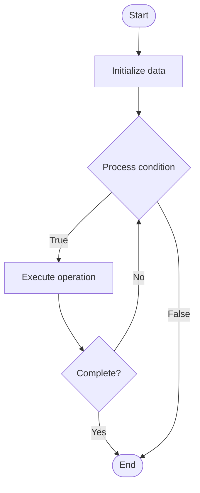

# Model Parallelism for LLMs

1. **Name of Algorithm**  

## Code Files


## Algorithm Visualization

### Flowchart (ASCII)


```
Model Parallelism for LLMs Flowchart:

┌─────────────┐
│   Start     │
└──────┬──────┘
       │
       ▼
┌─────────────┐
│  Initialize │
│   data      │
└──────┬──────┘
       │
       ▼
┌─────────────┐      Yes
│  Process   ├──────┐
│  condition?│      │
└──────┬──────┘      │
       │ No          │
       ▼             │
┌─────────────┐      │
│  Execute   │      │
│  operation │      │
└──────┬──────┘      │
       │             │
       └─────────────┘
       │
       ▼
┌─────────────┐
│    End      │
└─────────────┘
```


### Step-by-Step Execution


```
Model Parallelism for LLMs Step-by-Step Execution:

Input: [example data]

Step 1: Initialize
State: [initial state]

Step 2: Process
State: [intermediate state]

Step 3: Finalize
State: [final state]

Result: [output]
```


### Interactive Flowchart (Mermaid)





> **Note**: Mermaid diagrams are rendered automatically on GitHub. For local viewing, use a Mermaid-compatible Markdown viewer.
- [Python Implementation](semester_10/lecture_65_llm_training_advanced/model_parallelism/algorithm.py)
- [Java Implementation](semester_10/lecture_65_llm_training_advanced/model_parallelism/Algorithm.java)
- [Python Tests](semester_10/lecture_65_llm_training_advanced/model_parallelism/test_algorithm.py)


   Model Parallelism for LLMs

2. **What problem does it solve? (1 sentence)**  
   Partitions large language models across multiple devices by splitting layers or tensors, enabling training of models too large to fit on a single GPU while maintaining model integrity.

3. **Intuition (plain-language explanation)**  
   Like splitting a large painting across multiple canvases: model parallelism is like painting a huge mural by splitting it across multiple canvases - each artist (GPU) works on their section of the painting (model partition), and they pass their work to the next artist (communication) who continues - the final painting (model) is complete only when all sections are done together - this allows creating much larger paintings (models) than any single canvas (GPU) could hold.

4. **Inputs & Outputs**  
   - Input: Large model, multiple GPUs, partitioning strategy, communication pattern, model architecture.  
   - Output: Partitioned model, distributed computation, scaled model capacity, trained model.

5. **Step-by-step description (5–10 lines max)**  
1. Analyze model: analyze model structure and memory requirements.
2. Choose strategy: select partitioning strategy (tensor parallelism, pipeline parallelism, or hybrid).
3. Partition: partition model layers or tensors across GPUs.
4. Distribute: distribute model partitions to different GPUs.
5. Forward pass: each GPU processes its partition, communicates activations to next GPU.
6. Communicate: GPUs communicate activations and gradients (all-gather, all-reduce).
7. Backward pass: each GPU computes gradients for its partition.
8. Synchronize: synchronize gradients across partitions.
9. Update: update parameters in each partition.
10. Optimize: optimize communication patterns and load balancing.

6. **Tiny example (hand-simulated)**  
   Model parallelism: GPT-3 (175B params) → 8 GPUs → tensor parallelism: split attention and FFN across GPUs → GPU 0-3: first half of layers → GPU 4-7: second half → forward: activations flow GPU 0→1→2→...→7 → backward: gradients flow GPU 7→6→...→0 → communication: all-reduce for synchronization → model parallel training operational.

7. **Time & Space Complexity**  
   - Time: O(n/p + c) where n is sequential time, p is parallelism degree, c is communication overhead.  
   - Space: O(m/p) per GPU where m is model size, p is number of GPUs (model partitioned).

8. **Strengths**  
- Scalability: enables training models larger than single GPU memory.
- Efficiency: better memory utilization across multiple GPUs.
- Feasibility: makes training very large models feasible.

9. **Weaknesses / limitations**  
- Communication: communication overhead can be significant.
- Complexity: model parallelism is complex to implement and debug.
- Load balancing: requires careful load balancing across partitions.

10. **Compare with alternatives**  
    Alternatives: Data Parallelism, Pipeline Parallelism, Hybrid Parallelism, CPU Offloading

11. **30-second explanation (your own words)**  
    Partitions large language models across multiple devices by splitting layers or tensors, enabling training of models too large to fit on a single GPU while maintaining model integrity.

*Sources: Adapted from standard university textbooks and Wikipedia summaries.*
